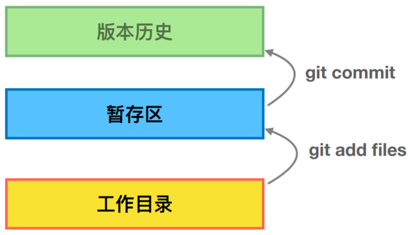

## 1、初始化仓库
```
git init
```
第一次使用要设置用户和邮箱：
```java
git config --global user.name "gugibv"
git config --global user.email gugibv@163.com

git config --global user.name "zhoujing"
git config --global user.email zhoujing@sunline.cn

git config --global user.name        // 查看用户名是否配置成功
git config --global user.email       // 查看邮箱是否配置

# 其他查看配置相关
git config --global --list           // 查看全局设置相关参数列表
git config --local --list            // 查看本地设置相关参数列表
git config --system --list           // 查看系统配置参数列表
git config --list                    // 查看所有Git的配置(全局+本地+系统)
git config --global color.ui true    // 显示git相关颜色
```
创建ssh:
```
$ ssh-keygen -t rsa -C "gugibv@163.com"
```
将路径下的id_rsa.pub添加到github网站上

## 2、将文件添加到仓库

<div align="center">  </div>

```java
git add 文件名 // 将工作区的某个文件添加到暂存区   
git add -u    // 添加所有被tracked文件中被修改或删除的文件信息到暂存区，不处理untracked的文件
git add -A    // 添加所有被tracked文件中被修改或删除的文件信息到暂存区，包括untracked的文件
git add .     // 将当前工作区的所有文件都加入暂存区
git add -i    // 进入交互界面模式，按需添加文件到缓存区
```
## 3、将暂存区文件提交到本地仓库

```java
git commit -m "提交说明"    // 将暂存区内容提交到本地仓库
git commit -a -m "提交说明" // 跳过缓存区操作，直接把工作区内容提交到本地仓库

git commit --amend         // 修改提交注释
git rebase -i 版本号        // 合并未 push 的commit 为一次 
```
## 4、查看仓库当前状态
```
git status
```
## 5、比较文件异同
```java
git diff               // 工作区与暂存区的差异
git diff 分支名         // 工作区与某分支的差异，远程分支这样写：remotes/origin/分支名
git diff HEAD          // 工作区与HEAD指针指向的内容差异
git diff 提交id   	 // 文件路径 # 工作区某文件当前版本与历史版本的差异
git diff --stage       // 工作区文件与上次提交的差异
git diff 版本TAG       // 查看从某个版本后都改动内容
git diff 分支A 分支B   // 比较从分支A和分支B的差异(也支持比较两个TAG)
git diff 分支A...分支  // 比较两分支在分开后各自的改动

# 另外：如果只想统计哪些文件被改动，多少行被改动，可以添加 --stat 参数
```
## 6、查看历史记录java
```java
git log                 // 查看所有commit记录(SHA-A校验和，作者名称，邮箱，提交时间，提交说明)
git log --oneline       // 让提交记录以精简的一行输出
git log -n4 --oneline   // 查看最近4次提交
git log --all --graph   // 查看所有分支历史
git log fileName        // 查看某文件的修改记录，找背锅专用
    
gitk 打开图形化界面
```
## 7、代码回滚
```java
git reset HEAD^   // 恢复成上次提交的版本
git reset HEAD^^  // 恢复成上上次提交的版本，就是多个^，以此类推或用~次数

git reflog              // 查看版本号
git reset --hard 版本号  // 通过查看版本号来恢复   

// soft：只是改变HEAD指针指向，缓存区和工作区不变；
// mixed：修改HEAD指针指向，暂存区内容丢失，工作区不变；
// hard：修改HEAD指针指向，暂存区内容丢失，工作区恢复以前状态；

// 撤消add 的内容
git status                      // 先看一下add 中的文件 
git reset HEAD                  // 如果后面什么都不跟的话 就是上一次add 里面的全部撤销了 
git reset HEAD XXX/XXX/XXX.java // 就是对某个文件进行撤销了

// 撤消本地还没有commit 的修改
git checkout -- filepathname

// 撤消commit 但是还没有push 的内容：
git reset --soft HEAD^

// 忽略文件的改动，但是不加入.gitignore 文件中
// 这样可以达到仅在本地目录中忽略，不影响其他团队成员的工作
git update-index --assume-unchanged 文件名

// 上一个命令的逆操作，重新追踪文件改动。
git update-index --no-assume-unchanged 文件名
```
## 8、同步远程仓库
```
git push -u origin master
```
## 9、删除版本库文件
```
git rm 文件名
```
## 10、版本库里的版本替换工作区的版本
```
git checkout -- test.txt
```
## 11、本地仓库内容推送到远程仓库
```java
git remote add origin git@github.com:帐号名/仓库名.git
```

修改远程库命令：
```
git remote set-url origin [url]
```
或者先删后加
```
git remote rm origin
git remote add origin [url]
```
查看远程库地址：
```
git remote -v
```

## 12、从远程仓库克隆项目到本地
```
git clone git@github.com:git帐号名/仓库名.git


git clone -b mvp3.0_dev  git@github.com:git帐号名/仓库名.git #指定分支下载
```
## 13、分支管理
```java
git branch           // 查看本地分支
git branch -a        // 查看所有分支包括本地分支和远程分支
git branch -r        // 查看远程分支

git checkout -b dev  // -b表示创建并切换分支，上面一条命令相当于一面的二条：
git branch dev       // 创建分支
git checkout dev     // 切换分支
git checkout master  // 切换到主分支

git push origin dev  // 将新分支推送至GitHub.

git merge dev        // 用于合并指定分支到当前分支

git merge --no-ff -m "merge with no-ff" dev  // 加上--no-ff参数就可以用普通模式合并，合并后的历史有分支，能看出来曾经做过合并

git branch -d dev    //删除分支

git log --graph --pretty=oneline --abbrev-commit  // 查看分支合并图
```


## 14、拉取远程分支到本地仓库
```java
git checkout -b 本地分支 远程分支           // 会在本地新建分支，并自动切换到该分支
git fetch origin 远程分支:本地分支          // 会在本地新建分支，但不会自动切换，还需checkout
git branch --set-upstream 本地分支 远程分支 // 建立本地分支与远程分支的链接
```
## 15、标签命令
```java
git tag 标签                 // 打标签命令，默认为HEAD
git tag                     // 显示所有标签
git tag 标签 版本号          // 给某个commit版本添加标签
git show 标签               // 显示某个标签的详细信息
```
## 16、同步远程仓库更新
```java
 // 从远程获取最新的到本地，首先从远程的origin的master主分支下载最新的版本到origin/master分支上，
 // 然后比较本地的master分支和origin/master分支的差别，最后进行合并。
git fetch origin master
    
git fetch比git pull更加安全
```

---


## 17、github搜索技巧

1、awesome + xx  比方说：
```
awesome python
awesome go
awesome linux
```
2、功能 + 网站

比方说当你想采集某个网站的时候，你可以在Github里面搜「网站名称+Scrapy」，如果搜不到可以搜「网站名称+采集」，还可以搜「网站名称+Python」等等。

3、接口

## 18、统计代码提交量

```
git log --author="zhoujing" --pretty=tformat: --numstat | awk '{ add += $1; subs += $2; loc += $1 - $2 } END { printf "added lines: %s, removed lines: %s, total lines: %s\n", add, subs, loc }' -
```

## 19、其他命令

```java
git mv readme readme.md   // 文件重命令
```

