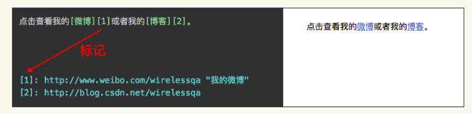

## Markdown实用指南


### 一、了解Markdown

**Markdown**是一种轻量级标记语言，创始人为約翰·格魯伯（英语：John Gruber）。 它允许人们“使用易读易写的纯文本格式编写文档，然后转换成有效的XHTML（或者HTML）文档”。

不同的段落之间使用空格来标记

#### 1.  标题 

```
# + 空格 +标题内容
```

#的个数表明了标题的等级

#### 2. 列表

有序列表

```
数字 + 英文 + 空格 + 列表内容
```

无序列表

```
星号/加号/减号 + 空格 + 列表内容
```

嵌套列表

```
+ 第一层列表
TAB + 第二层列表
TAB + TAB + 第三层列表
```

列表里面可以嵌套列表,有序列表和无序列表也可以互相嵌套

#### 3. 引用

```
> 引用内容
```

引用可以嵌套引用

#### 4. 分割线

```
***
```

 分割线由三个以上的星号/减号/下划线来标记

#### 5. 粗体

```
**粗体内容**
或 __粗体内容__
```

粗体由两个\*或两个\_包裹,斜体由一个\*或\_包裹

#### 6. 图片

```

```

图片替代文字在图片无法显示时有用,正常情况下可为空,图片地址可以是本地图片也可以是网络图片.本地图片支持绝对路径和相对路径.

#### 7. 链接

行内式链接

```
[链接文字](链接地址 "Title")
```

title在链接地址后使用单引号或双引号括起来,可以省略

参考式链接

```
[链接文字][链接标记]
[链接标记]:链接地址 "Title"
```

链接标记可以有字母,数字,空白和标点符号

链接标记不区分大小写

链接内容可以放在当前文件的任意文字

<div align="center">  </div><br>

自动链接

```
<url或邮箱地址>
```

#### 8. 转义

```
\特殊符号
```

#### 9. 锚点

锚点,也称为书签,用来标记文档中的特定位置,使用锚点可以跳转到当前文档或其他文档中指定的标记位置.github,gitbook中的目录都是通过锚点来实现跳转的.

```
[锚点描述](#锚点名)
```

锚点名建议使用中文和数字,当然中文也是可以的.


### 二、实时预览编辑器Typora

安装Typora以后,安装Pandoc.如果不安装Pandoc,Typora只支持到出HTML和PDF格式的文件.

如果安装了Pandoc,Typora支持的文件格式更多.
测试

