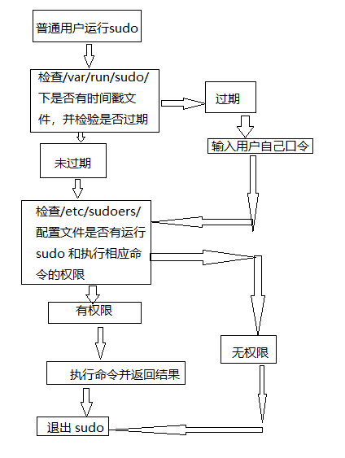

### 一、磁盘分区

 磁盘使用前要进行分区。

磁盘分区有主分区、扩展分区和逻辑分区之分。

一块硬盘最多可以4个主分区，其中一个主分区的位置可以用一个扩展分区替换，而一块硬盘只能有一个扩展分区，在这个扩展分区可以划分多个逻辑分区。

ll /dev/sd*  查看分区

linux的目录结构也是有规律的，而且也是按照类别组织的。

>  应用程序 /usr/bin
>
> 数据文件 和帮助文件 /usr/share
>
> 配置文件 /etc/
>
> 启动命令 /etc/init.d

### 二、用户管理

超级用户：默认root用户，其UID和GID均为0。root用户是每台操作unix/linux 操作系统中都是唯一且真实存在的，通过它可以登陆系统，可以操作系统中的任何文件和命令，拥有最高的管理权限。在生产环境中，一般会禁止root账号通过ssh远程连接服务器，当然了，也会更改默认的ssh端口，以加强系统安全。


<div align="center">  </div><br>

```sql
visudo 
98G      ##跳转到98行 添加下面内容：
cpestst   ALL=(ALL)  /usr/sbin/useradd ,/bin/rm
## 切换到cpestst用户
su - cpestst
sudo useradd mmm  ##输入cpestst用户的密码
```

ll /etc/sudoers

> -r--r----- 1 root root 2126 2010-03-01 /etc/sudoers

通过sudoers向sudo授权

visudo 相当于 vi /etc/sudoers

### 三、文件权限

chmod 的数字方法说明：

> 可读r      4      （目录）表示具有浏览目录下面文件及目录的权限 即 ls dir
>
> ​                       （文件）表示具有读取阅读文件内容的权限
>
> 可写w      2     （目录）表示具有增加、删除或修改目录内文件名的权限
>
> ​			            （文件）表示具有新增，修改文件内容的权限
>
> 可执行x     1   （目录）表示具有进入目录的权限
>
> ​				        （文件）表示具有、修改文件内容的权限
>
> \-    0

默认权限是目录755，文件 644 ，这是网站目录相对安全的权限，并且用户为root以及用户组为root。

linux 系统默认权限的方针：允许浏览，查看，但是禁止创建和修改，增加文件及内容。

在linux 下文件的默认权限是由 umask 值决定的， umask 是通过八进制的数值来定义用户创建文件或目录的默认权限。

系统是如何根据umask 值来确定文件及目录的权限的呢？

> 创建文件默认最大权限为666（-rw-rw-rw），默认创建的文件一般没有可执行权限 x 位。
>
> 对于文件来说，umask 的设置是假定文件拥有八进制 666 的权限上进行的，文件的权限就是 666  减去umask的掩码数值，如果 umask 的部分位或全部位为奇数，那么，在对应为奇数 的文件权限位计算结果分别再加 1 才是最终文件权限值。
>
> 创建目录默认最大权限为 777 (-rwx-rwx-rwx)，默认创建的目录属组是有x权限，允许用户进入。
>
> 对应目录来说，umask 的设置是假定文件拥有八进制 777 权限上进行，目录八进制 777 减去 umask 的掩码值。 
>
> 假设 umask 值为：045 （其他用户组位为奇数）
>
> 6 6 6 —> 文件的起始权限值
>
> 0 4 5  —> umask 的值
>
> ___
>
> 6 2 1  —>计算出来的权限  ，由于 umask 的最后一位数字是5， 所以最终权限是6 2 2 。只要有奇数的位置就+1.

### 四、定时任务

#### 1、crond是什么?

crond 是linux 系统中用来定期执行命令或指定程序任务的一种服务或者软件。crond 服务默认情况（每分钟），会坚持系统中是否有需要执行的定时任务，如果有，就会根据事先定义好的规则来执行这个定时任务。

秒级任务处理不了，这个可以自己写个 while 循环 守护进程，quartz 也可以实现秒级任务。

为什么需要定时任务？

7*24小时开机提供服务是网站的基本特征。有重要数据，服务器上的数据一般最低1天备一次，每分钟（实时备份）再增量备份。

#### 2、linux 定时任务分类

- 系统自身的定期执行的任务

  > ll /etc/|grep cron

- 用户执行的定时任务

  > crontal - l  浏览crontab 文件内容
  >
  > crontal -e  编辑crontab文件内容

#### 3、基本格式

> 01 * * * * cmd
>
> 02 4 * * * cmd
>
> 22 4 * * 0 cmd
>
> 42 4 1 * * cmd
>
> 分钟  小时   某天（1-31）  某月（1-12） 星期几（0-6） 要执行的命令或脚本

cmd 为要执行的命令或脚本 ，例如/bin/sh  /cpestst/cpestst.sh

\* 号，表示任意时间都，实际就是“每”时间的意思

\- 号，表示分隔符，表示一个时间范围，区间的，例如17-19点

, 号，表示分割时间段，30 17,18,19 * * * /bin/sh /scripsts/cpestst.sh  表示每天17、18、19点的半点时刻执行/scripsts/cpestst.sh 脚本，也可以结合 "-"使用。

/n, 代表数字，即“每隔 n 单位时间” ，例如 */10 * * * * cmd 表示每10分钟执行一次任务

#### 4、要领

* 为定时任务规则添加必要的助手

* 执行shell 脚本任务前加 /bin/sh
* 定时任务命令或脚本的结尾加 >/dev/null 2 >&1
* 定时任务任务命令的执行，最好用脚本
* 在指定用户下执行相关定时任务
* 在生产任务程序下不要随意打印输出信息
* 定时任务执行的脚本要规范路径/server/scripts
* 配置定时任务规范操作过程，防止出错

> \>/dev/null ----输出重定向到空，即不输出到控制台
>
>  2>&1 -----错误定位到输出

 

### 五、Linux正则表达式

简单的说，正则表达式就是一套处理字符串的规则和方法，以行为单位对字符串进行处理，通过特殊的符号的辅助，我们可以快速的过滤，替换某些特定的字符串。

运维工作中，会有大量的访问日志，错误日志，大数据。如何能够快读的过滤出我们需要的内容，这就要靠正则表达式。

linux 里正则表达式，主要是awk,sed,grep(egrep)三剑客的正则表达式。

正则表达式实际就是一些特殊字符，赋予了他特定的含义。

> 1)^word 搜索以 word 开头的
>
> 2)word$ 搜索以 word 结尾的
>
> 3).    代表且只能代表任意一个字符
>
> 4)\ 转移符号，让有特殊身份意义的字符，脱掉马甲，还原原型
>
> 5) *  重复0个或多个前面的一个字符
>
> 6)

例如：grep -i  "^m" cpestst-send-info.log 搜索以m 开头的行

### 六、vi 命令

退出保存 :wq

退出并强制保存:wq!

强制退出不保存 :q!

光标移动到文件最后一行 shift+g

光标移动到文件第一行 gg  或 1G

 取消上一次的动作 u

删除一行 dd

从光标位置到当前行开头 0 或 ^

从光标位置到当前行结尾 $

