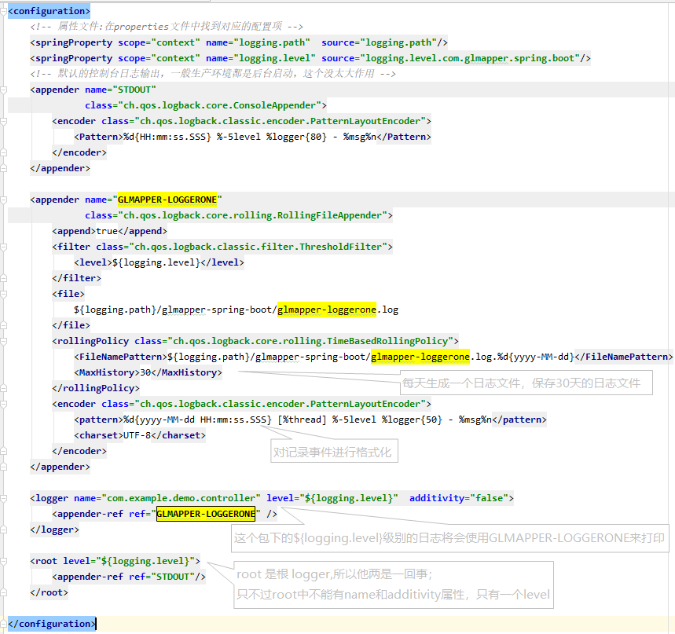

### 一. 什么是springboot与微服务？

Spring 是一个开源框架，2003 年兴起的一个轻量级的 Java 开发框架，作者：Rod Johnson 。

什么是 SpringBoot 呢，就是一个 javaweb 的开发框架，和 SpringMVC 类似，对比其他 javaweb 框架的好处，官方说是简化开发，约定大于配置， you can "just run"，能迅速的开发web应用，几行代码开发一个 http 接口。

- 构建一个个功能独立的微服务应用单元，可以使用 springboot,可以帮我们快速构建一个应用
- 大型分布式网络服务的调用，这部分由 spring cloud 来完成，实现分布式
- 在分布式中间，进行流式数据计算、批处理，我们有 spring cloud data flow
- spring为 我们想清楚了整个从开始构建应用到大型分布式应用全流程方案


#### 1.1. springboot 初体验

File ——>new project ——> 选择spring Initailizr ——> 默认Default:https://start.spring.io，点击next

——>选择配置依赖 ——> 输入项目名称 ——> 点击完成

配置 IDEA 的 Maven，指定 Setting 的 Maven目录和 MAVEN的setting.xml 文件

如果下载依赖太慢，设置 maven 的仓库：

```xml
<mirrors>
	<mirror>
		<id>alimaven</id>
		<name>aliyun maven</name>
		<url>http://maven.aliyun.com/nexus/content/groups/public/</url>
		<mirrorOf>central</mirrorOf>       
	</mirror>
</mirrors>
```

删掉多余的东西：.mvn   .gitignore  HELP.md  mvnw  mvnw.cmd

在启动主程序同目录创建 controller 层：

```java
package com.example.demo.controller;

import org.springframework.stereotype.Controller;
import org.springframework.web.bind.annotation.GetMapping;
import org.springframework.web.bind.annotation.RequestBody;
import org.springframework.web.bind.annotation.RequestMapping;
import org.springframework.web.bind.annotation.ResponseBody;

@Controller
@RequestMapping("/hello")
public class HelloController {
    @GetMapping("/hello")
    @ResponseBody
    public String sayHello(){
        return "hello";
    }
}
```

运行主程序，访问：http://localhost:8080/hello/hello，页面即显示 hello 字符串。

也可以打包运行：在 Terminal 中输入 mvn package 

运行结果：

> Building jar: D:\Repository\IdeaCode\springboot\demo\target\demo-0.0.1-SNAPSHOT.jar

cmd 控制台进入 D:\Repository\IdeaCode\springboot\demo\target\目录，执行命令：

```cmake
java -jar .\demo-0.0.1-SNAPSHOT.jar
```

浏览器访问可以得到相同的结果。

扩展 IDE 快捷键：

```xaml
Ctrl+D 复制一行
Ctrl+Y 删除一行
Ctrl+P 参数提示
Ctrl+Alt+V 自动补齐方法
Ctrl+N 查找类方法
Alt+Ins 构造器、getter/setter toString
Ctrl+O 重载方法提示
Alt+Enter 提示导入类etc
Shift+F6 :文件重命名
```

修改启动图标，在resources 下创建banner.txt，输入  https://www.bootschool.net/ascii 网站得到的图标字符串即可。

#### 1.2. HelloWorld深度理解

##### 1.2.1. 父项目

```xaml
<parent>
    <groupId>org.springframework.boot</groupId>
    <artifactId>spring-boot-starter-parent</artifactId>
    <version>2.0.1.RELEASE</version>
    <relativePath/> <!-- lookup parent from repository -->
</parent>
```

这个父项目**spring-boot-starter-parent**又依赖一个父项目

```xaml
<parent>
    <groupId>org.springframework.boot</groupId>
    <artifactId>spring-boot-dependencies</artifactId>
    <version>2.0.1.RELEASE</version>
    <relativePath>../../spring-boot-dependencies</relativePath>
</parent>
```

下面有个属性，定义了对应的版本号

```xaml
<properties>
    <activemq.version>5.15.3</activemq.version>
    <antlr2.version>2.7.7</antlr2.version>
    <appengine-sdk.version>1.9.63</appengine-sdk.version>
    <artemis.version>2.4.0</artemis.version>
    <aspectj.version>1.8.13</aspectj.version>
    <assertj.version>3.9.1</assertj.version>
    <atomikos.version>4.0.6</atomikos.version>
    <bitronix.version>2.1.4</bitronix.version>
    <build-helper-maven-plugin.version>3.0.0</build-helper-maven-plugin.version>
    。。。。。。。
```

##### 1.2.2. 启动器

```xaml
<dependency>
    <groupId>org.springframework.boot</groupId>
    <artifactId>spring-boot-starter-web</artifactId>
</dependency>
```

**spring-boot-starter-web**：帮我们导入 web 模块正常运行所依赖的组件

**spring boot** 将所有的功能场景都抽取出来，做成一个个的 starter (启动器)，只需要在项目里引入这些 starter 相关场景的所有依赖都会被导入进来，要用什么功能就导入什么场景的启动器。

##### 1.2.3. 主程序入口

```java
@SpringBootApplication
public class DemoApplication {
    public static void main(String[] args) {
        SpringApplication.run(DemoApplication.class, args);
    }
}
```

**@SpringBootApplication**：说明这个类是SpringBoot的主配置类，SpringBoot就应该运行这个类的main方法来启动应用。

进入 `SpringBootApplication` 注解

```java
@Target({ElementType.TYPE})
@Retention(RetentionPolicy.RUNTIME)
@Documented
@Inherited
@SpringBootConfiguration
@EnableAutoConfiguration
@ComponentScan(
    excludeFilters = {@Filter(
    type = FilterType.CUSTOM,
    classes = {TypeExcludeFilter.class}
), @Filter(
    type = FilterType.CUSTOM,
    classes = {AutoConfigurationExcludeFilter.class}
)}
)

public @interface SpringBootApplication {...}
```

**@SpringBootConfiguration**：SpringBoot的配置类： 标准在某个类上，表示这是一个SpringBoot的配置类

**@EnableAutoConfiguration**：借助@Import的帮助，将所有符合条件的`@Configuration`配置都加载到当前SpringBoot创建并使用的IoC容器

```
@Target({ElementType.TYPE})
@Retention(RetentionPolicy.RUNTIME)
@Documented
@Inherited
@AutoConfigurationPackage
@Import({AutoConfigurationImportSelector.class})
public @interface EnableAutoConfiguration {...}
```

借助于Spring框架原有的一个工具类：SpringFactoriesLoader的支持，`@EnableAutoConfiguration`可以智能的自动配置功效才得以大功告成！

在 `AutoConfigurationImportSelector` 类中可以看到通过 `SpringFactoriesLoader.loadFactoryNames()`

把 `spring-boot-autoconfigure.jar`/`META-INF`/`spring.factories` 中每一个 xxxAutoConfiguration 文件都加载到容器中，spring.factories 文件里每一个 xxxAutoConfiguration 文件一般都会有下面的条件注解:

- @ConditionalOnClass ： classpath 中存在该类时起效
- @ConditionalOnMissingClass ： classpath 中不存在该类时起效
- @ConditionalOnBean ： DI 容器中存在该类型 Bean 时起效
- @ConditionalOnMissingBean ： DI 容器中不存在该类型 Bean 时起效
- @ConditionalOnSingleCandidate ： DI 容器中该类型 Bean 只有一个或 @Primary 的只有一个时起效
- @ConditionalOnExpression ： SpEL 表达式结果为 true 时
- @ConditionalOnProperty ： 参数设置或者值一致时起效
- @ConditionalOnResource ： 指定的文件存在时起效
- @ConditionalOnJndi ： 指定的 JNDI 存在时起效
- @ConditionalOnJava ： 指定的 Java 版本存在时起效
- @ConditionalOnWebApplication ： Web 应用环境下起效
- @ConditionalOnNotWebApplication ： 非 Web 应用环境下起效

`SpringFactoriesLoader` 是一个抽象类，类中定义的静态属性定义了其加载资源的路径 `public static final String FACTORIES_RESOURCE_LOCATION = "META-INF/spring.factories"`，此外还有三个静态方法：

- loadFactories：加载指定的 factoryClass 并进行实例化。
- loadFactoryNames：加载指定的 factoryClass 的名称集合。
- instantiateFactory：对指定的 factoryClass 进行实例化。

 在 loadFactories 方法中调用了 loadFactoryNames 以及 instantiateFactory 方法。

```java
public static <T> List<T> loadFactories(Class<T> factoryType, 
                                        @Nullable ClassLoader classLoader) {
        Assert.notNull(factoryType, "'factoryType' must not be null");
        ClassLoader classLoaderToUse = classLoader;
        if (classLoader == null) {
            classLoaderToUse = SpringFactoriesLoader.class.getClassLoader();
        }

        List<String> factoryImplementationNames = 
            loadFactoryNames(factoryType, classLoaderToUse);
       
    	if (logger.isTraceEnabled()) {
            logger.trace("Loaded [" + factoryType.getName() + "] names: " + 		
                         factoryImplementationNames);
        }

        List<T> result = new ArrayList(factoryImplementationNames.size());
        Iterator var5 = factoryImplementationNames.iterator();

        while(var5.hasNext()) {
            String factoryImplementationName = (String)var5.next();
            result.add(instantiateFactory(factoryImplementationName, 
                                          factoryType, classLoaderToUse));
        }

        AnnotationAwareOrderComparator.sort(result);
        return result;
    }
```

`loadFactories` 方法首先获取类加载器，然后调用 `loadFactoryNames`方法获取所有的指定资源的名称集合、接着调用 `instantiateFactory` 方法实例化这些资源类并将其添加到 result 集合中。最后调用AnnotationAwareOrderComparator.sort 方法进行集合的排序。

> 参考文章：《[SpringBoot之@EnableAutoConfiguration注解](https://blog.csdn.net/zxc123e/article/details/80222967?depth_1-utm_source=distribute.pc_relevant.none-task-blog-BlogCommendFromBaidu-1&utm_source=distribute.pc_relevant.none-task-blog-BlogCommendFromBaidu-1)》 

上面解释了`AutoConfigurationImportSelector` 将类路径下 MATE-INF/spring.factories里面配置的所有的EnableAutoConfiguration的值加入到了容器中。

下面以`HttpEncodingAutoConfiguration` 为例

```java
@Configuration 
//表示是一个配置类，以前编写的配置文件一样，也可以给容器中添加组件

@EnableConfigurationProperties({HttpEncodingProperties.class})
//启动指定类的 Configurationproperties 功能；将配置文件中的值和 HttpEncodingProperties 绑定起来了；并把 HttpEncodingProperties 加入 ioc 容器中

@ConditionalOnWebApplication
//根据不同的条件，进行判断，如果满足条件，整个配置类里面的配置就会失效，判断是否为 web 应用；
(
    type = Type.SERVLET
)
@ConditionalOnClass({CharacterEncodingFilter.class})
//判断当前项目有没有这个类，解决乱码的过滤器

@ConditionalOnProperty(
    prefix = "spring.http.encoding",
    value = {"enabled"},
    matchIfMissing = true
)
//判断配置文件是否存在某个配置 spring.http.encoding，matchIfMissing = true 如果不存在也是成立，即使不配置也生效

public class HttpEncodingAutoConfiguration {
   //给容器添加组件，这个组件的值需要从properties属性中获取
    private final HttpEncodingProperties properties;
	
    //只有一个有参数构造器情况下，参数的值就会从容器中拿
    public HttpEncodingAutoConfiguration(HttpEncodingProperties properties) {
        this.properties = properties;
    }

    @Bean
    @ConditionalOnMissingBean
    public CharacterEncodingFilter characterEncodingFilter() {
        CharacterEncodingFilter filter = new OrderedCharacterEncodingFilter();
        filter.setEncoding(this.properties.getCharset().name());
        filter.setForceRequestEncoding(
            this.properties.shouldForce(
          org.springframework.boot.autoconfigure.http.HttpEncodingProperties.Type.REQUEST
            ));
        filter.setForceResponseEncoding(
            this.properties.shouldForce(
         org.springframework.boot.autoconfigure.http.HttpEncodingProperties.Type.RESPONSE
            ));
        return filter;
    }
```

所有在配置文件中能配置的属性都是在xxxProperties类中封装着；配置文件能配置什么就可以参照某个功能对应的这个属性类。

```java
@ConfigurationProperties(prefix = "spring.http.encoding")
//从配置文件中的值进行绑定和bean属性进行绑定
public class HttpEncodingProperties {}
```

根据当前不同条件判断，决定这个配置类是否生效？

一旦这个配置类生效；这个配置类会给容器添加各种组件；这些组件的属性是从对应的properties中获取的，这些类里面的每个属性又是和配置文件绑定的。

总结：

1. SpringBoot启动会加载大量的自动配置类。
2. 我们看我们需要的功能有没有SpringBoot默认写好的默认配置类。
3. 如果有在看这个自动配置类中配置了哪些组件；（只要我们要用的组件有，我们需要再来配置）。
4. 给容器中自动配置添加组件的时候，会从properties类中获取属性。我们就可以在配置文件中指定这些属性的值。

自动配置类必须在一定条件下生效，我们可以通过在配置文件中启用 debug=true 属性，配置文件，打印自动配置报告，这样就可以知道自动配置类生效。

### 二、配置文件

#### 2.1. 配置文件

Spring Boot使用全局配置文件，配置文件名是固定的；

- application.properties
- application.yml

配置文件作用：修改Spring Boot在底层封装好的默认值；

YAML（YAML AIN'T Markup Language） 

它的基本语法规则如下：

- 大小写敏感
- 使用缩进表示层级关系
- 缩进时不允许使用Tab键，只允许使用空格。
- 缩进的空格数目不重要，只要相同层级的元素左侧对齐即可

`#` 表示注释，从这个字符一直到行尾，都会被解析器忽略。

#### 2.2. 配置文件值注入

编写一个实体类 Dog

```java
@Component //注册bean到容器中
public class Dog {
    @Value("阿黄")
    private String name;
    @Value("3")
    private Integer age;
    
    //set get toString 方法   
}
```

在SpringBoot的测试类下注入狗狗输出一下

```java
@SpringBootTest
class DemoApplicationTests {
    @Autowired
    Dog dog;

    @Test
    void contextLoads() {
        System.out.println(dog);
    }

}
```

结果：

> Dog{name='阿黄', age=3}

这是以前的方法，

@Value 支持三种取值方式，分别是 字面量、${key} 从环境变量、配置文件中获取值以及 #{SpEL}

试试yaml配置：

```java
@Component 
@ConfigurationProperties(prefix = "person")
public class Person {
    private String name;
    private Integer age;
    private Boolean happy;
    private Date birth;
    private Map<String,Object> maps;
    private List<Object> lists;
    private Dog dog;
    
    //有参无参构造、get、set方法、toString()方法  
}
```

在 springboot 项目中的 resources 目录下新建一个文件 application.yml，内容添加：

```xml
person:
  name: qinjiang
  age: 3
  happy: false
  birth: 2000/01/01
  maps: {k1: v1,k2: v2}
  lists:
   - code
   - girl
   - music
  dog:
    name: 旺财
    age: 1
```

在SpringBoot的测试类下输出：

```java
@SpringBootTest
class DemoApplicationTests {
    @Autowired
    Person person;

    @Test
    void contextLoads() {
        System.out.println(person);
    }
}
```

结果：

> Person{name='qinjiang', age=3, happy=false, birth=Sat Jan 01 00:00:00 CST 2000, maps={k1=v1, k2=v2}, lists=[code, girl, music], dog=Dog{name='旺财', age=1}}

【注意】properties配置文件在写中文的时候，会有乱码 ， 我们需要去IDEA中设置编码格式为UTF-8；

Fiel --> settings --> file encoding  --> property-->utf-8 ,并勾上Transparent native-to-ascii conversion

IDEA 提示，springboot配置注解处理器没有找到，则添加依赖：

```xml
        <!-- 导入配置文件处理器，配置文件进行绑定就会有提示，需要重启 -->
        <dependency>
            <groupId>org.springframework.boot</groupId>
            <artifactId>spring-boot-configuration-processor</artifactId>
            <optional>true</optional>
        </dependency>
```

| 二者区别             | @Value                   | @ConfigurationProperties |
| -------------------- | ------------------------ | ------------------------ |
| 功能                 | 批量注入配置文件中的属性 | 一个个指定               |
| 松散绑定（松散语法） | 支持                     | 不支持                   |
| SPEL                 | 不支持                   | 支持                     |
| JSR303数据校验       | 支持                     | 不支持                   |
| 复杂类型封装         | 支持                     | 不支持                   |

配置yml和配置properties都可以获取到值 ， 强烈推荐 yml；

如果我们在某个业务中，只需要获取配置文件中的某个值，可以使用一下 @value；

如果说，我们专门编写了一个JavaBean来和配置文件进行一一映射，就直接@configurationProperties，不要犹豫！


#### 2.3. JSR303校验

请求参数的校验是很多新手开发非常容易犯错，或存在较多改进点的常见场景。比较常见的问题主要表现在以下几个方面：

- 仅依靠前端框架解决参数校验，缺失服务端的校验。这种情况常见于需要同时开发前后端的时候，虽然程序的正常使用不会有问题，但是开发者忽略了非正常操作。比如绕过前端程序，直接模拟客户端请求，这时候就会突然在前端预设的各种限制，直击各种数据访问接口，使得我们的系统存在安全隐患。
- 大量地使用`if/else`语句嵌套实现，校验逻辑晦涩难通，不利于长期维护。

所以，针对上面的问题，建议服务端开发在实现接口的时候，对于请求参数必须要有服务端校验以保障数据安全与稳定的系统运行。同时，对于参数的校验实现需要足够优雅，要满足逻辑易读、易维护的基本特点。

**什么是JSR？**

JSR是Java Specification Requests的缩写，意思是Java 规范提案

使用数据校验，可以保证数据的正确性；例如上面的person类

```
@Component 
@ConfigurationProperties(prefix = "person")
@Validated  
public class Person {
    @Email(message="邮箱格式错误") 
    private String name;
    
    // getter 和setter方法
}
```

常见参数

```xml
@NotNull(message="名字不能为空")
private String userName;

@Max(value=120,message="年龄最大不能查过120")
private int age;

@Email(message="邮箱格式错误")
private String email;

空检查
@Null       验证对象是否为null
@NotNull    验证对象是否不为null, 无法查检长度为0的字符串
@NotBlank   检查约束字符串是不是Null还有被Trim的长度是否大于0,只对字符串,且会去掉前后空格.
@NotEmpty   检查约束元素是否为NULL或者是EMPTY.
    
Booelan检查
@AssertTrue     验证 Boolean 对象是否为 true  
@AssertFalse    验证 Boolean 对象是否为 false  
    
长度检查
@Size(min=, max=) 验证对象（Array,Collection,Map,String）长度是否在给定的范围之内  
@Length(min=, max=) string is between min and max included.

日期检查
@Past       验证 Date 和 Calendar 对象是否在当前时间之前  
@Future     验证 Date 和 Calendar 对象是否在当前时间之后  
@Pattern    验证 String 对象是否符合正则表达式的规则

.......等等
除此以外，我们还可以自定义一些数据校验规则
```

又例：

```
@NotNull(message = "adultTax不能为空")
private Integer adultTax;

@NotNull(message = "adultTaxType不能为空")
@Min(value = 0, message = "adultTaxType 的最小值为0")
@Max(value = 1, message = "adultTaxType 的最大值为1")
private Integer adultTaxType;

@NotNull(message = "reason信息不可以为空")
@Pattern(regexp = "[1-7]{1}", message = "reason的类型值为1-7中的一个类型")
private String reason;//订单取消原因
```

下边是一个完整的例子：

```java
public class ValidateTestClass {
    @NotNull(message = "reason信息不可以为空")
    @Pattern(regexp = "[1-7]{1}", message = "reason的类型值为1-7中的一个类型")
    private String reason;//订单取消原因
    
    //get、set方法、有参构造方法、无参构造方法、toString方法省略
    
    /**
     * 验证参数：就是验证上述注解的完整方法
     */
    public void validateParams() {
        //调用JSR303验证工具，校验参数
        Validator validator = Validation.buildDefaultValidatorFactory().getValidator();
        Set<ConstraintViolation<ValidateTestClass>> violations = validator.validate(this);
        Iterator<ConstraintViolation<ValidateTestClass>> iter = violations.iterator();
        if (iter.hasNext()) {
            String errMessage = iter.next().getMessage();
            throw new ValidationException(errMessage);
        }
    }
    
}
```

然后写一个测试类进行验证：

```java
public class ValidateTestClassValidateTest {

    @Test
    public void validateParam(){
        ValidateTestClass validateTestClass = new ValidateTestClass();
        validateTestClass .setReason("12");

        validateTestClass .validateParams(); //调用验证的方法
    }
}
```

运行结果：

> javax.validation.ValidationException: reason的类型值为1-7中的一个类型

正则则表达式的验证对象可以为String类型的，但是不可以为Integer类型的数据，否则使用正则表达式进行验证的时候就会出现错误：

> javax.validation.UnexpectedTypeException: HV000030: No validator could be found for type: java.lang.Integer.


#### 2.4. 多环境配置及配置文件位置

profile 是 Spring 对不同环境提供不同配置功能的支持，可以通过激活不同的环境版本，实现快速切换环境；

我们在主配置文件编写的时候，文件名可以是 application-{profile}.properties/yml , 用来指定多个环境版本；

例如：

application-test.properties 代表测试环境配置

application-dev.properties 代表开发环境配置

但是 Springboot 并不会直接启动这些配置文件，它默认使用 application.properties 主配置文件；

我们需要通过一个配置来选择需要激活的环境：

```xml
spring.profiles.active=dev
```

**yaml 的多文档块**

和 properties 配置文件中一样，但是使用 yml 去实现不需要创建多个配置文件，更加方便了 

```xml
server:
  port: 8081
  
#选择要激活那个环境块
spring:
  profiles:
    active: prod

server:
  port: 8083
spring:
  profiles: dev #配置环境的名称

server:
  port: 8084
spring:
  profiles: prod  #配置环境的名称
```

注意：如果 yml 和 properties 同时都配置了端口，并且没有激活其他环境 ， 默认会使用properties配置文件的！

- project:/config/（项目根目录下面config文件夹里的配置文件）
- project:/（项目根目录下面的配置文件）
- classpath:/config/（Resources文件夹下面config文件夹里的配置文件）
- classpath:/（Resources文件夹下面的配置文件）

官方参考文档：[Externalized Configuration](https://docs.spring.io/spring-boot/docs/1.5.9.RELEASE/reference/htmlsingle/#boot-features-external-config)

[Common application properties](https://docs.spring.io/spring-boot/docs/2.0.1.RELEASE/reference/htmlsingle/#common-application-properties)

####  2.5. 自动配置的原理

### 三、日志文件

slf4j 为各种日志框架提供了一个统一的界面，使用户可以用统一的接口记录日志，动态地决定要使用的实现框架，比如 Logback，Log4j，common-logging 等框架都实现了这些接口。

| 日志抽象层                                                   | 日志实现             |
| ------------------------------------------------------------ | -------------------- |
| ~~JCL(Jakarta Commons Logging)~~ SLF4j (Simple Logging Facade for Java) | Log4j Log4j2 Logback |

SpringBoot 默认使用 logback，logback 相当于 log4j 的升级版，做了很多改进，比如更快的运行速度，更充分的测试等。

logback 由三个模块组成

- logback-core
- logback-classic
- logback-access

`logback-core`是其它模块的基础设施，其它模块基于它构建，显然，`logback-core`提供了一些关键的通用机制。`logback-classic`的地位和作用等同于 `Log4J`，它也被认为是 `Log4J`的一个改进版，并且它实现了简单日志门面 `SLF4J`；而 `logback-access`主要作为一个与 `Servlet`容器交互的模块，比如说`tomcat`或者 `jetty`，提供一些与 `HTTP`访问相关的功能。

以后开发的时候，日志记录方法的调用，不应该来直接调用日志的实现类，而是调用日志抽象层里面的方法。

应该给系统里面导入 slf4j 的 jar 包和 logback 的实现 jar。

```java
import org.slf4j.Logger;
import org.slf4j.LoggerFactory;

public class HelloWorld {
  public static void main(String[] args) {
    Logger logger = LoggerFactory.getLogger(HelloWorld.class);
    logger.info("Hello World");
  }
}
```

在项目中，我们使用Logback，其实只需增加一个配置文件（自定义你的配置）即可。

#### 3.1.  配置文件详解

配置文件精简结构如下所示

```xml
<configuration scan="true" scanPeriod="60 seconds" debug="false">  
         <!-- 属性文件:在properties/yml文件中找到对应的配置项 -->
    <springProperty scope="context" name="logging.path" source="logging.path"/>
    <contextName>程序员小明</contextName> 
    
    <appender>
        //xxxx
    </appender>   
    
    <logger>
        //xxxx
    </logger>
    
    <root>             
       //xxxx
    </root>  
</configuration>  
```

这个文件在 springboot 中默认叫做 `logback-spring.xml`，我们只要新建一个同名文件放在 `resources` 下面， 配置即可生效。

- contextName：每个`logger`都关联到`logger`上下文，默认上下文名称为`“default”`。但可以使用`contextName`标签设置成其他名字，用于区分不同应用程序的记录

- appender：负责写日志的组件

- appender 的种类：

  - ConsoleAppender：把日志添加到控制台
  - FileAppender：把日志添加到文件
  - RollingFileAppender：滚动记录文件，先将日志记录到指定文件，当符合某个条件时，将日志记录到其他文件。它是FileAppender的子类


#### 3.2.  项目实例

有关日志的简单配置，我们可以直接在`application.yml`中进行简单的配置，比如指明日志的打印级别和日志的输出位置。

```xml
logging:
  level:
    root: info
  path: ./logs
```

也可以根据分环境配置指明使用的配置文件，缺省为 logback-spring.xml 。

```xml
logging:
  level:
    root: info
  path: ./logs
  config: classpath:/logback-dev.xml
```

通过控制台输出的 log

在 resources 目录下新建 logback-spring.xml 文件。举例一个简单的需求，通过控制台输出的 log

```xml
<configuration>
    <!-- 默认的控制台日志输出，一般生产环境都是后台启动，这个没太大作用 -->
    <appender name="STDOUT" class="ch.qos.logback.core.ConsoleAppender">
        <encoder class="ch.qos.logback.classic.encoder.PatternLayoutEncoder">
            <Pattern>%d{HH:mm:ss.SSS} %-5level %logger{80} - %msg%n</Pattern>
        </encoder>
    </appender>
    
    <root level="info">
        <appender-ref ref="STDOUT"/>
    </root>
</configuration>
```

打印日志的 controller 

```java
@Controller
@RequestMapping("/hello")
public class HelloController {
    private static final Logger LOGGER = LoggerFactory.getLogger(HelloController.class);

    @Autowired
    private TestLogService testLogService;

    @GetMapping("/hello")
    @ResponseBody
    public String sayHello(){
        LOGGER.info("GLMAPPER-SERVICE:info");
        LOGGER.error("GLMAPPER-SERVICE:error");
        testLogService.printLogToSpecialPackage();

        return "hello";
    }
}
```

验证结果：

> 09:48:17.716 INFO  com.example.demo.controller.HelloController - GLMAPPER-SERVICE:info
> 09:48:17.716 ERROR com.example.demo.controller.HelloController - GLMAPPER-SERVICE:error

上面的就是通过控制台打印出来的，这个时候因为我们没有指定日志文件的输出，因为不会在工程目录下生产`logs`文件夹。

控制台不打印，直接输出到日志文件，先来看下配置文件：

<div align="center">  </div>
参考文章：《[看完这个不会配置 logback ，请你吃瓜！](https://juejin.im/post/5b51f85c5188251af91a7525)》

### 四、web开发

web 开发要解决的问题：

- 导入静态资源
- 首页
- jsp,模板引擎Thymeleaf
- 装配扩展springmvc
- 增删查改
- 拦截器
- 国际化

#### 4.1. 导入静态资源

查看`WebMVCAutoConfiguration`源码如下：

```java
     @Override
     public void addResourceHandlers(ResourceHandlerRegistry registry) {
            if (!this.resourceProperties.isAddMappings()) {
                logger.debug("Default resource handling disabled");
                return;
            }
            Integer cachePeriod = this.resourceProperties.getCachePeriod();
            if (!registry.hasMappingForPattern("/webjars/**")) {
                customizeResourceHandlerRegistration(
                        registry.addResourceHandler("/webjars/**")
                                .addResourceLocations(
                                        "classpath:/META-INF/resources/webjars/")
                        .setCachePeriod(cachePeriod));
            }
           
            // 对静态资源文件映射支持
            // 第一步拿到 staticPathPattern = "/**"
            String staticPathPattern = this.mvcProperties.getStaticPathPattern();
          
            // 第二步如果资源请求没有对应映射，就添加资源处理器及资源找寻位置并设置缓存
            if (!registry.hasMappingForPattern(staticPathPattern)) {
                customizeResourceHandlerRegistration(
                        registry.addResourceHandler(staticPathPattern)
                                .addResourceLocations(
                                        this.resourceProperties.getStaticLocations())
                        .setCachePeriod(cachePeriod));
            }
        }
```

其中 staticLocations 在 `ResourceProperties`类中，源码如下：

```java
@ConfigurationProperties(
    prefix = "spring.resources",
    ignoreUnknownFields = false
)
public class ResourceProperties {
    private static final String[] CLASSPATH_RESOURCE_LOCATIONS = new String[]{
        				"classpath:/META-INF/resources/", 
                 		"classpath:/resources/", 
                        "classpath:/static/", 
                        "classpath:/public/"};
    private String[] staticLocations;
 
    public ResourceProperties() {
        this.staticLocations = CLASSPATH_RESOURCE_LOCATIONS;
        ......
    }

    public String[] getStaticLocations() {
        return this.staticLocations;
    }
    ......
}
```

对于所有访问 /webjars/** 下面的请求，都会去 classpath:/META-INF/resources/webjars/ 找资源。

在项目中以 jar 包的方式引入静态资源，比如引入 jquery，就可以在 pom.xml 文件中，加入如下依赖：

```xml
    <dependency>
		<groupId>org.webjars</groupId>
		<artifactId>jquery</artifactId>
		<version>3.3.1</version>
	</dependency>
```

对于在项目中引入该jquery，可以采用如下方式：

> localhost:8080/webjars/jquery/3.3.1/jquery.js

对于访问当前项目的所有请求  /**，如果没有任何控制器处理，都会去（静态资源的文件夹下）找映射，具体目录如下：

`classpath:/META-INF/resources/`,
`classpath:/resources/`,
`classpath:/static/`,
`classpath:/public/`
`/`：当前项目的根路径
例如：访问 http://localhost:8080/abc 请求，没有控制器处理该请求，就会去静态资源文件夹里面找 abc

例如：访问 http://localhost:8080/asserts/img/test.png

目录结构：

```xml
-src
	-main
		-java
		-resources
			-static.asserts.img
				-test.png
```

这里注意URL上面不要添加静态资源文件夹(路径)的名字，如static、public等等。

#### 4.2. 欢迎页

##### 4.2.1. 使用 index.html 作为首页面

默认访问 resources/static/ 目录下的 index.html 作为首页文件，如果没有，则访问 resources/templates  目录下的 index.html 作为首页文件，需要添加依赖：

```xml
    <dependency>
            <groupId>org.springframework.boot</groupId>
            <artifactId>spring-boot-starter-thymeleaf</artifactId>
    </dependency>
```

可以在配置文件修改静态资源文件夹

```xml
spring.resources.static-locations=classpath:xxxx
```

##### 4.2.2. 使用非index.html作为首页

静态页面的 return 默认是跳转到 /static/ 目录下，当在 pom.xml 中引入了 thymeleaf 组件，动态跳转会覆盖默认的静态跳转，默认就会跳转到/templates/下，注意看两者 return 代码也有区别，动态没有 html 后缀。

**静态首页**

```java
@Controller
public class HelloController {
    @GetMapping("/")
    public String hello(){
        return "forward:login.html";
    }
}
```

 或者通过自定义一个 **MVC** 配置，并重写 **addViewControllers** 方法进行转发：

```java
@Configuration
public class WebMvcConfig implements WebMvcConfigurer {
    @Override
    public void addViewControllers(ViewControllerRegistry registry) {
        registry.addViewController("/").setViewName("forward:login.html");
    }
}
```

**动态首页**

```java
@Controller
public class HelloController {
     @GetMapping("/")
     public String hello(){
         return "login";
     }
}
```

另一种方式是通过自定义一个 MVC 配置，并重写 addViewControllers 方法进行映射关系配置即可。

```java
@Configuration
public class WebMvcConfig implements WebMvcConfigurer {
    @Override
    public void addViewControllers(ViewControllerRegistry registry) {
        registry.addViewController("/").setViewName("login");
    }
}
```

官方参考文档：[29. Developing Web Applications](https://docs.spring.io/spring-boot/docs/2.1.7.RELEASE/reference/html/boot-features-developing-web-applications.html#boot-features-spring-mvc-auto-configuration)

#### 4.3. 模板引擎Thymeleaf

第一步：引入jar包（thymeleaf对应的starter）：

```xml
<dependency>
    <groupId>org.springframework.boot</groupId>
    <artifactId>spring-boot-starter-thymeleaf</artifactId>
</dependency>
```

第二步：配置 thymeleaf：

```
spring:
  thymeleaf:
  	prefix: classpath:/templates/
  	check-template-location: true
  	cache: false
  	suffix: .html
  	encoding: UTF-8
  	content-type: text/html
  	mode: HTML5
```

- prefix：指定模板所在的目录
- check-tempate-location: 检查模板路径是否存在
- cache: 是否缓存，开发模式下设置为false，避免改了模板还要重启服务器，线上设置为true，可以提高性能。
- encoding&content-type：这个大家应该比较熟悉了，与Servlet中设置输出对应属性效果一致。　
- mode：这个还是参考官网的说明吧，并且这个是2.X与3.0不同，本文自动引入的包是2.15。

第三步 编写 thymeleaf 模板文件：

只要把 HTML 页面放到 classpath:/templates/，`thymeleaf` 就能自动渲染；

使用：

1. 导入 thymeleaf 的名称空间

   > ```jsp
   > <html xmlns:th="http://www.thymeleaf.org">    
   > ```

2. thymeleaf 语法规则

   1. 变量表达式(获取变量值)

      > ```jsp
      > <div th:text="'你是否读过，'+${session.book}+'!!'">
      > </div>
      > ```

      ```jsp
      代码分析：
      1.可以看出获取变量值用$符号,对于javaBean的话使用变量名.属性名方式获取,这点和EL表达式一样
      2.它通过标签中的th:text属性来填充该标签的一段内容，意思是$表达式只能写在th标签内部,不然不会生效,上面例子就是使用th:text标签的值替换div标签里面的值,至于div里面的原有的值只是为了给前端开发时做展示用的.这样的话很好的做到了前后端分离.意味着div标签中的内容会被表达式${session.book}的值所替代，无论模板中它的内容是什么，之所以在模板中“多此一举“地填充它的内容，完全是为了它能够作为原型在浏览器中直接显示出来。
      3.访问spring-mvc中model的属性，语法格式为“${}”，如${user.id}可以获取model里的user对象的id属性 
      4.牛叉的循环 
         <tbody th:each="article : ${list}">
           <tr>
              <td th:text="${article.id}"></td>
              <td th:text="${article.title}"></td>
          </tr>
          </tbody>
      ```

      2. URL表达式(引入URL)

         - 引用静态资源文件(CSS使用th:href，js使用使用th:src)

           ```html
           <html xmlns:th="http://www.thymeleaf.org">
           <head>
               <!--jquery-3.5.0.js 放在目录resources/static/js下-->
               <script type="text/javascript" th:src="@{js/jquery-3.5.0.js}"></script>
               <script type="text/javascript" >
                   alert($)
               </script>
           </head>
           ```

         - href 链接URL(使用th:href)

           ```html
           <link href="#" th:href="@{/css/signin.css}" rel="stylesheet" />
           ```
         
           href 路径默认的 /static 不用写。
   
3. 选择变量表达方法：语法：*{…}
         也叫星号变量表达式，使用th:object属性来绑定对象，比如：
     
     ~~~html
     ```html
     <div th:object="${session.user}">
         <p>Name: <span th:text="*{firstName}">Sebastian</span>.</p>
         <p>Surname: <span th:text="*{lastName}">Pepper</span>.</p>
     </div>
     
     <!--等价于-->
     
     <div>
       <p>Name: <span th:text="${session.user.firstName}">Sebastian</span>.</p>
     <p>Surname: <span th:text="${session.user.lastName}">Pepper</span>.</p>
    </div>
   ~~~
    官方参考文档：[usingthymeleaf](https://www.thymeleaf.org/doc/tutorials/2.1/usingthymeleaf.html)

#### 4.4. SpringMVC自动配置

Spring Boot 自动配置好了SpringMVC ，SpringBoot 对 SpringMVC 的默认配置参考官方参考文档： [Developing web applications](https://docs.spring.io/spring-boot/docs/1.5.12.RELEASE/reference/htmlsingle/#boot-features-developing-web-applications)

##### 4.4.1. 扩展 springmvc

编写一个配置类，直接实现WebMvcConfigurer，也可以直接继承WebMvcConfigurationSupport

不能标注@EnableWebMvc，这样就既保留了配置，也能拓展我们自己的应用

```java
@Configuration
public class MyMvcConfig implements WebMvcConfigurer {

    @Override
    protected void addViewControllers(ViewControllerRegistry registry) {
        //super.addViewControllers(registry);
        //浏览器发送 /aa 请求来到 success
        registry.addViewController("/aa").setViewName("success");
    }
}
```

#### 4.5. RestfulCRUD

首先下载 [前端素材](https://pan.baidu.com/s/1yyjSeZcXd2RmaSwTtyCLig)，提取码：hb8k

html 页面放入 templates 目录下，css img js 放入 static 目录下，pom.xml 添加依赖：

```xml
    <dependency>
            <groupId>org.springframework.boot</groupId>
            <artifactId>spring-boot-starter-thymeleaf</artifactId>
    </dependency>
```

此时页面没有样式，所有页面的静态资源都需要使用 thymeleaf 接管： 

- 导入 thymeleaf 的名称空间
- 引用css img js ，修改为 thymeleaf 语法

```xml
#application.properties 关闭模板引擎缓存
spring.thymeleaf.cache=false
```

参考官方文档：[Using Thymeleaf](https://www.thymeleaf.org/doc/tutorials/3.0/usingthymeleaf.html)

##### 4.5.1. 国际化

在 resources 下新建文件夹 i18n ，新建文件login.properties、login_en_US.properties、login_zh_CN.properties，分别添加内容：

```xml
login.btn=登录
login.password=密码
login.remember=记住我
login.tip=请登录
login.username=用户名
```

```xml
login.btn=Sign in
login.password=Password
login.remember=Remember me
login.tip=Please sign in
login.username=Username
```

```xml
login.btn=登录
login.password=密码
login.remember=记住我
login.tip=请登录
login.username=用户名
```

在 application.properties 中指定

```xml
#我们配置文件的真实位置
spring.messages.basename=i18n.login
```

修改 html 页面：

```html
<h1 class="h3 mb-3 font-weight-normal">Please sign in</h1>
<input type="checkbox" value="remember-me"> Remember me
```

使用 thymeleaf 语法 #{} 引入修改为：

```html
<h1 class="h3 mb-3 font-weight-normal" th:text="#{login.tip}">Please sign in</h1>
<input type="checkbox" value="remember-me" > [[#{login.remember}]]
```

其他页面的修改类似。接下来实现`LocaleResolver`接口，获取前端参数 L：

```java
public class MyLocaleResolver implements LocaleResolver {
    @Override
    public Locale resolveLocale(HttpServletRequest request) {
        //获取请求中的参数链接
        String Language = request.getParameter("L");
        Locale local = Locale.getDefault();//如果没有就使用默认的
        //如果请求的链接携带了国际化的参数
        if(!StringUtils.isEmpty(Language)){
            String[] split = Language.split("_");
            //国家，地区
            local = new Locale(split[0],split[1]);
        }
        return local;
    }
}
```

将 `MyLocaleResolver` 类通过`@bean` 注入IOC容器 ：

```java
@Configuration
public class MyMvcConfig implements WebMvcConfigurer {
    @Bean
    public LocaleResolver localeResolver(){
        return new MyLocaleResolver();
    }
    
    //扩展 mvc 添加新的映射
    public void addViewControllers(ViewControllerRegistry registry) {
        registry.addViewController("/").setViewName("index");
        registry.addViewController("/index.html").setViewName("index");
    }
}
```

这样点击下面的超链接，就能实现中英切换了。

```html
<a class="btn btn-sm" th:href="@{/index.html(L='zh_CN')}">中文</a>
<a class="btn btn-sm" th:href="@{/index.html(L='en_US')}">English</a>
```

##### 4.5.2. 登录功能实现

页面添加 action 请求：

```html
	<form class="form-signin" th:action="@{/user/login}">
        <button type="submit" th:text="#{login.btn}">Sign in</button>
	</form>
```

添加 Controller 类：

```java
@Controller
public class LoginController {
    @RequestMapping("/user/login")
    public String login(@RequestParam("username") String username, 			
                        @RequestParam("password") String password, 
                        Model model, 
                        HttpSession session){
        if(!StringUtils.isEmpty(username) && password.equals("123456")){
            session.setAttribute("loginUser",username);
            return "dashboard";
        }else{
            model.addAttribute("msg","用户名或密码错误!");
            return "index";
        }
    }
}
```

密码正确会跳转到 dashboard.html ，否则会跳转到 index.html 。失败跳转添加提示：

```html
<p style="color: red" th:text="${msg}" th:if="${not #strings.isEmpty(msg)}"></p>
```

但这种跳转用户名和密码会显示在页面，可以设置 controller 跳转 `main.html`，然后扩展 mvc 映射 `main.html` 到 dashboard。

```java
@Controller
public class LoginController {
    @RequestMapping("/user/login")
    public String login(@RequestParam("username") String username, @RequestParam("password") String password, Model model, HttpSession session){
        if(!StringUtils.isEmpty(username) && password.equals("123456")){
            session.setAttribute("loginUser",username);
            return "redirect:/main.html";
        }else{
            model.addAttribute("msg","用户名或密码错误!");
            return "index";
        }
    }
}
```

```java
@Configuration
public class MyMvcConfig implements WebMvcConfigurer {
    @Override
    public void addViewControllers(ViewControllerRegistry registry) {
        registry.addViewController("/").setViewName("index");
        registry.addViewController("/index.html").setViewName("index");
        registry.addViewController("/main.html").setViewName("dashboard");
    }
}
```

但是这样即使不登录也可以访问主页面，添加登录拦截器。

##### 4.5.3. 登录拦截器

实现 `HandlerInterceptor`接口创建拦截器：

```java
public class LoginHandlerInterceptor implements HandlerInterceptor {
    @Override
    public boolean preHandle(HttpServletRequest request, 
                             HttpServletResponse response, 
                             Object handler) throws Exception {
        Object loginUser = request.getSession().getAttribute("loginUser");
        if (loginUser==null){
            request.setAttribute("msg","没有权限,请先登录!");
            request.getRequestDispatcher("/index.html").forward(request,response);
            return false;
        }else{
            return true;
        }
    }
}
```

在配置类中将拦截器注入到容器：

```java
@Configuration
public class MyMvcConfig implements WebMvcConfigurer {
    @Override
    public void addInterceptors(InterceptorRegistry registry) {
        registry.addInterceptor(new LoginHandlerInterceptor())
            .addPathPatterns("/**")
            .excludePathPatterns("/index.html","/","/user/login",
                        "/css/**","/img/**","/js/**");
    }
}
```

登录到主页后显示登录用户：

```html
<a> [[${session.loginUser}]] </a>
```

##### 4.5.4. 员工增删查改

引入`lombok`，可以减少一些  `get/set/toString` 方法的编写

```xml
  <dependency>
            <groupId>org.projectlombok</groupId>
            <artifactId>lombok</artifactId>
  </dependency>
```

创建`pojo`类：

```java
@Data
@NoArgsConstructor
@AllArgsConstructor
public class Department {
    private Integer id;
    private String departmentName;
}
```

```java
@Data
@NoArgsConstructor
public class Employee {
    private Integer id;
    private String lastName;
    private String email;
    private Integer gender;// 0 男 1女
    private Department department;
    private Date birth;

    public Employee(Integer id, 
                    String lastName, 
                    String email, 
                    Integer gender, 
                    Department department) {
        this.id = id;
        this.lastName = lastName;
        this.email = email;
        this.gender = gender;
        this.department = department;
        //创建默认的日期
        this.birth = new Date();
    }
}
```

创建 `dao` 类：

```java
@Repository
public class DepartmentDao {
    //模拟数据库中的数据
    private static Map<Integer, Department> departments=null;
    static{
        departments=new HashMap<Integer, Department>();//创建一个部门表
        departments.put(101,new Department(101,"教学部"));
        departments.put(102,new Department(102,"市场部"));
        departments.put(103,new Department(103,"教研部"));
        departments.put(104,new Department(104,"运营部"));
        departments.put(105,new Department(105,"后勤部"));
    }
    //获得所有部门信息
    public Collection<Department> getDepartment(){
        return departments.values();
    }
    //通过id得到部门
    public Department getDepartmentById(Integer id){
        return departments.get(id);
    }
}
```

```java
@Repository
public class EmployeeDao {
    //模拟数据库的信息
    private static Map<Integer, Employee> employees=null;
    //员工所属的部门
    @Autowired
    private DepartmentDao departmentDao;
    static {
        employees=new HashMap<Integer, Employee>();
        employees.put(1001,new Employee(1001,"AA1","1918308849@qq.com",0,new Department(101,"教学部")));
        employees.put(1002,new Employee(1002,"AA2","1918308849@qq.com",1,new Department(102,"市场部")));
        employees.put(1003,new Employee(1003,"AA3","1918308849@qq.com",0,new Department(103,"教研部")));
        employees.put(1004,new Employee(1004,"AA4","1918308849@qq.com",1,new Department(104,"运营部")));
        employees.put(1005,new Employee(1005,"AA5","1918308849@qq.com",0,new Department(105,"后勤部")));
    }
    
    //主键自增
    private static Integer initId=1006;
    
    //增加一个员工
    public void save(Employee employee){
        if(employee.getId()==null){
            employee.setId(initId++);
        }
        employee.setDepartment(departmentDao.
                               getDepartmentById(employee.getDepartment().getId()));
        employees.put(employee.getId(),employee);
    }
    
    //查询全部员工信息
    public Collection<Employee> getAll(){
        return employees.values();
    }
    
    //通过id查询员工
    public Employee getEmployeeById(Integer id){
        return  employees.get(id);
    }
    
    //删除员工通过id
    public void delete(Integer id){
        employees.remove(id);
    }
}
```

创建 `controller` 类：

```java
@Controller
public class EmployeeController {
    @Autowired
    EmployeeDao employeeDao;
    @Autowired
    DepartmentDao departmentDao;
    @RequestMapping("/emps")
    public String list(Model model){
        Collection<Employee> employees=employeeDao.getAll();
        model.addAttribute("emps",employees);
        return "emp/list";
    }
    @GetMapping("/emp")
    public String toAddpage(Model model){
        //查询所有部门的信息
        Collection<Department> departments=departmentDao.getDepartment();
        model.addAttribute("departments",departments);
        return "emp/add";
    }
    @PostMapping("/emp")
    public String addEmp(Employee employee){
        //添加操作
        employeeDao.save(employee);
        return "redirect:/emps";
    }
    //去员工的修改页面
    @GetMapping("/emp/{id}")
    public String toUpdateEmp(@PathVariable("id")Integer id,Model model){
        //查出原来的数据
        Employee employee=employeeDao.getEmployeeById(id);
        model.addAttribute("emp",employee);
        //查询所有部门信息
        Collection<Department> departments=departmentDao.getDepartment();
        model.addAttribute("departments",departments);
        return "emp/update";
    }
    @PostMapping("/updateEmp")
    public String updateEmp(Employee employee){
        employeeDao.save(employee);
        return "redirect:/emps";
    }
    @GetMapping("/delemp/{id}")
    public String toDeleteEmp(@PathVariable("id")Integer id){
        employeeDao.delete(id);
        return "redirect:/emps";
    }
    @RequestMapping("/user/logout")
    public String UserLogout(HttpSession session){
        session.invalidate();
        return "redirect:/index.html";
    }
}
```

修改html 页面，可以将页面公共的部分通过 `th:fragment`定义，例如在首页`dashboard .html`侧边栏加上ID：

```html
<nav class="" th:fragment="sidebar">...</nav>
```

然后另外一个 `list.html` 页面引用：

```html
<div th:replace="~{dashboard::sidebar}"></div>
```

也可以将公共的部分放到独立的一个页面，例如` /commons/common.html`，

```html
<!DOCTYPE html>
<html lang="en">
<html xmlns:th="http://www.thymeleaf.org">
<!--头部导航栏-->
<nav class="..." th:fragment="topbar">...</nav>
<!--侧边栏-->
<nav class="..." th:fragment="sidebar">...</nav>

</html>
```

然后首页页面 `dashboard .html` 和 员工页面 `list.html` 分别引用头部导航栏 和 侧边栏：

```html
<div th:replace="~{commons/commons::topbar}"></div>

<div th:replace="~{commons/commons::sidebar}"></div>
```

`common.html` 页面中，高亮的选项 class 内容是：

```html
<a class="nav-link active" th:href="@{/index.html}"> 首页 </a>
```

如何实现选中的选项高亮? 在`dashboard .html`传值

```html
<div th:replace="~{commons/commons::sidebar(active='main.html')}"></div>
```

`list.html` 传值：

```html
<div th:replace="~{commons/commons::sidebar(active='list.html')}"></div>
```

`common.html` 页面加上判断：

```html
<a th:class="${active=='main.html'?'nav-link active':'nav-link'}" 		th:href="@{/index.html}">首页</a>
```

```html
<a th:class="${active=='list.html'?'nav-link active':'nav-link'}" th:href="@{/emps}">
```

这样就实现了点击首页，首页选项高亮；点击员工管理，员工管理选项高亮。

接下来实现页面员工数据展示：

```html
<table class="...">
<thead>
    <tr>
        <th>id</th>
        <th>lastName</th>
        <th>email</th>
        <th>gender</th>
        <th>department</th>
        <th>birth</th>
        <th>操作</th>
    </tr>
</thead>
<tbody>
<tr th:each="emp:${emps}">
    <td th:text="${emp.getId()}"></td>
    <td th:text="${emp.getLastName()}"></td>
    <td th:text="${emp.getEmail()}"></td>
    <td th:text="${emp.getGender()==0?'女':'男'}"></td>
	<td th:text="${emp.getDepartment().getDepartmentName()}"></td>
    <td th:text="${#dates.format(emp.getBirth(),'yyyy-MM-dd HH:mm:ss')}"></td>
    <td>
        <a class="btn btn-sm btn-primary" th:href="@{'/emp/'+${emp.getId()}}">编辑</a>								
        <a class="btn btn-sm btn-danger" th:href="@{'/delemp/'+${emp.getId()}}">删除</a>
    </td>
    </tr>
</tbody>
</table>
```

**添加员工**

```html
<h2><a class="btn btn-sm btn-success" th:href="@{/emp}">添加员工</a> </h2>
```

通过上面 controller 类跳转到 `add.html`，这里列举部分：

```html
<form th:action="@{/emp}" method="post">
      <input type="hidden" th:value="${emp.getId()}" name="id">
     <div class="form-group">
              <label>姓名</label>
                    <input th:value="${emp.getLastName()}" 
                           type="text" 
                           name="lastName" 
                           class="form-control" 
                           placeholder="gugibv">
                </div>

                <div class="form-group">
                    <label>性别</label><br/>
                    <div class="form-check form-check-inline">
                        <input th:checked="${emp.getGender()==1}" 
                               class="form-check-input" 
                               type="radio" 
                               name="gender" 
                               value="1">
                        <label class="form-check-label">男</label>
                    </div>
                    <div class="form-check form-check-inline">
                        <input th:checked="${emp.getGender()==0}" 
                               class="form-check-input" 
                               type="radio" 
                               name="gender" 
                               value="0">
                        <label class="form-check-label">女</label>
                    </div>
                </div>
                <div class="form-group">

                <label>部门选择</label>
                    <select class="form-control" name="department.id">
                        <option th:selected="${dept.getId()==
                                             emp.getDepartment().getId()}"
                                th:each="dept:${departments}"
                                th:text="${dept.getDepartmentName()}"
                                th:value="${dept.getId()}">
                        </option>
                    </select>
                </div>
                <div class="form-group">
                    <label>出生日期</label>
                    <input th:value="${#dates.format(emp.getBirth(),
                                     'yyyy-MM-dd HH:mm:ss')}"
                           type="text" 
                           name="birth" 
                           class="form-control" 
                           placeholder="yyyy-MM-dd">
                </div>
                <button type="submit" class="btn btn-primary">添加</button>
 </form>
```

[参考代码](https://pan.baidu.com/s/15Niw-GdAQUb11MN2gH48Lw)，提取码：68b4

##### 4.5.5. 错误机制的处理

 **如何定制错误的页面？**

1. 有模板引擎的情况下

   静态资源/404.html,什么错误什么页面；所有以4开头的 4xx.html 5开头的5xx.html

   ```html
   页面获得的数据：
   timestamp：时间戳
   status：状态码
   error：错误提示
   exception：异常对象
   message：异常信息
   errors:JSR303有关
   
   例如创建：
   +-resources/
   	+-templates/
   		+-error
   			+-4xx.html
   			+-5xx.html
   页面获取：
   <body >
       <p>status: [[${status}]]</p>
       <p>timestamp: [[${timestamp}]]</p>
       <p>error: [[${error}]]</p>
       <p>message: [[${message}]]</p>
       <p>exception: [[${exception}]]</p>
   </body>
   ```

   

2. 没有模板引擎（模板引擎找不到这个错误页面），静态资源文件夹下找，就是没法使用模板取值

3. 以上都没有错误页面，就是默认来到SpringBoot默认的错误提示页面

#### 4.6. 整合jdbc使用

对于数据库的访问，无论是 SQL（关系型数据库）还是 NOSQL（非关系型数据库），Spring Boot 底层都是采用 Spring Data 的方式进行统一处理。Spring Data 也是 spring 中与 Spring Boot、Spring Cloud 等齐名的知名项目。

IDEA 创建： 

File ——>new project ——> 选择spring Initailizr ——> 默认Default:https://start.spring.io，点击next

——>选择配置依赖（勾选SQL:JDBC API） ——> 输入项目名称 ——> 点击完成

引入 mysql driver 依赖

```xml
<dependency>
    <groupId>mysql</groupId>
    <artifactId>mysql-connector-java</artifactId>
    <scope>runtime</scope>
</dependency>
```

配置application.yml：

```xml
spring:
  datasource:
    username: root
    password: rootroot
    url: jdbc:mysql://localhost:3306/ssm?useUnicode=true&characterEncoding=utf-8&serverTimezone=UTC
    driver-class-name: com.mysql.jdbc.Driver
```

url 列举几个重要的参数：

| 参数名称              | 参数说明                                                     | 缺省值 |
| --------------------- | ------------------------------------------------------------ | ------ |
| user                  | 数据库用户名（用于连接数据库）                               |        |
| password              | 用户密码（用于连接数据库）                                   |        |
| useUnicode            | 是否使用Unicode字符集，如果参数characterEncoding设置为gb2312或gbk，本参数值必须设置为true | false  |
| characterEncoding     | 当useUnicode设置为true时，指定字符编码。比如可设置为gb2312或gbk |        |
| autoReconnect         | 当数据库连接异常中断时，是否自动重新连接？                   | false  |
| autoReconnectForPools | 是否使用针对数据库连接池的重连策略                           | false  |
| failOverReadOnly      | 自动重连成功后，连接是否设置为只读？                         | true   |
| maxReconnects         | autoReconnect设置为true时，重试连接的次数                    | 3      |
| initialTimeout        | autoReconnect设置为true时，两次重连之间的时间间隔，单位：秒  | 2      |
| connectTimeout        | 和数据库服务器建立socket连接时的超时，单位：毫秒。 0表示永不超时，适用于JDK 1.4及更高版本 | 0      |
| socketTimeout         | socket操作（读写）超时，单位：毫秒。 0表示永不超时           | 0      |

测试输出：

```java
@SpringBootTest
class SpringbootJdbcApplicationTests {
    @Autowired
    DataSource dataSource;

    @Test
    void contextLoads() throws SQLException {
        //查看一下默认的数据源：com.zaxxer.hikari.HikariDataSource
        System.out.println(dataSource.getClass());

        //获得数据库连接
        Connection connetction = dataSource.getConnection();
        System.out.println(connetction);
		//输出： com.mysql.cj.jdbc.ConnectionImpl@eca6a74
        connetction.close();
    }
}
```

测试查询：

```java
@RestController
public class jdbController {
    @Autowired
    JdbcTemplate jdbcTemplate;
    //xxxxTemplate ：Springboot 已经配置好的模板bean ,拿来调用其中的方法即用

    @GetMapping("/userlist")
    public List<Map<String,Object>> userList(){
        String sql = "select * from TB_BankInfo";
        List<Map<String,Object>> results = jdbcTemplate.queryForList(sql);
        return  results;
    }
}
```

@RestController相当于 @ResponseBody ＋ @Controller ，返回页面用@Controller，要想返回数据就用@RestController,这个注解对于返回数据比较方便，因为它会自动将对象实体转换为JSON格式

#### 4.7. 整合Druid数据源

 Druid 是阿里巴巴开源平台上的一个数据库连接池实现，结合了C3P0、DBCP、PROXOOL 等 DB 池的优点，同时加入了日志监控。

Druid 可以很好的监控 DB 池连接和 SQL 的执行情况，天生就是针对监控而生的 DB 连接池。

Spring Boot 2.0 以上默认使用 Hikari 数据源，可以说 Hikari 与 Driud 都是当前 Java Web 上最优秀的数据源。

导入 Druid 依赖：

```xml
<!-- https://mvnrepository.com/artifact/com.alibaba/druid -->
<dependency>
    <groupId>com.alibaba</groupId>
    <artifactId>druid</artifactId>
    <version>1.1.22</version>
</dependency>
```

在 application.yml 中指定 Type：

```xml
spring:
  datasource:
    username: root
    password: rootroot
    url: jdbc:mysql://localhost:3306/ssm?useUnicode=true&characterEncoding=utf-8&serverTimezone=UTC
    driver-class-name: com.mysql.cj.jdbc.Driver
    type: com.alibaba.druid.pool.DruidDataSource
```

测试输出：

```java
@SpringBootTest
class SpringbootJdbcApplicationTests {
    @Autowired
    DataSource dataSource;

    @Test
    void contextLoads() throws SQLException {
        //查看一下默认的数据源：com.alibaba.druid.pool.DruidDataSource
        System.out.println(dataSource.getClass());

        //获得数据库连接
        Connection connetction = dataSource.getConnection();
        System.out.println(connetction);
		//输出： com.mysql.cj.jdbc.ConnectionImpl@eca6a74
        connetction.close();
    }
}
```

druid 数据源专有配置：

```xml
spring:
  datasource:
    username: root
    password: rootroot
    url: jdbc:mysql://localhost:3306/eaotst?useUnicode=true&characterEncoding=utf-8&serverTimezone=UTC
    driver-class-name: com.mysql.cj.jdbc.Driver
    type: com.alibaba.druid.pool.DruidDataSource
    #springboot 默认是不注入这些属性值得，需要自己绑定
    #druid 数据源专有配置
    initial-size: 5
    min-idle: 5
    max-active: 20                   			   #配置获取连接等待超时的时间
    max-wait: 60000                  #配置间隔多久才进行一次检测，检测需要关闭的空闲连接，单位是毫秒
    time-between-eviction-runs-millis: 60000       #配置一个连接在池中最小生存的时间，单位是毫秒
    min-evictable-idle-time-millis: 300000
    validation-query: SELECT 1 FROM DUAL
    test-while-idle: true
    test-on-borrow: false
    test-on-return: false
    pool-prepared-statements: true
	#配置监控统计拦截的filters，去掉后监控界面sql无法统计
    #stat：监控统计，log4j：日志记录，wall：防御sql注入
    max-pool-prepared-statement-per-connection-size: 20
    filters: stat,log4j,wall
    use-global-data-source-stat: true
    #通过connectProperties属性来打开mergeSql功能；慢SQL记录
    connect-properties: druid.stat.mergeSql=true;druid.stat.slowSqlMillis=5000
```

druid 其他具体配置具体参考 [官网](https://github.com/alibaba/druid/tree/master/druid-spring-boot-starter)

导入 Log4j 依赖：

```xml
        <dependency>
            <groupId>log4j</groupId>
            <artifactId>log4j</artifactId>
            <version>1.2.17</version>
        </dependency>
```

配置 config:

```java
@Configuration
public class DruidConfig {
    @ConfigurationProperties(prefix = "spring.datasource")
    @Bean
    public DataSource druidDataSource(){
        return  new DruidDataSource();
    }
    
    //后台监控：web.xml ,ServletRegistrationBean
    //因为SpringBoot 内置了 servlet 容器，所以没有web.xml ，替代方法 ServletRegistrationBean
    @Bean
    public ServletRegistrationBean statViewServlet(){
        ServletRegistrationBean<StatViewServlet> bean = 
            new ServletRegistrationBean<>(new StatViewServlet(),"/druid/*");

        //后台需要有人登陆，账号密码设置
        HashMap<String,String> initParameters = new HashMap<>();
        //增加配置
        //登陆key 是固定的 loginUsername loginPassword
        initParameters.put("loginUsername","admin"); 
        initParameters.put("loginPassword","123456");

        //允许谁可以访问
        initParameters.put("allow","");// 为空都可以访问

        //禁止谁访问 initParameters.put("gugibv","192.168.11.123");
        bean.setInitParameters(initParameters);//设置池初始化参数

        return bean;
    }
    
    //
    @Bean
    public FilterRegistrationBean webstatFilter(){
        FilterRegistrationBean bean = new FilterRegistrationBean();
        bean.setFilter(new WebStatFilter());
        //可以过滤哪些请求呢？
        Map<String,String> initParameter = new HashMap<>();

        initParameter.put("exclusions","*.js,*.css,/druid/*");
        bean.setInitParameters(initParameter);

        return bean;
    }
}
```

这样就可以访问控制台：http://localhost:8080/druid/

#### 4.8. 整合Mybatis框架

导入依赖：

```xml
<dependency>
    <groupId>mysql</groupId>
    <artifactId>mysql-connector-java</artifactId>
    <scope>runtime</scope>
</dependency>

<dependency>
    <groupId>org.mybatis.spring.boot</groupId>
    <artifactId>mybatis-spring-boot-starter</artifactId>
    <version>2.1.1</version>
</dependency>
```

引入`lombok`，可以减少一些  `get/set/toString` 方法的编写

```xml
  <dependency>
            <groupId>org.projectlombok</groupId>
            <artifactId>lombok</artifactId>
  </dependency>
```

创建`pojo`类：

```java
@Data
@NoArgsConstructor
@AllArgsConstructor
public class User {
    private String id;
    private String name;
    private int age;
}
```

创建Mapper接口:

```java
@Mapper
@Repository
public interface UserMapper {
    List<Map<String,String>> queryUserList();
    Map<String,String> queryUserById(int id);
}
```

在 resources 创建 mybatis/mapper/ 文件夹，创建 UserMapper.xml，配置：

```xml
<?xml version="1.0" encoding="UTF-8" ?>
<!DOCTYPE mapper
        PUBLIC "-//mybatis.org//DTD Mapper 3.0//EN"
        "http://mybatis.org/dtd/mybatis-3-mapper.dtd">
<mapper namespace="com.example.springbootjdbc.mapper.BankMapper">
    <select id="queryUserList" resultType="User">
          select * from user
    </select>

    <select id="queryUserById" resultType="User">
          select * from user where id = #{id}
    </select>
</mapper>
```

配置application.yml：

```xml
spring:
  datasource:
    username: root
    password: rootroot
    url: jdbc:mysql://localhost:3306/ssm?useUnicode=true&characterEncoding=utf-8&serverTimezone=UTC
    driver-class-name: com.mysql.jdbc.Driver

# 整合mybatis
mybatis:
  type-aliases-package: com.example.springbootjdbc.pojo
  mapper-locations: classpath:mybatis/mapper/*.xml
```

controller 查询：

```java
@RestController
public class UserController {

    @Autowired
    private UserMapper userMapper;

    @GetMapping("/userlist")
    public List<User> queryUserList(){
       List<User> userList = userMapper.queryUserList();
        return  userList;
    }

    @GetMapping("/queryUserById")
    public User queryUserById(@RequestParam(value="id") int ID){
        User user = userMapper.queryUserById(ID);
        return user;
    }
    
 /* 或者 restful 风格  
    @GetMapping("/queryUserById/{id}")
    public User queryUserById(@PathVariable("id") int ID){
        User user = userMapper.queryUserById(ID);
        return user;
    }
 */
}
```

页面访问测试查询结果：http://localhost:8080/queryUserById?id=1

#### 4.8.  springsecurity环境搭建

springsecurity 是针对 spring 项目的安全框架，也是 Spring Boot 底层安全模块默认的技术选项，它可以实现强大的 web 安全控制，我们仅需要引入`spring-boot-starter-security`模块，进行少量的配置，即可实现强大的安全管理。

记住几个类：

- WebSecurityConfigurerAdapter ：自定义安全策略
- AuthenticationManagerBuilder ：自定义认证策略
- EnableWebSecurity ：开启 WebSecurity 模式

Spring Security 的两个主要目标是“认证”和“授权”（访问控制）。

“认证” Authentication

“授权” Authorization

概念是通用的，而不只是 Spring Security 中存在。

引入web和security的依赖

```xml
<dependency>
    <groupId>org.springframework.boot</groupId>
    <artifactId>spring-boot-starter-security</artifactId>
</dependency>
<dependency>
    <groupId>org.springframework.boot</groupId>
    <artifactId>spring-boot-starter-web</artifactId>
</dependency>
```

现在，我们创建一个`Controller`类作为接口进行测试：

```java
@RestController
public class DemoController{
        @GetMapping("/")
        public String home(){
            return "hello";
        }
}
```

访问 http://localhost:8080/ 自动跳转到登录页面说明 security 的环境已经搭建成功。

接下来，我们正式进行Spring Security的配置。

在刚刚创建的Controller类中增加一个接口test：

```java
@GetMapping("/test")
    public String test(){
    return "test authentication";
}
```

然后创建`SpringSecurityConfig`类并继承`WebSecurityConfigurerAdapter`类，具体实现如下：

```java
@Configuration
@EnableWebSecurity
public class SpringSecurityConfig extends WebSecurityConfigurerAdapter {
    @Override
    protected void configure(HttpSecurity http) throws Exception{
        //允许访问项目主路径/的请求，其它请求都要经过拦截验证
        //同时也允许注销请求，支持表单验证登录
        //取消掉默认的csrf认证
        http.authorizeRequests()
                .antMatchers("/").permitAll()
                .anyRequest().authenticated()
                .and()
                .logout().permitAll()
                .and()
                .formLogin();
        http.csrf().disable();
    }
}

```

现在启动项目，继续访问http://localhost:8080/ 页面成功放回了`hello`,http://localhost:8080/test则会被拦截。因为我们在`SpringSecurityConfig`类中配置了放行`主路径/`的请求和`注销`请求，而拦截所有其他请求。

Controller类中新增一个接口test2：

```java
    @PreAuthorize("hasRole('ROLE_ADMIN')")
    @GetMapping("/test2")
    public String test2(){
        return "admin auth";
    }
```

`ROLE_`是 SpringS ecurity 要求的权限前缀

这里`@PreAuthorize`注解发生在方法执行前，意思是要求执行此方法要有`ADMIN`权限

在配置类中 `SpringSecurityConfig` 重写 `configure`方法：

```java
    @Override
    protected void configure(AuthenticationManagerBuilder auth) throws Exception {
        auth.inMemoryAuthentication().withUser("admin").password("{noop}admin").roles("ADMIN");
        auth.inMemoryAuthentication().withUser("scott").password("{noop}scott").roles("USER");
    }
```

重新启动项目，现在访问http://localhost:8080/test输入账号/密码为admin/admin就可以通过验证，而其它的如scott 用户则不可以。

前端一些图标的修改可以参考：[semantic-ui](https://semantic-ui.com/)

#### 4.9. shiro快速开始

#### 4.11. swagger介绍与集成

#### 4.12. 异步任务

#### 4.13. 邮件任务

#### 4.14. 定时任务

#### 4.15. springboot集成redis

#### 4.16. Duboo及Zookeeper快速开始

