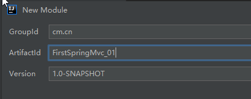
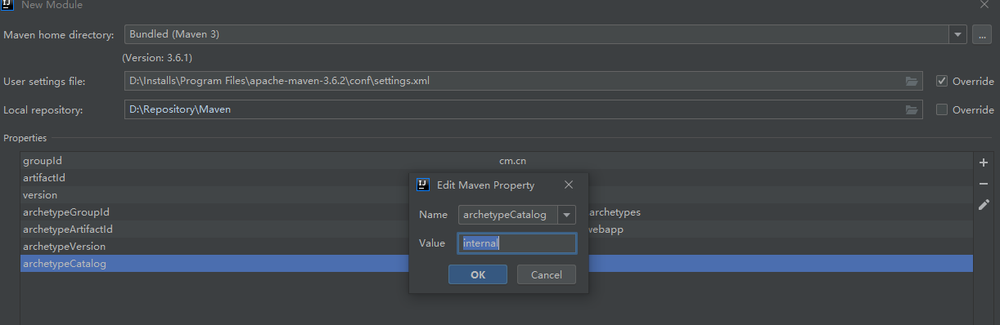

### 一、springmvc入门

创建第一个springmvc项目

<div align="center">  </div><br>

点击 next,

<div align="center">  </div><br>

点击 next，选择 maven 仓库，点击 + 添加一对键值对，解决 maven创建过慢的问题。 

```
key：archetypeCatalog
value:internal
```

<div align="center">  </div><br>