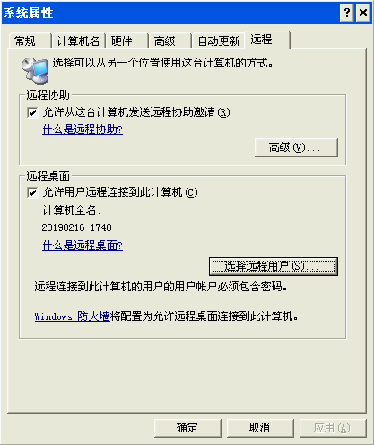
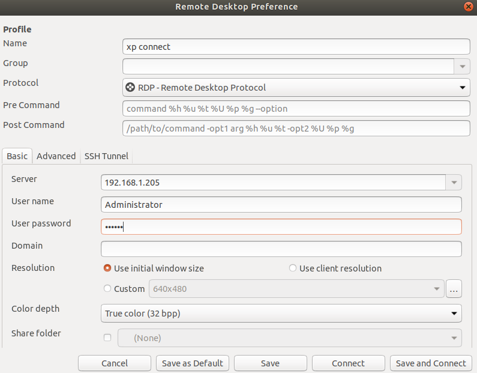

#### 1、ubuntu安装Remmina

参考[How to install Remmina](https://remmina.org/how-to-install-remmina/#)

```
sudo apt-add-repository ppa:remmina-ppa-team/remmina-next
sudo apt update
sudo apt install remmina remmina-plugin-rdp remmina-plugin-secret
```

#### 2、xp系统的设置

- 要在windows xp上设置一个有密码的账户，虽然尽量不用Administrator，但是我图方便还是用了。
- 得到ip地址
- 右键我的电脑，选择属性，然后选择远程，勾选允许用户远程连接到此计算机，再把上一步有密码的账户添加到远程桌面用户中，至此windows xp配置完毕。

<div align="center">  </div><br>
#### 3、使用Remmina连接xp

<div align="center">  </div><br>
然后点击Save and Connect 即可。

最后另外还有一种方法就是unbutu和windows系统都使用teamviewer个人版。