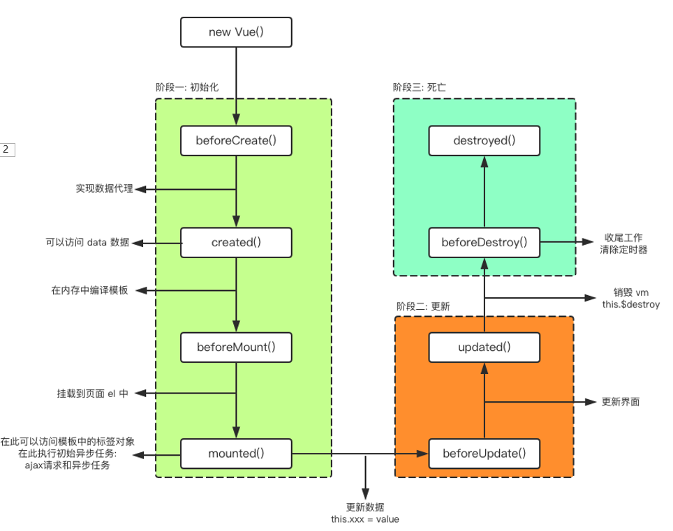

笔记来源：《[2019年最全最新Vue、Vuejs教程，从入门到精通](https://www.bilibili.com/video/BV15741177Eh?from=search&seid=1193450960557808037)》

### 一、邂逅Vuejs

- vue 读音 /vju:/ ，类似于 view
- vue是一个渐进式的框架，渐进式意味着你可以将vue作为你应用的一部分嵌入其中，带来更丰富的交互体验
- vue有很多特点和web开发中常见的高级功能
  - 解耦视图和数据
  - 可复用的组件
  - 前端路由技术
  - 状态管理
  - 虚拟DOM

#### 1.1、vue.js安装

安装Vue的方式有很多：

方式一：直接CDN引入

```js
<!-- 开发环境版本，包含了有帮助的命令行警告 --> 
<script src="https://cdn.jsdelivr.net/npm/vue/dist/vue.js"></script>

<!-- 生产环境版本，优化了尺寸和速度 -->
<script src="https://cdn.jsdelivr.net/npm/vue"></script>
```

方式二：下载和引入

```html
开发环境 https://vuejs.org/js/vue.js 

生产环境 https://vuejs.org/js/vue.min.js
```

方式三：NPM安装

后续通过`webpack`和`CLI`的使用，我们使用该方式

#### 1.2、小案例-计数器

```html
 <div id="app">
       <div class="input-num">
         <button @click="sub">-</button>
         <span>当前计数：{{num}}</span>
         <button @click="add">+</button>
       </div>
 </div>
    <script src="https://cdn.jsdelivr.net/npm/vue/dist/vue.js"></script>
    <script>
       var app = new Vue({
        el: '#app',
        data: {
          num: 1
        },
        methods:{
            add:function(){
                this.num++
            },
            sub:function(){{
                this.num--
            }
        }
      })
      </script>
```

#### 1.3、vue的mvvm

<div align="center">  </div><br>


View层：

- 视图层，在我们前端开发中，通常就是DOM层。主要的作用是给用户展示各种信息。

Model层：

- 数据层，数据可能是我们固定的死数据，更多的是来自我们服务器，从网络上请求下来的数据。

VueModel层：

- 视图模型层，视图模型层是View和Model沟通的桥梁。
- 一方面它实现了Data Binding，也就是数据绑定，将Model的改变实时的反应到View中
- 另一方面它实现了DOM Listener，也就是DOM监听，当DOM发生一些事件(点击、滚动、touch等)时，可以监听到，并在需要的情况下改变对应的Data。

> MVVM维基百科解释：`MVVM`有助于将图形用户界面的开发与业务逻辑或后端逻辑（数据模型）的开发分离开来，这是通过置标语言或`GUI`代码实现的。`MVVM`的视图模型是一个值转换器，这意味着视图模型负责从模型中暴露（转换）数据对象，以便轻松管理和呈现对象。在这方面，视图模型比视图做得更多，并且处理大部分视图的显示逻辑。视图模型可以实现中介者模式，组织对视图所支持的用例集的后端逻辑的访问。

计数器的MNNM，它们之间如何工作呢？

- 首先ViewModel通过Data Binding让obj中的数据实时的在DOM中显示。
- 其次ViewModel通过DOM Listener来监听DOM事件，并且通过methods中的操作，来改变obj中的数据。

有了Vue帮助我们完成VueModel层的任务，在后续的开发，我们就可以专注于数据的处理，以及DOM的编写工作了。

#### 1.4、Vue的options选项

你会发现，我们在创建Vue实例的时候，传入了一个对象options。

这个options中可以包含哪些选项呢？详细解析：[选项-数据](https://cn.vuejs.org/v2/api/#%E9%80%89%E9%A1%B9-%E6%95%B0%E6%8D%AE)

目前掌握这些选项：

el：决定之后Vue实例会管理哪一个DOM

data：Vue实例对应的数据对象（组件当中data必须是一个函数）

methods：定义属于Vue的一些方法，可以在其他地方调用，也可以在指令中使用

#### 1.5、Vue的生命周期

<div align="center">  </div><br>

### 二、基础语法

#### 2.1、插值操作

##### 2.1.1、Mustache语法

也就是双大括号

我们可以像下面这么使用，并且数据是响应式的

```html
 <div id="app">
        <h2>hello,{{name}}</h2>
		<h2>{{firstName}} {{lastName}}</h2>
        <h2>{{counter * 2}}</h2>
 </div>
 <script src="../js/vue.js"></script>
 <script>
       let vm = new Vue({
         el: '#app',
         data: {
           name:'VueJS',
           firstName:'coder',
           lastName: 'why',
           counter:100
        }
      })
 </script>
```

##### 2.1.2、v-once

在某些情况下，我们不希望界面随意的跟随改变，这个时候，我们就可以使用 `v-once `指令

- 该指令后面不需要跟任何表达式(比如之前的v-for后面是有跟表达式的)
- 该指令表示元素和组件(组件后面才会学习)只渲染一次，不会随着数据的改变而改变。

```html
 <div id="app">
        <h2 v-once="message"></h2>
 </div>
 <script src="../js/vue.js"></script>
 <script>
       let vm = new Vue({
        el: '#app',
        data: {
          message: 'Hello World！'
        }
      })
 </script>
```

就算对变量重新赋值，页面显示也不会改变

```js
vm.message = 'java gogogo'
```

##### 2.1.3、v-html

如果我们希望解析出HTML展示，可以使用v-html指令

- 该指令后面往往会跟上一个string类型
- 会将string的html解析出来并且进行渲染

```html
 <div id="app">
        <h2 v-html="link"></h2>
        <h2>{{link}}</h2>
 </div>
 <script src="../js/vue.js"></script>
 <script>
       let vm = new Vue({
        el: '#app',
        data: {
          link: '<a href="http://wwww.baidu.com">百度一下</a>'
        }
      })
 </script>
```

##### 2.1.4、v-text

- v-text作用和Mustache比较相似：都是用于将数据显示在界面中
- v-text通常情况下，接受一个string类型

```html
 <div id="app">
        <h2 v-text="message"></h2>
        <h2>{{message}}</h2>
 </div>
 <script src="../js/vue.js"></script>
 <script>
       let vm = new Vue({
        el: '#app',
        data: {
          message: 'Hello World！'
        }
      })
 </script>
```

##### 2.1.5、v-pre

v-pre用于跳过这个元素和它子元素的编译过程，用于显示原本的Mustache语法。

比如下面的代码：

- 第一个h2元素中的内容会被编译解析出来对应的内容

- 第二个h2元素中会直接显示{{message}}

```html
 <div id="app">
        <h2>{{message}}</h2>
        <h2 v-pre="message"></h2>
 </div>
 <script src="../js/vue.js"></script>
 <script>
       let vm = new Vue({
          el: '#app',
          data: {
            message: 'Hello World！'
        }
      })
 </script>
```

##### 2.1.6、v-cloak

- 在某些情况下，我们浏览器可能会直接显然出未编译的Mustache标签。
- cloak: 斗篷

```html
 <style>
     [v-cloak]{
         dispaly:none;
     }
 <style>
 <div id="app">
        <h2 v-cloak>Hello {{name}}</h2>
 </div>
 <script src="../js/vue.js"></script>
 <script>
     setTimeout(()=>{
         let vm = new Vue({
        	 el: '#app',
         	 data: {
           		name: 'VueJS！'
           }
        })
     },10000)
 </script>
```

添加了`v-cloak`会渲染完成后再显示

#### 2.2、绑定属性

##### 2.2.1、v-bind基础语法

v-bind用于绑定一个或多个属性值，或者向另一个组件传递props值(这个学到组件时再介绍)

在开发中，有哪些属性需要动态进行绑定呢？

- 还是有很多的，比如图片的链接src、网站的链接href、动态绑定一些类、样式等等

比如通过Vue实例中的data绑定元素的src和href，代码如下：

```html
<div id="app">
    <a v-bind:href="link">vue官网</a>
    

    <!--语法糖，省略写法-->
    <a :href="link">vue官网</a>
    
</div>

<script src="../js/vue.js"></script>
<script>
    let vm = new Vue({
        el: '#app',
        data: {
            link:'https://cn.vuejs.org/index.html',
            logoURL:'https://cn.vuejs.org/images/logo.png'
        }
    })
</script>
```

##### 2.2.2、v-bind绑定class

很多时候，我们希望动态的来切换class，比如：

- 当数据为某个状态时，字体显示红色。

- 当数据另一个状态时，字体显示黑色。

绑定class有两种方式：

- 对象语法

- 数组语法

绑定方式：对象语法

- 对象语法的含义是:class后面跟的是一个对象。

对象语法有下面这些用法：

```html
<!--用法一：直接通过{}绑定一个类-->
<h2 :class="{'active': isActive}">Hello World</h2>

<!--用法二：也可以通过判断，传入多个值-->
<h2 :class="{'active': isActive, 'line': isLine}">Hello World</h2>

<!--用法三：和普通的类同时存在，并不冲突
注：如果isActive和isLine都为true，那么会有title/active/line三个类-->
<h2 class="title" :class="{'active': isActive, 'line': isLine}">Hello World</h2>

<!--用法四：如果过于复杂，可以放在一个methods或者computed中 注：classes是一个计算属性-->
<h2 class="title" :class="classes">Hello World</h2>
```

演示案例：

```html
<head>
    <style>
        .active{
            color: red;
        }
    </style>
</head>
<body>
<div id="app">
    <h2 :class="{'active': isActive}">{{message}}</h2>
    <h2 :class="getClasses()">{{message}}</h2>
    <button v-on:click="btnClick">按钮</button>
</div>

<script src="../js/vue.js"></script>
<script>
    let vm = new Vue({
        el: '#app',
        data: {
            message:'Hello World',
            isActive:true,
            isLine:true
        },
        methods:{
            btnClick:function () {
                this.isActive=!this.isActive;
            },
            getClasses:function () {
                return {active:this.isActive,line:this.isLine}
            }
        }
    })
</script>
```

绑定方式：数组语法

- 数组语法的含义是:class后面跟的是一个数组。

数组语法有下面这些用法：

```html
<!--用法一：直接通过{}绑定一个类-->
<h2 :class="['active']">Hello World</h2>

<!--用法二：也可以传入多个值-->
<h2 :class=“[‘active’, 'line']">Hello World</h2>

<!--用法三：和普通的类同时存在，并不冲突  注：会有title/active/line三个类-->
<h2 class="title" :class=“[‘active’, 'line']">Hello World</h2>

<!--用法四：如果过于复杂，可以放在一个methods或者computed中  注：classes是一个计算属性-->
<h2 class="title" :class="classes">Hello World</h2>
```

演示案例:

```html
<body>
<div id="app">
    <h2 :class="[active , line]">{{message}}</h2>
    <h2 :class="getClasses()">{{message}}</h2>
</div>

<script src="../js/vue.js"></script>
<script>
    let vm = new Vue({
        el: '#app',
        data: {
            message:'Hello World',
            active:'aaaaa',
            line:'bbbbb'
        },
        methods:{
            getClasses:function () {
                return [this.active , this.line]
            }
        }
    })
</script>
```

##### 2.2.3、v-bind绑定style

我们可以利用v-bind:style来绑定一些CSS内联样式。

在写CSS属性名的时候，比如font-size

- 我们可以使用驼峰式 (camelCase) fontSize 

- 或短横线分隔 (kebab-case，记得用单引号括起来) ‘font-size’

绑定class有两种方式：

- 对象语法

  ```html
  :style="{color: currentColor, fontSize: fontSize + 'px'}"
  ```

  style后面跟的是一个对象类型
  对象的key是CSS属性名称
  对象的value是具体赋的值，值可以来自于data中的属性

- 数组语法

  ```html
  <div v-bind:style="[baseStyles, overridingStyles]"></div>
  ```

  style后面跟的是一个数组类型
  多个值以，分割即可


#### 2.3、计算属性

#### 2.5、事件监听

#### 2.5、条件和循环

#### 2.6、阶段案例

#### 2.7、表单绑定

### 三、组件开发

### 四、Vue CLI详解