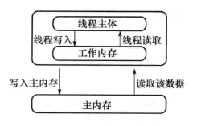
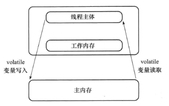
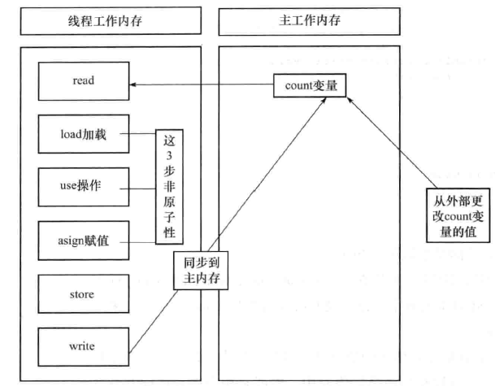

## 一、多线程技能

### 1、实现多线程

（1）继承 Thread 类

（2）实现 Runnable 接口

### 2、停止线程


（1）共享 bool 类型变量方式；

（2）调用线程 interrupt 方式，同时通过 isInterrupted 方式判断线程是否被停止，若停止则终止循环操作（线程类中循环外没有其他操作）；

（3）调用线程 interrupt 方式 ＋ 抛出异常方式（循环外有其他操作情况）；

（4）调用线程 interrupt 方式 ＋ return 方式（循环外有其他操作情况）；

（5）将线程设置为守护线程，则所有非守护线程停止时，守护线程便结束；

[interrupt、interrupted和isInterrupted的区别](https://blog.csdn.net/hj7jay/article/details/53462553)

建议使用抛出异常的方式：异常可上抛


### 3、暂停线程

1. suspend() 暂停线程
2. resume() 恢复线程


**缺点**：容易造成公共的同步对象的独占， 使其他对象无法访问公共同步对象。


 看下面案例
```java
public class FirstDemo {
	public static void main(String[] args) {
		try {
			MyThread tt = new MyThread();
			tt.start();
			Thread.sleep(2000);
			tt.suspend();
			System.out.println("main end");
		} catch (InterruptedException e) {
			e.printStackTrace();
		}

	}
}
```

```java
public class MyThread extends Thread {
	private long i = 0;

	public void run() {
		while (true) {
			i++;
			//System.out.println(i++); 
		}
	}
}
```
如果注释掉上面输出这行，控制台会有 main end 输出，但是取消注释，输出到一定数字就不动了。

```
983543
983545
983547
983549
983551
983553
```

为什么？

原因是，println() 方法是同步的，当线程进入 println() 方法时获得了同步锁，而此时挂起线程导致同步锁不被释放，所以主线程的 println() 方法不会执行。这就是独占特性。

println() 源代码：
```java
    public void println(long x) {
        synchronized (this) {
            print(x);
            newLine();
        }
    }
```

另外，在使用 suspend 和 resume 方法也容易出现因为线程的暂停导致数据不一致的情况。

### 4、yield 方法

yield() 方法的作用：放弃当前的 cpu 资源，将它让给其他任务去占用 cpu 执行时间。但放弃的时间不确定，有可能刚刚放弃，马上又获得 cpu 时间片。

先了解一下线程优先级，线程总是存在优先级，优先级范围在 1~10 之间。

JVM 线程调度程序是基于优先级的抢先调度机制。在大多数情况下，当前运行的线程优先级将大于或等于线程池中任何线程的优先级。

线程的优先级具有继承性。

高优先级的线程总是大部分先执行完，但不代表高优先级的线程全部先执行完。

优先级高的线程不是每一次都先执行完。优先级具有随机性。

设置优先级 setPriority() 方法的源码：

```java
    public final void setPriority(int newPriority) {public class MyThread extends Thread {
        ThreadGroup g;
        checkAccess();
        if (newPriority > MAX_PRIORITY || newPriority < MIN_PRIORITY) {
            throw new IllegalArgumentException();
        }
        if((g = getThreadGroup()) != null) {
            if (newPriority > g.getMaxPriority()) {
                newPriority = g.getMaxPriority();
            }
            setPriority0(priority = newPriority);
        }
    }
```
yield() 应该做的是让当前运行线程回到可运行状态，以允许具有相同优先级的其他线程获得运行机会。实际中无法保证 yield() 达到让步目的，因为让步的线程还有可能被线程调度程序再次选中。 

结论：yield() 从未导致线程转到等待/睡眠/阻塞状态。在大多数情况下，yield() 将导致线程从运行状态转到可运行状态，但有可能没有效果。

### 5、join 方法

Thread 的非静态方法 join() 让一个线程 B“加入”到另外一个线程 A 的尾部。在 A 执行完毕之前，B 不能工作。例如：

```java
Thread t = new MyThread();
        t.start();
        t.join(); 
```
另外，join() 方法还有带超时限制的重载版本。 例如 t.join(5000);则让线程等待 5000 毫秒，如果超过这个时间，则停止等待，变为可运行状态。 

线程的加入 join() 对线程栈导致的结果是线程栈发生了变化，当然这些变化都是瞬时的。  

**小结**：线程离开运行状态的几种方法： 

1、调用 Thread.sleep()：使当前线程睡眠至少多少毫秒（尽管它可能在指定的时间之前被中断）。 

2、调用 Thread.yield()：不能保障太多事情，尽管通常它会让当前运行线程回到可运行性状态，使得有相同优先级的线程有机会执行。 

3、调用 join() 方法：保证当前线程停止执行，直到该线程所加入的线程完成为止。然而，如果它加入的线程没有存活，则当前线程不需要停止。

除了以上三种方式外，还有下面几种特殊情况可能使线程离开运行状态： 

1、线程的 run() 方法完成。 

2、在对象上调用 wait() 方法（不是在线程上调用）。 

3、线程不能在对象上获得锁定，它正试图运行该对象的方法代码。 

4、线程调度程序可以决定将当前运行状态移动到可运行状态，以便让另一个线程获得运行机会，而不需要任何理由。

### 6、守护线程

java的线程分为两种：User Thread(用户线程)、DaemonThread(守护线程)。

只要当前JVM实例中尚存任何一个非守护线程没有结束，守护线程就全部工作；只有当最后一个非守护线程结束时，守护线程随着JVM一同结束工作，Daemon作用是为其他线程提供便利服务，守护线程最典型的应用就是GC(垃圾回收器)，他就是一个很称职的守护者。

## 二、对象及变量的并发访问
### 1、synchronized 同步方法

#### 1.1. 方法内的变量为线程安全

**方法中的变量**不存在线程安全问题，永远都是线程安全的。这是方法内部的变量是私有的特性造成的。

#### 1.2. 实例变量非线程安全

1. 多个线程访问一个**对象的实例变量**，则可能出现“脏读”（非线程安全）。
2. 多个线程访问一个不同步的方法时，则可能出现“脏读”（非线程安全）。

在方法前，加入 synchronized 之后即可同步。

#### 1.3. 多个对象多个锁

看下面代码：

```java
public class HasSelfPrivateNum {  
    private int num = 0;  
    synchronized public void addI(String username) {  
        try {  
            if (username.equals("a")) {  
                num = 100;  
                System.out.println("a set over!");  
                Thread.sleep(2000);  
            } else {  
                num = 200;  
                System.out.println("b set over!");  
            }  
            System.out.println(username + " num=" + num);  
        } catch (InterruptedException e) {  
            e.printStackTrace();  
        }  
    }  
} 
```
```java
public class ThreadA extends Thread {
	private HasSelfPrivateNum numRef;
	public ThreadA(HasSelfPrivateNum numRef) {
		super();
		this.numRef=numRef;
	}
	public void run() {
		super.run();
		numRef.addI("A");
	}
}
```

```java
public class ThreadB extends Thread {
	private HasSelfPrivateNum numRef;
	public ThreadB(HasSelfPrivateNum numRef) {
		super();
		this.numRef=numRef;
	}
	public void run() {
		super.run();
		numRef.addI("b");
	}
}
```

运行：

```java
public class Run {  
    public static void main(String[] args) {  
        HasSelfPrivateNum numRef1 = new HasSelfPrivateNum();  
        HasSelfPrivateNum numRef2 = new HasSelfPrivateNum();  
        ThreadA athread = new ThreadA(numRef1);  
        athread.start();  
        ThreadB bthread = new ThreadB(numRef2);  
        bthread.start();  
    }  
} 
```
运行结果：

```
a set over!
b set over!
b num=200
a num=100
```

问题：从上面程序运行结果来看，虽然在 HasSelfPrivateNum.java 中使用了 synchronized 关键字，但打印的顺序却不是同步的，是交叉的。为什么是这样的结果呢？

关键字 synchronized 取得的锁都是对象锁，而不是把一段代码或方法（函数）当作锁，所以在上面的示例中，哪个线程先执行带 synchronized 关键字的方法，哪个线程就持有该方法所属对象的锁 Lock，那么其他线程只能呈等待状态，前提是多个线程访问的是同一个对象。

但如果多个线程访问多个对象，则 JVM 会创建多个锁。上面的示例就是创建了 2 个 HasSelfPrivateNum.java 类的对象，所以就会产生出 2 个锁。

同步的单词为 synchronized，异步的单词为 asynchronized。

#### 1.4. synchronized 方法与锁对象

上面这个案例，如果在类 Run 的 main 方法里只创建一个对象，  

如果 HasSelfPrivateNum 的方法加 synchronized，A 线程先持有 object 对象的 Lock 锁，B 线程如果在这时调用 object 对象中的 synchronized 类型的方法则需等待，也就是同步。

#### 1.5. 脏读

虽然在赋值时进行了同步，但在取值时有可能出现一些意想不到的意外，这种情况就是脏读（dirtyRead）。发生脏读的情况是在读取实例变量时，此值已经被其他线程更改过了。

> 当 A 线程调用 anyObject 对象加入 synchronized 关键字的 X 方法时，A 线程就获得了 X 方法锁，更准确地讲，是获得了对象的锁，所以其他线程必须等 A 线程执行完毕才可以调用 X 方法，但 B 线程可以随意调用其他的非 synchronized 同步方法。

> 当 A 线程调用 anyObject 对象加入 synchronized 关键字的 X 方法时，A 线程就获得了 X 方法所在对象的锁，所以其他线程必须等 A 线程执行完毕才可以调用 X 方法，而 B 线程如果调用声明了 synchronized 关键字的非 X 方法时，必须等 A 线程将 X 方法执行完，也就是释放对象锁后才可以调用。这时 A 线程已经执行了一个完整的任务，这时 A 线程调用的 X 方法的内容被完整执行了，不会出现脏读。

脏读一定会出现操作实例变量的情况下，这就是不同线程“争抢”实例变量的结果。

#### 1.6. synchronized 锁重入

关键字 synchronized 拥有锁重入的功能，也就是在使用 synchronized 时，当一个线程得到一个对象锁后，再次请求此对象锁时是可以再次得到该对象的锁的。这也证明**在一个 synchronized 方法/块的内部调用本类的其他 synchronized 方法/块时**，是永远可以得到锁的。

可重入锁也支持在父子类继承的环境中。存在父子类继承关系时，子类是完全可以通过“可重入锁”**调用**父类的同步方法的。

#### 1.7. 出现异常时，锁自动释放

#### 1.8. 同步不具有继承性

同步不能继承，所以还得在子类的方法中添加 synchronized 关键字

### 2、synchronized 同步语句块

用关键字 synchronized 声明方法在某些情况下是有弊端的，比如 A 线程调用同步方法执行一个长时间的任务，那么 B 线
程则必须等待比较长时间。在这样的情况下可以使用 synchronized 同步语句块来解决。

不在 synchronized 块中就是异步执行，在 synchronized 块中就是同步执行。

同步 synchronized(this) 代码块是锁定当前对象的

多个线程调用同一个对象中的不同名称的 synchronized 同步方法或 synchronized(this) 同步代码块时，调用的效果就是按顺序执行，也就是同步的，阻塞的。

Java 还支持对“任意对象”作为“对象监视器”来实现同步的功能。这个“任意对象”大多数是实例变量及方法的参数，使用 synchronized(非 this 对象) 格式的作用只有 1 种：

synchronized(非 this 对象 x) 同步代码块。

“synchronized(非 this 对象 x)”格式的写法是将 x 对象本身作为“对象监视器”：

> 当多个线程同时执行 synchronized(x){} 同步代码块时呈同步结果。

> 当其他线程执行**x 对象中 synchronized 同步方法**时呈同步效果。

> 当其他线程执行**x 对象方法里面的 synchronized(this) 代码块**时也呈现同步效果。

需要注意的是：如果其他线程调用不加 synchronized 关键字的方法时，还是异步调用。

#### 2.1. 静态同步 synchronized 方法与 synchronized(类名.class) 语句块

> **关键字 synchronized 加在 static 静态方法上，是给当前*.java 文件对应的 Class 类上锁；而加在非 static 静态方法上，是给对象上锁**。

synchronized 关键字加 static 静态方法和 synchronized 加到非 static 方法上的区别：一个锁的是 class 类，一个锁的是当前的对象。

同步 synchronized（class）代码块的作用和 synchronized static 方法作用一样。

#### 2.2. String 的常量池特性

在JVM中具有常量池缓存功能,例如： 

```java
public static void main(String[] args) {
       String s1 = "hello";
       String s2 = "hello";
       String s3 = "he" + "llo";
       String s4 = "hel" + new String("lo");
       String s5 = new String("hello");
       String s6 = s5.intern();
       String s7 = "h";
       String s8 = "ello";
       String s9 = s7 + s8;
        //在jdk1.6,1.7,1.8下运行的结果为：
        System.out.println(s1==s2);//true
        System.out.println(s1==s3);//true
        System.out.println(s1==s4);//false
        System.out.println(s4==s5);//false
        System.out.println(s1==s6);//true
        System.out.println(s1==s9);//false
       
    }
```
 将 synchronized(string) 同步块与 string 联合使用时，要注意常量池带来的一些意外：
 例如：

```java
public class Service {
    public static void print(String parm) throws InterruptedException{
        synchronized (parm) {
            while(true){
                System.out.println("线程名："+Thread.currentThread().getName());
                Thread.sleep(1000);
            }
        }
    }

    public static void main(String[] args) {
        Service s=new Service();
        ThreadA a=new ThreadA(s);
        a.setName("A");
        a.start();
        ThreadB b=new ThreadB(s);
        b.setName("B");
        b.start();
    }
}
```
```java
public class ThreadA extends Thread {
	private Service s;
	public ThreadA(Service s) {
		super();
		this.s=s;
	}
	public void run() {
		try {
			s.print("AAAA");
		} catch (InterruptedException e) {
			e.printStackTrace();
		}
	}
}
```

```java
public class ThreadB extends Thread {
	private Service s;
	public ThreadB(Service s) {
		super();
		this.s=s;
	}
	public void run() {
		try {
			s.print("AAAA");
		} catch (InterruptedException e) {
			e.printStackTrace();
		}
	}
}
```

运行结果表明一直运行的 A 线程，这是因为两个线程传入的 string 值都是 AAAA，两个线程持有相同的锁，导致线程 B 不能执行。这就是 string 常量池导致的问题，因此大多数情况下，同步 synchronized 代码块都不使用 String 作为锁对象，而改用其他，比如 new Object() 实例化一个 Object 对象，但它并不放入缓存中。

#### 2.3. 同步 synchronized 方法无限等待与解决 

例如：

```java
public class Service {
  synchronized  public void methodA(){
      System.out.println("methodA begin");
      boolean isContinueRun = true;
      while (isContinueRun) {

      }
      System.out.println("methodA end");
  }

  synchronized  public void methodB(){
      System.out.println("methodB begin");
      System.out.println("methodB end");
  }
}
```
 

```java
public class ThreadA extends Thread {
	private Service s;
	public ThreadA(Service s) {
		super();
		this.s=s;
	}
	public void run() {
		 s.methodA();
		 
	}
}
```

```java
public class ThreadB extends Thread {
	private Service s;
	public ThreadB(Service s) {
		super();
		this.s=s;
	}
	public void run() {
	s.methodB();
	}
}
```

运行：
```java
public class Test {
    public static void main(String[] args) {
        Service service = new Service();
        ThreadA threadA = new ThreadA(service);
        threadA.setName("a");
        threadA.start();
        ThreadB threadB = new ThreadB(service);
        threadB.setName("b");
        threadB.start();
    }
}
```
运行结果:b 线程一直得不到运行。

当一个类中，有两个 synchronized 方法，其中一个方法是一个死循环，当多个线程调用类中的不同方法时，会造成死锁。

解决方法是把 synchronized 方法转换成在方法中加 synchronized 语句块，而且两个方法持有不同的对象，这就解决了死锁问题，当多个线程调用不同方法时，虽然一个线程出现死锁，但不影响其他应用调用另一个方法。
改成：

```java
public class Service {
    Object object1 = new Object();
    public void methodA(){
        synchronized (object1) {
            System.out.println("methodA begin");
            boolean isContinueRun = true;
            while (isContinueRun) {

            }
            System.out.println("methodA end");
        }
  }
    Object object2 = new Object();
    public void methodB(){
        synchronized (object2) {
            System.out.println("methodB begin");
            System.out.println("methodB end");
        }
  }
}
```

#### 2.4. 多线程的死锁

java 死锁是因为不同的线程都在等待根本不可能释放的锁，从而导致所有任务都无法继续完成。
```java
public class DeadThread implements  Runnable{
    public String username;
    public Object object1 = new Object();
    public Object object2 = new Object();
    public void setFlag(String username) {
        this.username = username;
    }
    @Override
    public void run() {
        if (username.equals("a")) {
            synchronized (object1) {
                try {
                    System.out.println("username="+username);
                    Thread.sleep(2000);
                } catch (InterruptedException e) {
                    e.printStackTrace();
                }
                synchronized (object2) {
                    System.out.println("按lock1-》lock2代码顺序执行了");
                }
            }
        }

        if (username.equals("b")) {
            synchronized (object2) {
                try {
                    System.out.println("username="+username);
                    Thread.sleep(2000);

                } catch (InterruptedException e) {
                    e.printStackTrace();
                }

                synchronized (object1) {
                    System.out.println("按lock2-》lock1代码顺序执行了");
                }
            }
        }
    }
}
```

```java
public class Run {
    public static void main(String[] args) {
        try {
            DeadThread t1 = new DeadThread();
            t1.setFlag("a");
            Thread thread1 = new Thread(t1);
            thread1.start();
            Thread.sleep(100);
            t1.setFlag("b");
            Thread t2 = new Thread(t1);
            t2.start();
        } catch (InterruptedException e) {
            e.printStackTrace();
        }
    }
}
```
运行结果：
```
username=a
username=b
```
可以用 jdk 自带的工具来监测是否有死锁现象。进入命令行,cd 进入 jdk 安装的 bin 目录，执行 jps 命令,看到结果：

```
jing@ubuntu:/opt/jdk1.7.0_80/bin$ jps
20116 FirstDemo
22411 Jps
22375 Run
20067 FirstDemo
19848 org.eclipse.equinox.launcher_1.5.100.v20180827-1352.jar
```

​	 得到运行的线程 Run 的 id 值是 22375，再执行 jstack  22375，查看结果：

```
Java stack information for the threads listed above:
===================================================
"Thread-1":
	at com.thread.test.DeadThread.run(DeadThread.java:37)
	- waiting to lock <0x00000007d705bee0> (a java.lang.Object)
	- locked <0x00000007d705bef0> (a java.lang.Object)
	at java.lang.Thread.run(Thread.java:745)
"Thread-0":
	at com.thread.test.DeadThread.run(DeadThread.java:21)
	- waiting to lock <0x00000007d705bef0> (a java.lang.Object)
	- locked <0x00000007d705bee0> (a java.lang.Object)
	at java.lang.Thread.run(Thread.java:745)

Found 1 deadlock.
```

监测出现死锁。

死锁是程序设计的 bug,在程序设计时就要避免双方互相持有对方锁的情况，需要说明的是，本实验使用 synchronized 嵌套的代码结构来实现死锁，

其实不用嵌套的 synchronized 代码结构也会出现死锁，与是否嵌套无任何关系，不要被代码结构所误导，只要互相等待双方释放就有可能出现死锁。

### 3、 volatile 关键字

 volatile 关键字的主要作用使变量在多个线程间可见。

#### 3.1. 关键字 volatile 与死循环 

例如： 想通过改变 flag 的值，从而停止对 service 的 test() 方法，进行停止。

```java
public class Test {
	public static void main(String[] args) {
		Service service = new Service();
		service.test();
		System.out.println("我要停止他。。。。");
		service.setFlag(false);
	}
}
class Service{
	private boolean flag = true;
	public boolean isFlag() {
		return flag;
	}
	public void setFlag(boolean flag) {
		this.flag = flag;
	}
	public void test(){
		while(flag){
			System.out.println("run test threadName="+Thread.currentThread().getName());
			try {
				Thread.sleep(1000);
			} catch (InterruptedException e) {
				e.printStackTrace();
			}
		}
	}
}
```
由于 test() 方法尚未执行完成，所以主线程（main）不会执行后续代码。如果想要解决，当然是用多线程技术了。

#### 3.2  解决同步死循环

```java
public class Test2 {
	public static void main(String[] args) {
		final Service2 s2 = new Service2();
		Thread thread = new Thread(new  Runnable() {
			public void run() {
				s2.test();
			}
		},"service2");
		thread.start();
		try {
			Thread.sleep(5000);
		} catch (InterruptedException e) {
			e.printStackTrace();
		}
		System.out.println("我要停止他。。。。");
		s2.setFlag(false);
	}
}
class Service2{
	private volatile boolean flag = true;
 
	public boolean isFlag() {
		return flag;
	}
 
	public void setFlag(boolean flag) {
		this.flag = flag;
	}
	public void test(){
		while(flag){
			System.out.println("run test threadName="+Thread.currentThread().getName());
			try {
				Thread.sleep(1000);
			} catch (InterruptedException e) {
				e.printStackTrace();
			}
		}
	}
}
```

注意：**如果没有添加 volatile，那么同样的程序运行在 JVM 为-server 服务器的环境中，会出现死锁**。内存结构如图：

 <div align="center">  </div>

 

原因：

1、-server 模式为了线程运行的效率，线程一直在私有堆栈中取得的 flag 的值为 true，而 main 中设置的 flag=false，更新的却是公共堆栈中的 flag 值。

2、而 volatile 的作用就是强制从公共堆栈中取得变量的值，而不是从线程私有数据栈中取得变量的值。

3、总而言之，就是由于私有堆栈中的值和公共堆栈的值不同步造成的。

添加 volatile 修饰以后，内存结构如图：

 <div align="center">  </div>


####  3.3 volatile 与 synchronized 的比较

使用 volatile 关键字，增加了实例变量在多个线程之间的可见性，但 volatile 关键字最致命的缺点是**不支持原子性**。

1、关键字 volatile 是线程同步的轻量级表现，所以 volatile 的性能肯定比 synchronized 要好，并且 volatile 只能修饰于变量，而 synchronized 可以修饰方法，以及代码块。

2、多线程访问 volatile 不会发生阻塞，而 synchronized 会出现阻塞

3、volatile 能保证数据的可见性，但是不能保证原子性。而 synchronized 可以保证原子性，也可以间接保证可见性，以为它会将私有内存和公共内存的数据作同步。

4、关键字 volatile 解决的是变量在多个线程之间的可见性；而 synchronized 关键字解决的是多个线程之间访问资源的同步性。

#### 3.4 volatile 非原子的特性

volatile 关键字只具有可见性，没有原子性，要实现原子性建议使用 atomic 类的系列对象，支持原子性操作（注意 atomic 类只保证本身方法的原子性，并不保证多次操作的原子性） 

```java
public class VolatileNoAtomic extends Thread{
	private static volatile int count;
	//private static AtomicInteger count = new AtomicInteger(0);
	/*synchronized*/
	private  static void addCount(){
		for (int i = 0; i < 1000; i++) {
			count++ ;
			//count.incrementAndGet();
		}
		System.out.println(count);
	}
	public void run(){
		addCount();
	}
	
	/*10个线程对一个count变量进行++操作*/
	public static void main(String[] args) {
		VolatileNoAtomic[] arr = new VolatileNoAtomic[100];
		for (int i = 0; i < 10; i++) {
			arr[i] = new VolatileNoAtomic();
		}
		for (int i = 0; i < 10; i++) {
			arr[i].start();
		}
	}
}
```
代码最终输出结果应为10000，但实际输出结果如下。

```
1000
2000
3000
4000
5009
5836
6836
7836
9338
9589
```

可以使用 AtomicINTEGER 原子性进行实现，原子操作是不能分割的整体，没有其他线程能够中断或检查正在原子操作中的变量。一个原子类型就是一个原子操作可用的类型，它可以在没有锁的情况下做到线程安全（thread-saft）。将 private static volatile int count;换成 private static AtomicInteger count = new AtomicInteger(0)。将 count++换成 count.incrementAndGet();

注意：原子类也并不完全安全，  当多个线程调用增加方法时，结果值是正确的但是增加顺序却不是正确的，因为虽然方法本身使用 AtomicInteger 是原子的，但是方法与方法之间的调用却不是原子的，解决办法是在增加的方法上添加 synchronized 关键字。

#### 3.5 synchronized 代码块有 volatile 同步的功能 

关键字 synchronized 可以使多个线程访问同一个资源具有同步性，而且他还具有将线程工作内存中的私有变量与公共内存中的变量同步的功能。
例如：

```java
public class Service { 
	private boolean isContinueRun = true;
    public void runMethod() {
        while(isContinueRun == true) {
        }
        System.out.println("停下来了");
    }

	public void stopMethod() {
		isContinueRun = false;
	}

}
```
```java
public class ThreadA extends Thread {
	private Service s;
	public ThreadA(Service s) {
		super();
		this.s=s;
	}	
	public void run() {
		s.runMethod();
	}
}
```

```java
public class ThreadB extends Thread {
	private Service s;
	public ThreadB(Service s) {
		super();
		this.s=s;
	}
	public void run() {
		s.stopMethod();
	}
}
```

运行：

```java
public class Run {
    public static void main(String[] args) {
        try {
            Service service = new Service();
            ThreadA threadA = new ThreadA(service);
            threadA.start();
            Thread.sleep(2000);
            ThreadB threadB = new ThreadB(service);
            threadB.start();
            System.out.println("已经发起停止的命令");
        } catch (InterruptedException e) {
            e.printStackTrace();
        }

    }
}
```
已经发起停止的命令，以-server 服务器模式运行得到死循环

得到上面结果的原因是各个线程间的数据值没有可视性造成的。而关键字 synchronized 具有可视性。改进：

```java
public class Service {
    private boolean isContinueRun = true;
    public void runMethod() {
        String anything =new String();
        while(isContinueRun == true) {
           synchronized (anything) {
			
		   }
        }
        System.out.println("停下来了");
    }
    public void stopMethod() {
        isContinueRun = false;
    }
}
```
关键字 synchronized 可以保证在同一时刻，只有一个线程可以执行某一个方法或者某一个代码块

他包含了两个特性，互斥性和可见性，同步 synchronized 不仅可以解决一个线程看到的对象处于不一致的状态，还可以保证进入同步方法或者同步代码块的每个线程都看到由同一个锁保护之前的修改效果。

 总结： 如果想修改实例变量中的数据，比如 i++，也就是 i=i+1，则这样的操作其实并不是一个原子操作，也就是非线程安全的。表达式 i++的操作步骤分解如下：

- ①从内存中取出 i 的值；
- ②计算 i 的值
- ③将 i 的值写到内存中

假如在第 2 步计算值的时候，另一个线程也修改 i 的值，那么这个时候就会出现脏数据。解决的办法其实就是使用 synchronized 关键字，volatile 本身并不处理数据的原子性，而是强制对数据的读写及时影响到主内存中。

变量在内存中的工作过程：

(1)read 和 load 阶段：从主存内存复制变量到当前线程工作内存；

(2)use 和 assign 阶段:执行代码，改变共享变量值；

(3)store 和 write 阶段：用工作内存数据，刷新主存对应变量的值

 <div align="center">  </div>

 