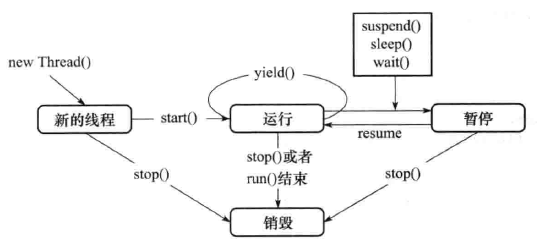
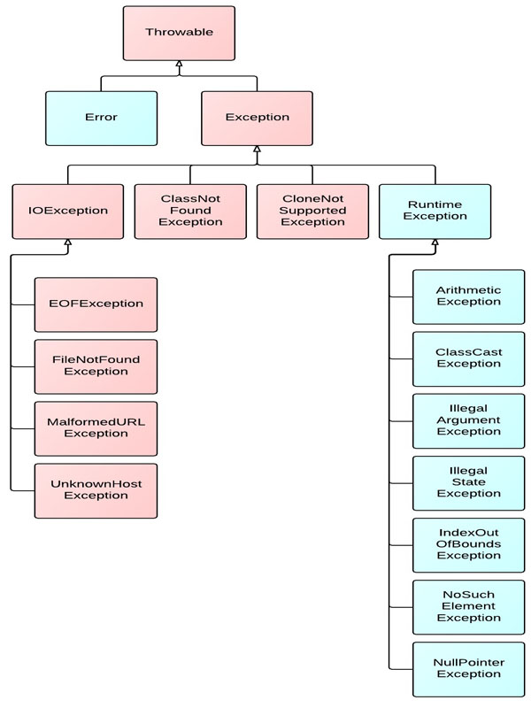

  * [1、实现多线程](#1实现多线程)
     * [2、停止线程](#2停止线程)
     * [3、暂停线程](#3暂停线程)
     * [4、yield 方法](#4yield-方法)
     * [5、join 方法](#5join-方法)
     * [6、守护线程](#6守护线程)
  * [二、对象及变量的并发访问](#二对象及变量的并发访问)
     * [1、synchronized 同步方法](#1synchronized-同步方法)
        * [1.1. 方法内的变量为线程安全](#11-方法内的变量为线程安全)
        * [1.2. 实例变量非线程安全](#12-实例变量非线程安全)
        * [1.3. 多个对象多个锁](#13-多个对象多个锁)
        * [1.4. synchronized 方法与锁对象](#14-synchronized-方法与锁对象)
        * [1.5. 脏读](#15-脏读)
        * [1.6. synchronized 锁重入](#16-synchronized-锁重入)
        * [1.7. 出现异常时，锁自动释放](#17-出现异常时锁自动释放)
        * [1.8. 同步不具有继承性](#18-同步不具有继承性)
     * [2、synchronized 同步语句块](#2synchronized-同步语句块)
        * [2.1. 静态同步 synchronized 方法与 synchronized(类名.class) 语句块](#21-静态同步-synchronized-方法与-synchronized类名class-语句块)
        * [2.2. String 的常量池特性](#22-string-的常量池特性)
        * [2.3. 同步 synchronized 方法无限等待与解决](#23-同步-synchronized-方法无限等待与解决)
        * [2.4. 多线程的死锁](#24-多线程的死锁)
     * [3、 volatile 关键字](#3-volatile-关键字)
        * [3.1. 关键字 volatile 与死循环](#31-关键字-volatile-与死循环)
        * [3.2.  解决同步死循环](#32--解决同步死循环)
        * [3.3. volatile 与 synchronized 的比较](#33-volatile-与-synchronized-的比较)
        * [3.4. volatile 非原子的特性](#34-volatile-非原子的特性)
        * [3.5 synchronized 代码块有 volatile 同步的功能](#35-synchronized-代码块有-volatile-同步的功能)
     * [三、等待通知机制](#三等待通知机制)
        * [4.1 等待通知机制的实现](#41-等待通知机制的实现)
        * [4.2 方法 wait() 锁释放与 notify() 锁不释放](#42-方法-wait-锁释放与-notify-锁不释放)
        * [4.3 生产者/消费者模式实现](#43-生产者消费者模式实现)
        * [4.4 使用管道进行线程间通信：字节流/字符流](#44-使用管道进行线程间通信字节流字符流)
     * [四、方法 join 的使用](#四方法-join-的使用)
     * [五、类 ThreadLocal 的使用](#五类-threadlocal-的使用)
     * [六、类 InheritableThreadLocal 的使用](#六类-inheritablethreadlocal-的使用)
     * [七、使用 ReentrantLock 类](#七使用-reentrantlock-类)
        * [多线程中使用 Condition 实现等待/通知](#多线程中使用-condition-实现等待通知)
        * [公平锁与非公平锁](#公平锁与非公平锁)
        * [使用 condition 实现顺序执行](#使用-condition-实现顺序执行)
     * [八、使用 ReentranReadWriteLock 类](#八使用-reentranreadwritelock-类)
     * [九、定时器 Timer](#九定时器-timer)
        * [9.1 schedule(TimerTask task,Date time)](#91-scheduletimertask-taskdate-time)
        * [9.2 schedule(TimerTask task,Date firstTime,long period)](#92-scheduletimertask-taskdate-firsttimelong-period)
        * [9.3 schedule(TimerTask task,long delay)](#93-scheduletimertask-tasklong-delay)
        * [9.4 schedule(TimerTask task,long delay,long period)](#94-scheduletimertask-tasklong-delaylong-period)
        * [9.5 scheduleAtFixedRate(TimerTask task,Date firestTime,long period)](#95-scheduleatfixedratetimertask-taskdate-firesttimelong-period)
     * [十、单例模式与多线程](#十单例模式与多线程)
        * [10.1 立即加载/“饿汉模式"](#101-立即加载饿汉模式)
        * [10.2 延迟加载/“懒汉模式”](#102-延迟加载懒汉模式)
        * [10.3 使用静态内置类实现单例模式](#103-使用静态内置类实现单例模式)
        * [10.4 序列化与反序列化的单例模式实现](#104-序列化与反序列化的单例模式实现)
        * [10.5 使用静态代码块实现单例模式](#105-使用静态代码块实现单例模式)
        * [10.6使用 enum 枚举类型实现单例模式](#106使用-enum-枚举类型实现单例模式)
     * [十一、线程补充](#十一线程补充)
        * [11.1 线程的状态](#111-线程的状态)
        * [11.2 线程组](#112-线程组)
           * [1、线程对象关联线程组：1级关联](#1线程对象关联线程组1级关联)
           * [2、线程对象关联线程组：多级关联](#2线程对象关联线程组多级关联)
           * [3、线程组自动归属特性](#3线程组自动归属特性)
           * [4、获取根线程组](#4获取根线程组)
           * [5、组内的线程批量停止](#5组内的线程批量停止)
        * [11.3 使线程具有有序性](#113-使线程具有有序性)
        * [11.4 SimpleDateFormat 非线程安全](#114-simpledateformat-非线程安全)
           * [1. 为什么 SimpleDateFormat 不是线程安全的？](#1-为什么-simpledateformat-不是线程安全的)
           * [2. 问题重现：](#2-问题重现)
           * [3. 解决方案：](#3-解决方案)
        * [11.5 线程中出现异常的处理](#115-线程中出现异常的处理)
        * [11.6 线程组内处理异常](#116-线程组内处理异常)

一、多线程技能

### 1、实现多线程

（1）继承 Thread 类

（2）实现 Runnable 接口

### 2、停止线程


（1）共享 bool 类型变量方式；

（2）调用线程 interrupt 方式，同时通过 isInterrupted 方式判断线程是否被停止，若停止则终止循环操作（线程类中循环外没有其他操作）；

（3）调用线程 interrupt 方式 ＋ 抛出异常方式（循环外有其他操作情况）；

（4）调用线程 interrupt 方式 ＋ return 方式（循环外有其他操作情况）；

（5）将线程设置为守护线程，则所有非守护线程停止时，守护线程便结束；

[interrupt、interrupted和isInterrupted的区别](https://blog.csdn.net/hj7jay/article/details/53462553)

建议使用抛出异常的方式：异常可上抛


### 3、暂停线程

1. suspend() 暂停线程
2. resume() 恢复线程


**缺点**：容易造成公共的同步对象的独占， 使其他对象无法访问公共同步对象。


 看下面案例
```java
public class FirstDemo {
	public static void main(String[] args) {
		try {
			MyThread tt = new MyThread();
			tt.start();
			Thread.sleep(2000);
			tt.suspend();
			System.out.println("main end");
		} catch (InterruptedException e) {
			e.printStackTrace();
		}

	}
}
```

```java
public class MyThread extends Thread {
	private long i = 0;

	public void run() {
		while (true) {
			i++;
			//System.out.println(i++); 
		}
	}
}
```
如果注释掉上面输出这行，控制台会有 main end 输出，但是取消注释，输出到一定数字就不动了。

```
983543
983545
983547
983549
983551
983553
```

为什么？

原因是，println() 方法是同步的，当线程进入 println() 方法时获得了同步锁，而此时挂起线程导致同步锁不被释放，所以主线程的 println() 方法不会执行。这就是独占特性。

println() 源代码：
```java
    public void println(long x) {
        synchronized (this) {
            print(x);
            newLine();
        }
    }
```

另外，在使用 suspend 和 resume 方法也容易出现因为线程的暂停导致数据不一致的情况。

### 4、yield 方法

yield() 方法的作用：放弃当前的 cpu 资源，将它让给其他任务去占用 cpu 执行时间。但放弃的时间不确定，有可能刚刚放弃，马上又获得 cpu 时间片。

先了解一下线程优先级，线程总是存在优先级，优先级范围在 1~10 之间。

JVM 线程调度程序是基于优先级的抢先调度机制。在大多数情况下，当前运行的线程优先级将大于或等于线程池中任何线程的优先级。

线程的优先级具有继承性。

高优先级的线程总是大部分先执行完，但不代表高优先级的线程全部先执行完。

优先级高的线程不是每一次都先执行完。优先级具有随机性。

设置优先级 setPriority() 方法的源码：

```java
    public final void setPriority(int newPriority) {public class MyThread extends Thread {
        ThreadGroup g;
        checkAccess();
        if (newPriority > MAX_PRIORITY || newPriority < MIN_PRIORITY) {
            throw new IllegalArgumentException();
        }
        if((g = getThreadGroup()) != null) {
            if (newPriority > g.getMaxPriority()) {
                newPriority = g.getMaxPriority();
            }
            setPriority0(priority = newPriority);
        }
    }
```
yield() 应该做的是让当前运行线程回到可运行状态，以允许具有相同优先级的其他线程获得运行机会。实际中无法保证 yield() 达到让步目的，因为让步的线程还有可能被线程调度程序再次选中。 

结论：yield() 从未导致线程转到等待/睡眠/阻塞状态。在大多数情况下，yield() 将导致线程从运行状态转到可运行状态，但有可能没有效果。

### 5、join 方法

Thread 的非静态方法 join() 让一个线程 B“加入”到另外一个线程 A 的尾部。在 A 执行完毕之前，B 不能工作。例如：

```java
Thread t = new MyThread();
        t.start();
        t.join(); 
```
另外，join() 方法还有带超时限制的重载版本。 例如 t.join(5000);则让线程等待 5000 毫秒，如果超过这个时间，则停止等待，变为可运行状态。 

线程的加入 join() 对线程栈导致的结果是线程栈发生了变化，当然这些变化都是瞬时的。  

**小结**：线程离开运行状态的几种方法： 

1、调用 Thread.sleep()：使当前线程睡眠至少多少毫秒（尽管它可能在指定的时间之前被中断）。 

2、调用 Thread.yield()：不能保障太多事情，尽管通常它会让当前运行线程回到可运行性状态，使得有相同优先级的线程有机会执行。 

3、调用 join() 方法：保证当前线程停止执行，直到该线程所加入的线程完成为止。然而，如果它加入的线程没有存活，则当前线程不需要停止。

除了以上三种方式外，还有下面几种特殊情况可能使线程离开运行状态： 

1、线程的 run() 方法完成。 

2、在对象上调用 wait() 方法（不是在线程上调用）。 

3、线程不能在对象上获得锁定，它正试图运行该对象的方法代码。 

4、线程调度程序可以决定将当前运行状态移动到可运行状态，以便让另一个线程获得运行机会，而不需要任何理由。

### 6、守护线程

java的线程分为两种：User Thread(用户线程)、DaemonThread(守护线程)。

只要当前JVM实例中尚存任何一个非守护线程没有结束，守护线程就全部工作；只有当最后一个非守护线程结束时，守护线程随着JVM一同结束工作，Daemon作用是为其他线程提供便利服务，守护线程最典型的应用就是GC(垃圾回收器)，他就是一个很称职的守护者。

## 二、对象及变量的并发访问
### 1、synchronized 同步方法

#### 1.1. 方法内的变量为线程安全

**方法中的变量**不存在线程安全问题，永远都是线程安全的。这是方法内部的变量是私有的特性造成的。

#### 1.2. 实例变量非线程安全

1. 多个线程访问一个**对象的实例变量**，则可能出现“脏读”（非线程安全）。
2. 多个线程访问一个不同步的方法时，则可能出现“脏读”（非线程安全）。

在方法前，加入 synchronized 之后即可同步。

#### 1.3. 多个对象多个锁

看下面代码：

```java
public class HasSelfPrivateNum {  
    private int num = 0;  
    synchronized public void addI(String username) {  
        try {  
            if (username.equals("a")) {  
                num = 100;  
                System.out.println("a set over!");  
                Thread.sleep(2000);  
            } else {  
                num = 200;  
                System.out.println("b set over!");  
            }  
            System.out.println(username + " num=" + num);  
        } catch (InterruptedException e) {  
            e.printStackTrace();  
        }  
    }  
} 
```
```java
public class ThreadA extends Thread {
	private HasSelfPrivateNum numRef;
	public ThreadA(HasSelfPrivateNum numRef) {
		super();
		this.numRef=numRef;
	}
	public void run() {
		super.run();
		numRef.addI("A");
	}
}
```

```java
public class ThreadB extends Thread {
	private HasSelfPrivateNum numRef;
	public ThreadB(HasSelfPrivateNum numRef) {
		super();
		this.numRef=numRef;
	}
	public void run() {
		super.run();
		numRef.addI("b");
	}
}
```

运行：

```java
public class Run {  
    public static void main(String[] args) {  
        HasSelfPrivateNum numRef1 = new HasSelfPrivateNum();  
        HasSelfPrivateNum numRef2 = new HasSelfPrivateNum();  
        ThreadA athread = new ThreadA(numRef1);  
        athread.start();  
        ThreadB bthread = new ThreadB(numRef2);  
        bthread.start();  
    }  
} 
```
运行结果：

```
a set over!
b set over!
b num=200
a num=100
```

问题：从上面程序运行结果来看，虽然在 HasSelfPrivateNum.java 中使用了 synchronized 关键字，但打印的顺序却不是同步的，是交叉的。为什么是这样的结果呢？

关键字 synchronized 取得的锁都是对象锁，而不是把一段代码或方法（函数）当作锁，所以在上面的示例中，哪个线程先执行带 synchronized 关键字的方法，哪个线程就持有该方法所属对象的锁 Lock，那么其他线程只能呈等待状态，前提是多个线程访问的是同一个对象。

但如果多个线程访问多个对象，则 JVM 会创建多个锁。上面的示例就是创建了 2 个 HasSelfPrivateNum.java 类的对象，所以就会产生出 2 个锁。

同步的单词为 synchronized，异步的单词为 asynchronized。

#### 1.4. synchronized 方法与锁对象

上面这个案例，如果在类 Run 的 main 方法里只创建一个对象，  

如果 HasSelfPrivateNum 的方法加 synchronized，A 线程先持有 object 对象的 Lock 锁，B 线程如果在这时调用 object 对象中的 synchronized 类型的方法则需等待，也就是同步。

#### 1.5. 脏读

虽然在赋值时进行了同步，但在取值时有可能出现一些意想不到的意外，这种情况就是脏读（dirtyRead）。发生脏读的情况是在读取实例变量时，此值已经被其他线程更改过了。

> 当 A 线程调用 anyObject 对象加入 synchronized 关键字的 X 方法时，A 线程就获得了 X 方法锁，更准确地讲，是获得了对象的锁，所以其他线程必须等 A 线程执行完毕才可以调用 X 方法，但 B 线程可以随意调用其他的非 synchronized 同步方法。

> 当 A 线程调用 anyObject 对象加入 synchronized 关键字的 X 方法时，A 线程就获得了 X 方法所在对象的锁，所以其他线程必须等 A 线程执行完毕才可以调用 X 方法，而 B 线程如果调用声明了 synchronized 关键字的非 X 方法时，必须等 A 线程将 X 方法执行完，也就是释放对象锁后才可以调用。这时 A 线程已经执行了一个完整的任务，这时 A 线程调用的 X 方法的内容被完整执行了，不会出现脏读。

脏读一定会出现操作实例变量的情况下，这就是不同线程“争抢”实例变量的结果。

#### 1.6. synchronized 锁重入

关键字 synchronized 拥有锁重入的功能，也就是在使用 synchronized 时，当一个线程得到一个对象锁后，再次请求此对象锁时是可以再次得到该对象的锁的。这也证明**在一个 synchronized 方法/块的内部调用本类的其他 synchronized 方法/块时**，是永远可以得到锁的。

可重入锁也支持在父子类继承的环境中。存在父子类继承关系时，子类是完全可以通过“可重入锁”**调用**父类的同步方法的。

#### 1.7. 出现异常时，锁自动释放

#### 1.8. 同步不具有继承性

同步不能继承，所以还得在子类的方法中添加 synchronized 关键字

### 2、synchronized 同步语句块

用关键字 synchronized 声明方法在某些情况下是有弊端的，比如 A 线程调用同步方法执行一个长时间的任务，那么 B 线
程则必须等待比较长时间。在这样的情况下可以使用 synchronized 同步语句块来解决。

不在 synchronized 块中就是异步执行，在 synchronized 块中就是同步执行。

同步 synchronized(this) 代码块是锁定当前对象的

多个线程调用同一个对象中的不同名称的 synchronized 同步方法或 synchronized(this) 同步代码块时，调用的效果就是按顺序执行，也就是同步的，阻塞的。

Java 还支持对“任意对象”作为“对象监视器”来实现同步的功能。这个“任意对象”大多数是实例变量及方法的参数，使用 synchronized(非 this 对象) 格式的作用只有 1 种：

synchronized(非 this 对象 x) 同步代码块。

“synchronized(非 this 对象 x)”格式的写法是将 x 对象本身作为“对象监视器”：

> 当多个线程同时执行 synchronized(x){} 同步代码块时呈同步结果。

> 当其他线程执行**x 对象中 synchronized 同步方法**时呈同步效果。

> 当其他线程执行**x 对象方法里面的 synchronized(this) 代码块**时也呈现同步效果。

需要注意的是：如果其他线程调用不加 synchronized 关键字的方法时，还是异步调用。

#### 2.1. 静态同步 synchronized 方法与 synchronized(类名.class) 语句块

> **关键字 synchronized 加在 static 静态方法上，是给当前*.java 文件对应的 Class 类上锁；而加在非 static 静态方法上，是给对象上锁**。

synchronized 关键字加 static 静态方法和 synchronized 加到非 static 方法上的区别：一个锁的是 class 类，一个锁的是当前的对象。

同步 synchronized（class）代码块的作用和 synchronized static 方法作用一样。

#### 2.2. String 的常量池特性

在JVM中具有常量池缓存功能,例如： 

```java
public static void main(String[] args) {
       String s1 = "hello";
       String s2 = "hello";
       String s3 = "he" + "llo";
       String s4 = "hel" + new String("lo");
       String s5 = new String("hello");
       String s6 = s5.intern();
       String s7 = "h";
       String s8 = "ello";
       String s9 = s7 + s8;
        //在jdk1.6,1.7,1.8下运行的结果为：
        System.out.println(s1==s2);//true
        System.out.println(s1==s3);//true
        System.out.println(s1==s4);//false
        System.out.println(s4==s5);//false
        System.out.println(s1==s6);//true
        System.out.println(s1==s9);//false
       
    }
```
 将 synchronized(string) 同步块与 string 联合使用时，要注意常量池带来的一些意外：
 例如：

```java
public class Service {
    public static void print(String parm) throws InterruptedException{
        synchronized (parm) {
            while(true){
                System.out.println("线程名："+Thread.currentThread().getName());
                Thread.sleep(1000);
            }
        }
    }

    public static void main(String[] args) {
        Service s=new Service();
        ThreadA a=new ThreadA(s);
        a.setName("A");
        a.start();
        ThreadB b=new ThreadB(s);
        b.setName("B");
        b.start();
    }
}
```
```java
public class ThreadA extends Thread {
	private Service s;
	public ThreadA(Service s) {
		super();
		this.s=s;
	}
	public void run() {
		try {
			s.print("AAAA");
		} catch (InterruptedException e) {
			e.printStackTrace();
		}
	}
}
```

```java
public class ThreadB extends Thread {
	private Service s;
	public ThreadB(Service s) {
		super();
		this.s=s;
	}
	public void run() {
		try {
			s.print("AAAA");
		} catch (InterruptedException e) {
			e.printStackTrace();
		}
	}
}
```

运行结果表明一直运行的 A 线程，这是因为两个线程传入的 string 值都是 AAAA，两个线程持有相同的锁，导致线程 B 不能执行。这就是 string 常量池导致的问题，因此大多数情况下，同步 synchronized 代码块都不使用 String 作为锁对象，而改用其他，比如 new Object() 实例化一个 Object 对象，但它并不放入缓存中。

#### 2.3. 同步 synchronized 方法无限等待与解决 

例如：

```java
public class Service {
  synchronized  public void methodA(){
      System.out.println("methodA begin");
      boolean isContinueRun = true;
      while (isContinueRun) {

      }
      System.out.println("methodA end");
  }

  synchronized  public void methodB(){
      System.out.println("methodB begin");
      System.out.println("methodB end");
  }
}
```


```java
public class ThreadA extends Thread {
	private Service s;
	public ThreadA(Service s) {
		super();
		this.s=s;
	}
	public void run() {
		 s.methodA();
		 
	}
}
```

```java
public class ThreadB extends Thread {
	private Service s;
	public ThreadB(Service s) {
		super();
		this.s=s;
	}
	public void run() {
	s.methodB();
	}
}
```

运行：
```java
public class Test {
    public static void main(String[] args) {
        Service service = new Service();
        ThreadA threadA = new ThreadA(service);
        threadA.setName("a");
        threadA.start();
        ThreadB threadB = new ThreadB(service);
        threadB.setName("b");
        threadB.start();
    }
}
```
运行结果:b 线程一直得不到运行。

当一个类中，有两个 synchronized 方法，其中一个方法是一个死循环，当多个线程调用类中的不同方法时，会造成死锁。

解决方法是把 synchronized 方法转换成在方法中加 synchronized 语句块，而且两个方法持有不同的对象，这就解决了死锁问题，当多个线程调用不同方法时，虽然一个线程出现死锁，但不影响其他应用调用另一个方法。
改成：

```java
public class Service {
    Object object1 = new Object();
    public void methodA(){
        synchronized (object1) {
            System.out.println("methodA begin");
            boolean isContinueRun = true;
            while (isContinueRun) {

            }
            System.out.println("methodA end");
        }
  }
    Object object2 = new Object();
    public void methodB(){
        synchronized (object2) {
            System.out.println("methodB begin");
            System.out.println("methodB end");
        }
  }
}
```

#### 2.4. 多线程的死锁

java 死锁是因为不同的线程都在等待根本不可能释放的锁，从而导致所有任务都无法继续完成。
```java
public class DeadThread implements  Runnable{
    public String username;
    public Object object1 = new Object();
    public Object object2 = new Object();
    public void setFlag(String username) {
        this.username = username;
    }
    @Override
    public void run() {
        if (username.equals("a")) {
            synchronized (object1) {
                try {
                    System.out.println("username="+username);
                    Thread.sleep(2000);
                } catch (InterruptedException e) {
                    e.printStackTrace();
                }
                synchronized (object2) {
                    System.out.println("按lock1-》lock2代码顺序执行了");
                }
            }
        }

        if (username.equals("b")) {
            synchronized (object2) {
                try {
                    System.out.println("username="+username);
                    Thread.sleep(2000);

                } catch (InterruptedException e) {
                    e.printStackTrace();
                }

                synchronized (object1) {
                    System.out.println("按lock2-》lock1代码顺序执行了");
                }
            }
        }
    }
}
```

```java
public class Run {
    public static void main(String[] args) {
        try {
            DeadThread t1 = new DeadThread();
            t1.setFlag("a");
            Thread thread1 = new Thread(t1);
            thread1.start();
            Thread.sleep(100);
            t1.setFlag("b");
            Thread t2 = new Thread(t1);
            t2.start();
        } catch (InterruptedException e) {
            e.printStackTrace();
        }
    }
}
```
运行结果：
```
username=a
username=b
```
可以用 jdk 自带的工具来监测是否有死锁现象。进入命令行,cd 进入 jdk 安装的 bin 目录，执行 jps 命令,看到结果：

```
jing@ubuntu:/opt/jdk1.7.0_80/bin$ jps
20116 FirstDemo
22411 Jps
22375 Run
20067 FirstDemo
19848 org.eclipse.equinox.launcher_1.5.100.v20180827-1352.jar
```

​	 得到运行的线程 Run 的 id 值是 22375，再执行 jstack  22375，查看结果：

```
Java stack information for the threads listed above:
===================================================
"Thread-1":
	at com.thread.test.DeadThread.run(DeadThread.java:37)
	- waiting to lock <0x00000007d705bee0> (a java.lang.Object)
	- locked <0x00000007d705bef0> (a java.lang.Object)
	at java.lang.Thread.run(Thread.java:745)
"Thread-0":
	at com.thread.test.DeadThread.run(DeadThread.java:21)
	- waiting to lock <0x00000007d705bef0> (a java.lang.Object)
	- locked <0x00000007d705bee0> (a java.lang.Object)
	at java.lang.Thread.run(Thread.java:745)

Found 1 deadlock.
```

监测出现死锁。

死锁是程序设计的 bug,在程序设计时就要避免双方互相持有对方锁的情况，需要说明的是，本实验使用 synchronized 嵌套的代码结构来实现死锁，

其实不用嵌套的 synchronized 代码结构也会出现死锁，与是否嵌套无任何关系，不要被代码结构所误导，只要互相等待双方释放就有可能出现死锁。

### 3、 volatile 关键字

 volatile 关键字的主要作用使变量在多个线程间可见。

#### 3.1. 关键字 volatile 与死循环 

例如： 想通过改变 flag 的值，从而停止对 service 的 test() 方法，进行停止。

```java
public class Test {
	public static void main(String[] args) {
		Service service = new Service();
		service.test();
		System.out.println("我要停止他。。。。");
		service.setFlag(false);
	}
}
class Service{
	private boolean flag = true;
	public boolean isFlag() {
		return flag;
	}
	public void setFlag(boolean flag) {
		this.flag = flag;
	}
	public void test(){
		while(flag){
			System.out.println("run test threadName="+Thread.currentThread().getName());
			try {
				Thread.sleep(1000);
			} catch (InterruptedException e) {
				e.printStackTrace();
			}
		}
	}
}
```
由于 test() 方法尚未执行完成，所以主线程（main）不会执行后续代码。如果想要解决，当然是用多线程技术了。

#### 3.2.  解决同步死循环

```java
public class Test2 {
	public static void main(String[] args) {
		final Service2 s2 = new Service2();
		Thread thread = new Thread(new  Runnable() {
			public void run() {
				s2.test();
			}
		},"service2");
		thread.start();
		try {
			Thread.sleep(5000);
		} catch (InterruptedException e) {
			e.printStackTrace();
		}
		System.out.println("我要停止他。。。。");
		s2.setFlag(false);
	}
}
class Service2{
	private volatile boolean flag = true;
 
	public boolean isFlag() {
		return flag;
	}
 
	public void setFlag(boolean flag) {
		this.flag = flag;
	}
	public void test(){
		while(flag){
			System.out.println("run test threadName="+Thread.currentThread().getName());
			try {
				Thread.sleep(1000);
			} catch (InterruptedException e) {
				e.printStackTrace();
			}
		}
	}
}
```

注意：**如果没有添加 volatile，那么同样的程序运行在 JVM 为-server 服务器的环境中，会出现死锁**。内存结构如图：

 <div align="center">  </div>

 

原因：

1、-server 模式为了线程运行的效率，线程一直在私有堆栈中取得的 flag 的值为 true，而 main 中设置的 flag=false，更新的却是公共堆栈中的 flag 值。

2、而 volatile 的作用就是强制从公共堆栈中取得变量的值，而不是从线程私有数据栈中取得变量的值。

3、总而言之，就是由于私有堆栈中的值和公共堆栈的值不同步造成的。

添加 volatile 修饰以后，内存结构如图：

 <div align="center">  </div>


####  3.3. volatile 与 synchronized 的比较

使用 volatile 关键字，增加了实例变量在多个线程之间的可见性，但 volatile 关键字最致命的缺点是**不支持原子性**。

1、关键字 volatile 是线程同步的轻量级表现，所以 volatile 的性能肯定比 synchronized 要好，并且 volatile 只能修饰于变量，而 synchronized 可以修饰方法，以及代码块。

2、多线程访问 volatile 不会发生阻塞，而 synchronized 会出现阻塞

3、volatile 能保证数据的可见性，但是不能保证原子性。而 synchronized 可以保证原子性，也可以间接保证可见性，以为它会将私有内存和公共内存的数据作同步。

4、关键字 volatile 解决的是变量在多个线程之间的可见性；而 synchronized 关键字解决的是多个线程之间访问资源的同步性。

#### 3.4. volatile 非原子的特性

volatile 关键字只具有可见性，没有原子性，要实现原子性建议使用 atomic 类的系列对象，支持原子性操作（注意 atomic 类只保证本身方法的原子性，并不保证多次操作的原子性） 

```java
public class VolatileNoAtomic extends Thread{
	private static volatile int count;
	//private static AtomicInteger count = new AtomicInteger(0);
	/*synchronized*/
	private  static void addCount(){
		for (int i = 0; i < 1000; i++) {
			count++ ;
			//count.incrementAndGet();
		}
		System.out.println(count);
	}
	public void run(){
		addCount();
	}
	
	/*10个线程对一个count变量进行++操作*/
	public static void main(String[] args) {
		VolatileNoAtomic[] arr = new VolatileNoAtomic[100];
		for (int i = 0; i < 10; i++) {
			arr[i] = new VolatileNoAtomic();
		}
		for (int i = 0; i < 10; i++) {
			arr[i].start();
		}
	}
}
```
代码最终输出结果应为10000，但实际输出结果如下。

```
1000
2000
3000
4000
5009
5836
6836
7836
9338
9589
```

可以使用 AtomicINTEGER 原子性进行实现，原子操作是不能分割的整体，没有其他线程能够中断或检查正在原子操作中的变量。一个原子类型就是一个原子操作可用的类型，它可以在没有锁的情况下做到线程安全（thread-saft）。将 private static volatile int count;换成 private static AtomicInteger count = new AtomicInteger(0)。将 count++换成 count.incrementAndGet();

注意：原子类也并不完全安全，  当多个线程调用增加方法时，结果值是正确的但是增加顺序却不是正确的，因为虽然方法本身使用 AtomicInteger 是原子的，但是方法与方法之间的调用却不是原子的，解决办法是在增加的方法上添加 synchronized 关键字。

#### 3.5 synchronized 代码块有 volatile 同步的功能 

关键字 synchronized 可以使多个线程访问同一个资源具有同步性，而且他还具有将线程工作内存中的私有变量与公共内存中的变量同步的功能。
例如：

```java
public class Service { 
	private boolean isContinueRun = true;
    public void runMethod() {
        while(isContinueRun == true) {
        }
        System.out.println("停下来了");
    }

	public void stopMethod() {
		isContinueRun = false;
	}

}
```
```java
public class ThreadA extends Thread {
	private Service s;
	public ThreadA(Service s) {
		super();
		this.s=s;
	}	
	public void run() {
		s.runMethod();
	}
}
```

```java
public class ThreadB extends Thread {
	private Service s;
	public ThreadB(Service s) {
		super();
		this.s=s;
	}
	public void run() {
		s.stopMethod();
	}
}
```

运行：

```java
public class Run {
    public static void main(String[] args) {
        try {
            Service service = new Service();
            ThreadA threadA = new ThreadA(service);
            threadA.start();
            Thread.sleep(2000);
            ThreadB threadB = new ThreadB(service);
            threadB.start();
            System.out.println("已经发起停止的命令");
        } catch (InterruptedException e) {
            e.printStackTrace();
        }

    }
}
```
已经发起停止的命令，以-server 服务器模式运行得到死循环

得到上面结果的原因是各个线程间的数据值没有可视性造成的。而关键字 synchronized 具有可视性。改进：

```java
public class Service {
    private boolean isContinueRun = true;
    public void runMethod() {
        String anything =new String();
        while(isContinueRun == true) {
           synchronized (anything) {
			
		   }
        }
        System.out.println("停下来了");
    }
    public void stopMethod() {
        isContinueRun = false;
    }
}
```
关键字 synchronized 可以保证在同一时刻，只有一个线程可以执行某一个方法或者某一个代码块

他包含了两个特性，互斥性和可见性，同步 synchronized 不仅可以解决一个线程看到的对象处于不一致的状态，还可以保证进入同步方法或者同步代码块的每个线程都看到由同一个锁保护之前的修改效果。

 总结： 如果想修改实例变量中的数据，比如 i++，也就是 i=i+1，则这样的操作其实并不是一个原子操作，也就是非线程安全的。表达式 i++的操作步骤分解如下：

- ①从内存中取出 i 的值；
- ②计算 i 的值
- ③将 i 的值写到内存中

假如在第 2 步计算值的时候，另一个线程也修改 i 的值，那么这个时候就会出现脏数据。解决的办法其实就是使用 synchronized 关键字，volatile 本身并不处理数据的原子性，而是强制对数据的读写及时影响到主内存中。

变量在内存中的工作过程：

(1)read 和 load 阶段：从主存内存复制变量到当前线程工作内存；

(2)use 和 assign 阶段:执行代码，改变共享变量值；

(3)store 和 write 阶段：用工作内存数据，刷新主存对应变量的值

 <div align="center">  </div>

 

### 三、等待通知机制

#### 4.1 等待通知机制的实现

方法 wait() 的作用是使当前执行代码的线程进行等待，wait() 方法是 Object 类的方法，该方法是用来将当前线程置入“预执行队列”中，并且在 wait() 所在的代码处停止执行，直到接到通知或被中断为止。

wait() 方法只能在同步方法中或同步块中调用。如果调用 wait() 时，没有持有适当的锁，会抛出异常。wait() 方法执行后，当前线程释放锁，线程与其他线程竞争重新获取锁。

方法 notify() 也要在同步方法或同步块中调用，该方法是用来通知那些可能等待该对象的对象锁的其他线程，对其发出通知 notify，并使它重新获取该对象的对象锁。如果有多个线程等待，则有线程规划器随机挑选出一个呈 wait 状态的线程。

在 notify() 方法后，当前线程不会马上释放该对象锁，要等到执行 notify() 方法的线程将程序执行完，也就是退出同步代码块后,当前线程才会释放锁，而呈 wait 状态的线程才可以获取该对象锁。

当第一个获得了该对象锁的 wait 线程运行完毕以后，它会释放掉该对象锁，此时如果该对象没有再次使用 noyify 语句，则即便该对象已经空闲，其他 wait 状态等待的线程由于没有得到该对象的通知，还会继续阻塞在 wait 状态，直到这个对象发出一个 notify 或 notifyAll。

**使用方法**：

```java
public class MyThread1 extends Thread {
    private Object object;

	public MyThread1(Object object) {
		super();
		this.object = object;
	}
	
	public void run(){
		try {
			synchronized (object) {
				System.out.println("开始,wait time="+System.currentTimeMillis());
				object.wait();
				System.out.println("结束,wait time="+System.currentTimeMillis());
			}
		} catch (InterruptedException e) {
			e.printStackTrace();
		}
	}
}
public class MyThread2 extends Thread {
	private Object object;

	public MyThread2(Object object) {
		super();
		this.object = object;
	}
	
	public void run(){
		synchronized (object) {
			System.out.println("开始,notify time="+System.currentTimeMillis());
			object.notify();
			System.out.println("结束,notify time="+System.currentTimeMillis());
		}
	}
}
public class Test {
	public static void main(String[] args) {
        try {
            Object object=new Object();
            MyThread1 thread1=new MyThread1(object);
            thread1.start();
			Thread.sleep(5000);
			MyThread2 thread2=new MyThread2(object);
		    thread2.start();
		} catch (InterruptedException e) {
			e.printStackTrace();
		}
	}
}
```

运行结果：

```
开始,wait time=1547993850982
开始,notify time=1547993855983
结束,notify time=1547993855983
结束,wait time=1547993855983
```

从控制台打印来看，5 秒以后被唤醒。这个例子中，如果没有加锁 synchronized，就会抛出*IllegalMonitorStateException*异常

notify() 方法可以随机唤醒等待队列中等待同一共享资源的"一个"线程，使其退出等待队列，进入可运行状态。

notifyAll() 方法可以使所有正在等待队列中等待同一共享资源的"全部"线程从等待状态退出，进入可运行状态。此时，优先级最高的那个线程最先执行，但也有可能是随机执行，因为这要取决于 jvm 虚拟机的实现。

线程状态切换示意图：


 <div align="center">  </div>

 

每个锁对象都有两个队列，一个是就绪队列，一个阻塞队列。就绪队列存储了将要获得锁的线程，阻塞队列存储了被阻塞的线程。一个线程被唤醒后，才会进入就绪队列，等待 cpu 的调度；反之，一个线程被 wait 后，就会进入阻塞队列，等待下一次被唤醒。

#### 4.2 方法 wait() 锁释放与 notify() 锁不释放

调用 wait 方法后会将锁释放，但 notify 方法调用之后，不会马上释放锁，而是运行完该同步方法或者是运行完该同步代码块的代码。

当线程呈 wait() 状态时，调用线程对象的 interrupt() 方法会出现 InterruptedException 异常。

wait(long),超过设置的时间后会自动唤醒，还没超过该时间也可以通过其他线程唤醒

#### 4.3 生产者/消费者模式实现

等待/通知模式最经典的案例就是"生产者/消费者"模式。

[生产者/消费者问题的多种 Java 实现方式](https://blog.csdn.net/MONKEY_D_MENG/article/details/6251879)

[Java 生产者和消费者模型的5种实现方式](https://www.jianshu.com/p/66e8b5ab27f6)

#### 4.4 使用管道进行线程间通信：字节流/字符流

管道流 (pipeStream)，用于在不同管道间直接传送数据，一个线程发送数据到输出管道，另一个线程从输人管道中读数据。通过使用管道，实现不同线程间的通信，而无须借助于类似临时文件之类的东西。

在 Java 的 JDK 中提供了 4 个类来使线程间可以进行通信: 
　　

1)PipedInputStream 和 PipedOutputStream 
　　

2)PipedReader 和 PipedWriter

**使用方法**：

```java
public class ReadData {
    public void readMethod(PipedInputStream input) {  //字符流这里换成PipedReader
        try {
            System.out.println("read: ");
            byte[] byteArray = new byte[20];  //字符流这里换成char
            int readLength = input.read(byteArray);  
            while (readLength != -1) {
                String newData = new String(byteArray, 0, readLength);
                System.out.println(newData);
                readLength = input.read(byteArray);
            }
            System.out.println();
            input.close();
        } catch (IOException e) {
            e.printStackTrace();
        }
    }
}
```

```java
public class WriteData {
    public void writeMethod(PipedOutputStream out) { //字符流这里换成PipeWriter
        try {
            System.out.println("write :");
            for (int i=0; i<10; i++) {
                String outData = "" + (i+1);
                out.write(outData.getBytes());  //字符流这里换成out.write(outData)
                System.out.print(outData);
            }
            System.out.println();
            out.close();
        } catch (IOException e) {
            e.printStackTrace();
        }
    }
}
```

```java
public class ThreadRead extends Thread {
	private ReadData read ;
    //字符流这里换成PipedReader
	private PipedInputStream input;
    //字符流这里换成PipedReader
	public ThreadRead (ReadData read,PipedInputStream input) {
		this.read=read;
		this.input=input;
	}
  
	public void run() {
		read.readMethod(input);
		
	}
}
```

```java
public class ThreadWrite extends Thread {
	private WriteData write;
	//字符流这里换成PipedWriteer
	private PipedOutputStream out;
   //字符流这里换成PipedWriteer
	public ThreadWrite(WriteData write,PipedOutputStream out){
		this.write=write;
		this.out=out;
	}
	public void run() {
		write .writeMethod(out); 
		
	}
}
```

```java
public class Run {
    public static void main(String[] args) throws InterruptedException, IOException {
        WriteData writeData = new WriteData();
        ReadData readData = new ReadData();

        PipedInputStream inputStream = new PipedInputStream();   //字符流用PipedReader
        PipedOutputStream outputStream = new PipedOutputStream();  //字符流用PipedWriter

        inputStream.connect(outputStream); //这两个只能用一个
        //outputStream.connect(inputStream);

        ThreadRead threadRead = new ThreadRead(readData,inputStream);
        threadRead.start();

        Thread.sleep(2000);

        ThreadWrite threadWrite = new ThreadWrite(writeData,outputStream);
        threadWrite.start();
    }
}
```

运行结果：

```
write :
12345678910
read: 
12345678910
```

从程序打印结果来看，两个线程通过管道流成功进行数据的传输。

但是从实验看，首先是读取 new ThreadRead(inputStream) 启动，由于当时没有数据被写入，所以线程阻塞在 int readLength=in.read(byteArray);代码中，直到有数据被写入，才继续向下运行。

### 四、方法 join 的使用

在很多情况下，主线程创建并启动子线程，如果子线程中要进行大量的耗时运算，主线程往往早于子线程之前结束。这时，如果主线程想等待子线程执行完之后在结束，比如子线程处理一个数据，主线程要取得这个数据中的值，就是要用 jion() 方法。

join() 方法作用：使所属的线程对象 x 正常执行 run() 方法中的任务，而使当前线程 z 进行无限期的阻塞，等待线程 x 销毁后再继续执行线程 z 后面的代码。

join 和 synchronized 的区别:

> join 在内部使用了 wait() 方法进行等待，而 sychronized 关键字使用的是对象监视器原理作为同步。

例如：

```java
public class MyThread extends Thread {

	public void run(){
		try {
			int secondValue=(int) (Math.random()*10000);
			System.out.println("secondValue:"+secondValue);
			Thread.sleep(secondValue);
		} catch (InterruptedException e) {
			e.printStackTrace();
		}
	}
}
public class Test {
	public static void main(String[] args) {
	    try {
	    	MyThread thread=new MyThread();
	 	    thread.start();
			thread.join();
			System.out.println("我在支线程后面执行啦：");
		} catch (InterruptedException e) {
			e.printStackTrace();
		}
	}
}
```

在 join 过程中。如果当前线程对象被中断，则当前线程出现异常。

join() 方法还有带超时限制的重载版本。

例如 t.join(5000);则让线程等待 5000 毫秒，如果超过这个时间，则停止等待，变为可运行状态。

**join(long) 与 sleep(long) 的区别**：

由于 join 的内部实现是 wait()，所以使用 join() 方法是会释放锁的，那么其他线程就可以调用此线程的同步方法了， 而 sleep(long) 方法具有不是放锁的特点，因此线程会一直等待下去，直到任务完成，才会释放锁。

首先看 join 的源码：

```java
  /**
     * Waits for this thread to die.
     *
     * <p> An invocation of this method behaves in exactly the same
     * way as the invocation
     *
     * <blockquote>
     * {@linkplain #join(long) join}{@code (0)}
     * </blockquote>
     *
     * @throws  InterruptedException
     *          if any thread has interrupted the current thread. The
     *          <i>interrupted status</i> of the current thread is
     *          cleared when this exception is thrown.
     */
    public final void join() throws InterruptedException {
        join(0);
    }
```

从源码中可以看出，join()直接调用了join(long)方法，join(long)源码如下：

```java
 /**
     * Waits at most {@code millis} milliseconds for this thread to
     * die. A timeout of {@code 0} means to wait forever.
     *
     * <p> This implementation uses a loop of {@code this.wait} calls
     * conditioned on {@code this.isAlive}. As a thread terminates the
     * {@code this.notifyAll} method is invoked. It is recommended that
     * applications not use {@code wait}, {@code notify}, or
     * {@code notifyAll} on {@code Thread} instances.
     *
     * @param  millis
     *         the time to wait in milliseconds
     *
     * @throws  IllegalArgumentException
     *          if the value of {@code millis} is negative
     *
     * @throws  InterruptedException
     *          if any thread has interrupted the current thread. The
     *          <i>interrupted status</i> of the current thread is
     *          cleared when this exception is thrown.
     */
    public final synchronized void join(long millis)
    throws InterruptedException {
        long base = System.currentTimeMillis();
        long now = 0;

        if (millis < 0) {
            throw new IllegalArgumentException("timeout value is negative");
        }

        if (millis == 0) {
            while (isAlive()) {
                wait(0);
            }
        } else {
            while (isAlive()) {
                long delay = millis - now;
                if (delay <= 0) {
                    break;
                }
                wait(delay);
                now = System.currentTimeMillis() - base;
            }
        }
    }
```

通过阅读源码可以看出，是通过不断轮询的方式去观察线程是否还是活动线程

当 millis>0 时，不在是 wait(0),而是 wait(delay),delay 是还剩余的 millis 时间。有人会问第一次 wait(delay) 后不就已经经过这 millis 的时间，为什么还会有 while 执行多次 wait(delay) 呢？因为这里不仅要考虑 wait 在 delay 时间后被唤醒，还要考虑到在 delay 时间内，被 notify 唤醒，唤醒后还没有执行到 millis 的时间，因此要多次调用 wait（delay）方法。

join 方法底层调用的是 wait 方法，执行到 wait 方法可以释放锁，而 sleep 方法不释放锁

例如：

```java
public class MyThreadA extends Thread {
    private Thread b;
    public MyThreadA(Thread b)
    {
        this.b = b;
    }

    @Override
    public void run() {
        try {
            synchronized(b)
            {
            	//只是为了能够和线程b同步
            System.out.println("begin A thread,
           ThreadName="+Thread.currentThread().getName()+"==="+System.currentTimeMillis());
            Thread.sleep(5000);
            System.out.println("end A thread,
            ThreadName="+Thread.currentThread().getName()+"==="+System.currentTimeMillis());
            }
        } catch (InterruptedException e) {
            e.printStackTrace();
        }
    }
}
```

```java
public class MyThreadB extends Thread {
    @Override
    synchronized public void run() {
        try {
            System.out.println("begin B thread,
            ThreadName="+Thread.currentThread().getName()+"==="+System.currentTimeMillis());
            Thread.sleep(5000);
            System.out.println("end B thread,
            ThreadName="+Thread.currentThread().getName()+"==="+System.currentTimeMillis());
        } catch (InterruptedException e) {
            e.printStackTrace();
        }
    }
}
```

```java
public class ThreadTest {
    public static void main(String[] args) {
        try {
            Thread b = new MyThreadB();
            Thread a = new MyThreadA(b);

            a.start();
            b.start();
            b.join(2000);

            System.out.println("main end"+"==="+System.currentTimeMillis());
        } catch (InterruptedException e) {
  
            e.printStackTrace();
        }
    }
}
```

这个案例的结果并不是唯一的。首先看第一种输出情况

```
begin A thread,ThreadName=Thread-1===1547998419675
end A thread,ThreadName=Thread-1===1547998424676
begin B thread,ThreadName=Thread-0===1547998424676
end B thread,ThreadName=Thread-0===1547998429676
main end===1547998429677
```

分析：线程 a,b, b.join(2000),三者所执行的操作都是以线程实例 b 作为锁对象的，也就是说三者需要同步执行。一般来说 main 函数中的代码执行要比启动线程的代码执行要快。（这不是重点），运行结果解释如下：

（1）三者中 b.join(2000) 首先抢到 b 的锁，然后代码执行到 wait（delay）释放锁对象（去看上面的 join(long) 源码）

（2）线程 a,b 争抢锁，线程 a 获得锁对象，执行 synchronized(b){} 语句块，执行过程中 Thread.sleep(5000) 不释放锁，直到执行完成

（3）线程 b 与 b.join(2000) 方法争抢锁，线程 b 抢到锁对象，执行 run 方法，直到执行完

（4）b.join(2000) 获得锁，发现线程 b 已经销毁，join 方法执行完毕。

（5）打印 main end 语句。

上述解释中 join 争抢锁可以是在 a 执行完之后，不影响输出结果。

再看第二种运行情况：

```
begin A thread,ThreadName=Thread-1===1547998626729
end A thread,ThreadName=Thread-1===1547998631729
main end===1547998631730
begin B thread,ThreadName=Thread-0===1547998631730
end B thread,ThreadName=Thread-0===1547998636730
```

解释如下：

（1）三者中 b.join(2000) 首先抢到 b 的锁，然后代码执行到 wait（delay）释放锁对象（去看上面的 join(long) 源码）

（2）线程 a,b 争抢锁，线程 a 获得锁对象，执行 synchronized(b){} 语句块，执行过程中 Thread.sleep(5000) 不释放锁，直到执行完成

（3）线程 b 与 b.join(2000) 方法争抢锁，b.join 抢到锁，发现已经超过 2s，因此 join 方法执行完成，输出 main end，释放锁

（4）线程 b 获得锁，执行 run 方法

还有一只输出可能，这种可能不好演示，直接给出结果：

```
begin A thread, ThreadName=Thread-1===1450082014528
end A thread, ThreadName=Thread-1===1450082019529
begin B thread, ThreadName=Thread-0===1450082019529
main end===1450082019529
end B thread, ThreadName=Thread-0===1450082024530
```

解释如下：

（1）三者中 b.join(2000) 首先抢到 b 的锁，然后代码执行到 wait（delay）释放锁对象（去看上面的 join(long) 源码）

（2）线程 a,b 争抢锁，线程 a 获得锁对象，执行 synchronized(b){} 语句块，执行过程中 Thread.sleep(5000) 不释放锁，直到执行完成

（3）线程 b 与 b.join(2000) 方法争抢锁，b.join 抢到锁，发现已经超过 2s，因此 join 方法执行完成，释放锁

（4）线程 b 获得锁，在主线程的输出语句运行之前执行了线程 b 的 run 方法，这里 main 线程与 b 线程属于异步执行。

从上例中可以看出 join 与 sleep 的不同，调用 sleep 时只是单纯的阻塞，并且不会释放锁。上例同时解释了 join 方法后语句提前执行的情况。

重点理解 join 方法获取锁，执行到 wait 方法直接释放锁的问题。

### 五、类 ThreadLocal 的使用

变量值的共享可以使用 public static 变量的形式，所有的线程都使用同一个 public static 变量。如果想实现每一个线程都有自己的共享变量，那就可以使用 ThreadLocal 类。

类 ThreadLocal 主要解决的就是每个线程绑定自己的值，可以将 ThreadLocal 类比喻成全局存放数据的盒子，盒子中可以存储每个线程的私有数据。

ThreadLocal 定义了四个方法：

> get()：返回此线程局部变量的当前线程副本中的值。

> initialValue()：返回此线程局部变量的当前线程的“初始值”。

> remove()：移除此线程局部变量当前线程的值。

> set(T value)：将此线程局部变量的当前线程副本中的值设置为指定值。

验证线程变量的隔离性：

```java
public class Tools {
   public static ThreadLocalExt t1=new ThreadLocalExt();
}
public class ThreadLocalExt extends ThreadLocal<Object> {
 
	protected Object initialValue() {
		return new Date().getTime();
	}
}
public class ThreadA extends Thread {

	public void run() {
		try {
			
			for(int i=0;i<10;i++) {
				System.out.println("在A线程取值"+Tools.t1.get());
			}
			
			Thread.sleep(1000);
		} catch (InterruptedException e) {
			 
			e.printStackTrace();
		}
	}
}
public class MainRun {

	public static void main(String[] args) throws InterruptedException {
		  for(int i=0;i<10;i++) {
			  System.out.println("在main主线程取值："+Tools.t1.get());
		  }
		  ThreadA.sleep(5000);
          ThreadA threadA=new ThreadA();
          threadA.start();
		
	}
}
```

[【死磕 Java 并发】—– 深入分析 ThreadLocal](http://www.iocoder.cn/JUC/sike/ThreadLocal/)

### 六、类 InheritableThreadLocal 的使用

使用类 InheritableThreadLocal 类需要注意的是，如果可以在子线程中取得在父线程中继承下来的值。

在使用 InheritableThreadLocal 类需要注意的是，如果子线程在取得值的同时，主线程将 InheritableThreadLocal 中的值进行修改，那么子线程取得的值还是旧值。

### 七、使用 ReentrantLock 类

在 Java 多线程中，可以使用 synchronized 关键字来实现线程之间同步互斥，但在 JDK1.5 中新增了 ReentrantLock 类也能达到同样的效果，并且在扩展功能上也更加强大，比如有嗅探锁定、多路分支通知等功能，而且在使用上也比 synchronized 更加灵活。

下面以一个例子来说明 ReentrantLock 的使用

```java
public class MyService {
    private Lock lock = new ReentrantLock();   //持有锁变量

    public void testMethod(){
        lock.lock();                      //在方法内部，第一行加锁
        for (int i=0;i<5;i++){
            System.out.println("Thread name:"+Thread.currentThread().getName()+" "+(i+1));
        }
        lock.unlock();                 //处理完成之后解锁
    }
}
```

```java
public class MyThread extends Thread{
    private MyService service;

    public MyThread(MyService service){
        super();
        this.service = service;
    }
    @Override
    public void run(){
        service.testMethod();
    }
    public static void main(String[] args){
        MyService service = new MyService();
        MyThread t1 = new MyThread(service);
        MyThread t2 = new MyThread(service);
        MyThread t3 = new MyThread(service);
        MyThread t4 = new MyThread(service);

        t1.start();t2.start();t3.start();t4.start();
    }
}
```
从程序输出可以看到各个线程之间是同步执行的，一个线程执行完释放锁之后，另一个线程才能执行。

另外，当 Service 类多个方法（比如 A、B 方法）内部都调用了 lock.lock（）进行锁定时，当一个线程在方法 A 中时，另一个线程不能执行 B 方法。也就是说 lock 跟 synchronized 方法一样，调用 lock.lock（）的线程持有的是“对象锁”（对象监视器）。同一个时刻，只能有一个线程获得对象锁。

#### 多线程中使用 Condition 实现等待/通知

 关键字 synchronized 与 wait() 和 notify()/notifyAll() 方法相结合可以实现等待/通知模式，类 ReetranLock 也可以实现同样的功能，但需要借助于 Condition 对象。Condition 类是 jdk5 中出现的技术，使用它有更好的灵活性，比如可以实现多路通知功能，也就是在一个 Lock 对象里面可以创建多个 condition（即对象监视器）实例，线程对象可以注册在指定的 condition 中，从而可以有选择性的进行线程通知，在调度线程上更加灵活。

 正确使用 Condition 实现等待/通知：

```java
public class MyService{
	private ReentrantLock lock=new ReentrantLock();
	private Condition condition=lock.newCondition();
	
	public void await(){
		try {
			lock.lock();
			System.out.println("A");
			condition.await();
			System.out.println("B");
			
		} catch (InterruptedException e) {
			e.printStackTrace();
		}finally {
			lock.unlock();
		}
	}
}
```

```java
public class MyThread extends Thread {
          public MyService service =new MyService();
          public MyThread(MyService service){
        	  super();
        	  this.service=service;
          }
          public void run(){
        	  service.await();
          }
}
```

```java
public class Main {
	public static void main(String[] args) {
	 MyService myService=new MyService();
	 MyThread thread=new MyThread(myService);
	 thread.start();

	}
}
```
需要注意的是，condition.await() 调用前必须使用 lock.lock() 获取同步监视器。

在控制台只打印了一个 A，原因是当前执行线程进入了 waiting 等待状态。

使用多个 condition 实现通知部分线程。

Object 类中的 wait() 方法相当于 Condition 类中的 await() 方法 </br>
Object 类中的 wait(long timeout) 方法相当于 Condition 类中的 await(long time,TimeUnit unit) 方法 </br>
Object 类中的 notify() 方法相当于 Condition 类中的 signal() 方法 </br>
Object 类中的 notifyAll() 方法相当于 Condition 类中的 signalAll() 方法 </br>

#### 公平锁与非公平锁

在 ReentrantLock 中很明显可以看到其中同步包括两种，分别是公平的 FairSync 和非公平的 NonfairSync。公平锁的作用就是严格按照线程启动的顺序来执行的，不允许其他线程插队执行的；而非公平锁是允许插队的。

默认情况下 ReentrantLock 是通过非公平锁来进行同步的，包括 synchronized 关键字都是如此，因为这样性能会更好。因为从线程进入了 RUNNABLE 状态，可以执行开始，到实际线程执行是要比较久的时间的。而且，在一个锁释放之后，其他的线程会需要重新来获取锁。其中经历了持有锁的线程释放锁，其他线程从挂起恢复到 RUNNABLE 状态，其他线程请求锁，获得锁，线程执行，这一系列步骤。如果这个时候，存在一个线程直接请求锁，可能就避开挂起到恢复 RUNNABLE 状态的这段消耗，所以性能更优化。

```java
 /**
     * Creates an instance of {@code ReentrantLock}.
     * This is equivalent to using {@code ReentrantLock(false)}.
     */
    public ReentrantLock() {
        sync = new NonfairSync();
    }
```

使用案例：
```java
public class Service {
   private ReentrantLock lock;
   
   public Service (boolean isFair){
	   super();
	   lock=new ReentrantLock(isFair);
   }
   public void serviceMethod(){
	   try{
	      lock.lock();
	      System.out.println("ThreadName="+Thread.currentThread().getName()+"获得锁定");
	   }finally{
	      lock.unlock();
	   }
   }
}
```

```java
public class RunFair {

	public static void main(String[] args) {
		final Service service=new Service(true);
		//非公平锁改为false
        Runnable runnable=new Runnable() {
			@Override
			public void run() {
				System.out.println(Thread.currentThread().getName()+"运行了！");
				service.serviceMethod();
			}
		};
		
		Thread [] threads=new Thread[10];
		for(int i=0;i<10;i++){
			threads[i]=new Thread(runnable);
		}
		
		for(int i=0;i<10;i++){
			threads[i].start();
		}
	}
}
```
非公平锁的运行结果基本是乱系的，说明先 start() 启动的线程并不先获得锁。

> int getHoldCount()
> 查询当前线程保持此锁的个数，也就是调用 lock() 方法的次数 (重入锁的次数+1)。

> int getQueueLength()
> 返回正等待获取此锁定的线程估计数。</br>
> 如有 5 个线程等待 lock 锁，1 个线程首先执行 await() 方法，在其余 4 个线程未执行 lock() 前调用 lock.getQueueLength() 返回值为 4。

> int getWaitQueueLength(Condition condition)
> 返回等待与此锁定相关的给定条件 Condition 的线程估计数。</br>
> 如有 5 个线程，每一个线程都执行了同一个 Condtion 对象的 await() 方法，则调用该方法返回值为 5。

> boolean hasQueueThread(Thread thread)
> 查询指定线程是否正在等待此锁定释放。

> boolean hasQueueThreads()
> 查询有线程是否正在等待获取此锁定。

> boolean isFair()
> 判断是不是公平锁

> boolean isHeldByCurrentThread()
> 查询当前线程是否保持此锁定

> boolean isLocked()
> 查询此锁定是否由任意线程保持

> void lockInterruptibly()
> 如果当前线程未被中断，则获取锁定，如果已经被中断则出现异常

> boolean tryLock()
> 仅在调用时锁定未被另一个线程保持的情况下，才获取该锁定

> boolean tryLock(long timeout,TimeUnit unit)
> 如果锁定在给定等待时间内没有被另一个线程保持，且当前线程未被中断，则获取该锁定

> awaitUninterruptibly()
> 调用该方法的前提是，当前线程已经成功获得与该条件对象绑定的锁，否则调用该方法时会抛出 IllegalMonitorStateException。
> 调用该方法后，结束等待的唯一方法是其它线程调用该条件对象的 signal() 或 signalALL() 方法。等待过程中如果当前线程被中断，该方法仍然会继续等待，同时保留该线程的中断状态。 

例如：

```java
public class Service {
    private ReentrantLock lock=new ReentrantLock();
    private Condition condition=lock.newCondition();
    
    public void test(){
    	try {
    		lock.lock();
    		System.out.println("wait begin!");
			condition.await();
			//上面这句如果换成condition.awaitUninterruptibly();
			//线程阻塞被中断后，不会抛出异常，继续等待，除非被唤醒
			System.out.println("wait end!");
		} catch (InterruptedException e) {
			e.printStackTrace();
			System.out.println("catch");
		}finally{
			lock.unlock();
		}
    }
}
```

```java
public class MyThread extends Thread {
    private Service service;
	public MyThread(Service service){
		super();
		this.service=service;
		
	}
    public void run(){
    	service.test();
    }
}
```
```java
public class Main {

	public static void main(String[] args) {
     try {
      	   Service service=new Service();
           MyThread thread=new MyThread(service);
           thread.start();
   		   Thread.sleep(3000);
   		   thread.interrupt();
		} catch (InterruptedException e) {
			e.printStackTrace();
		}
	}
}
```
运行结果：

 <div align="center">  </div>


await() 被中断后程序运行结束。

而 condition.awaitUninterruptibly() 线程阻塞被中断后，不会抛出异常，继续等待，除非被唤醒

> await(long timeout, TimeUnitunit)
> 使线程在指定的最大时间单位内进入 WAITING 状态，如果超过这个时间则自动唤醒，程序继续向下运行。参数 timeout 是等待的时间，而 unit 参数是时间的单位。

线程在等待时间到达前，可以被其他线程唤醒


#### 使用 condition 实现顺序执行
使用 condition 对象可以对线程执行的业务进行排序规划。

```java
public class Run {
	volatile private static int nextPrintWho=1;
    private static ReentrantLock lock=new ReentrantLock();
	final private static Condition conditionA=lock.newCondition();
	final private static Condition conditionB=lock.newCondition();
	final private static Condition conditionC=lock.newCondition();
    
	public static void main(String[] args) {
         Thread threadA=new Thread(){
        	 public void run(){
        	  try {
        			  lock.lock();
        			  while(nextPrintWho!=1){
							conditionA.await();
        			   }
        			   for(int i=0;i<3;i++){
        				   System.out.println("ThreadA:"+i);
        			   }
        			   nextPrintWho=2;
        			   conditionB.signalAll();
					} catch (InterruptedException e) {
						e.printStackTrace();
					}finally {
						lock.unlock();
					}
        	 }
         };
         
         Thread threadB=new Thread(){
        	 public void run(){
        		 try {
        			lock.lock();
        			while(nextPrintWho!=2){
    					 conditionB.await();
        			} 
        			for(int i=0;i<3;i++){
        				System.out.println("ThreadB:"+i);
        			}
        			nextPrintWho=3;
        			conditionC.signalAll();
				} catch (InterruptedException e) {
					e.printStackTrace();
				}finally {
					lock.unlock();
				}
        	 }
        	 
         };
         
         Thread threadC=new Thread(){
        	 public void run(){
        		 try {
        			lock.lock();
        		    while(nextPrintWho!=3){
        		    	conditionC.await();
        		    }	 
        		    for(int i=0;i<3;i++){
        		    	System.out.println("ThreadC:"+i);
        		    }
        			nextPrintWho=1;
				    conditionA.signalAll();
				} catch (InterruptedException e) {
					e.printStackTrace();
				}finally{
					lock.unlock();
				}
        		 
        	 }
        	 
         };
         Thread []arr1=new Thread[5];
         Thread []arr2=new Thread[5];
         Thread []arr3=new Thread[5];
         for(int i=0;i<5;i++){
        	 arr1[i]=new Thread(threadA);
        	 arr2[i]=new Thread(threadB);
        	 arr3[i]=new Thread(threadC);
        	 arr1[i].start();
        	 arr2[i].start();
        	 arr3[i].start();
         }
	}
}
```

使用 ReentranReadWriteLock 类主要掌握:

ReentrantLock 类的使用

ReentrantReadWriteLock 类的使用

### 八、使用 ReentranReadWriteLock 类

类 ReentrantLock 具有完全互斥排他的效果，即同一时间只有一个线程在执行 ReentrantLock.lock() 方法后面的任务。这样做虽然保证了实例变量的线程安全性，但效率却是非常低下的。所以在 jdk 中提供了一种读写锁 ReentrantReadWriteLock 类，使用它可以加快运行效率，在某些不需要操作实例变量的方法中，完全可以使用读写锁 ReentrantReadWriteLock 来提升该方法代码运行速度。

读写锁表示也有两个锁，一个是读操作相关的锁，也称为共享锁；另一个是写操作相关的锁，也叫排他锁。也就是多个读锁之间不互斥，读锁与写锁互斥，写锁与写锁互斥。在没有线程 Thread 进行写操作时，进行读取操作的多个 Thread 都可以获取读锁，而进行写入操作的 Thread 只有在获取写锁后才能进行写入操作。即多个 Thread 可以同时进行读取操作，但是同一时刻只允许一个 Thread 进行写入操作。

即“读写”、“写读”、“写写”都是互斥的；而“读读”是异步的，非互斥的。

总结：在学习并发时，Lock 是 synchronized 关键字的进阶，掌握 Lock 有助于学习并发包中源代码的实现原理，在并发包中大量使用了 Lock 接口作为同步的处理方式。

类 ReentrantLock 具有完全互斥排他的效果，即同一时间只有一个线程在执行 ReentrantLock.lock() 方法后面的任务。这样做虽然保证了实例变量的线程安全性，但效率却是非常低下的。所以在 jdk 中提供了一种读写锁 ReentrantReadWriteLock 类，使用它可以加快运行效率，在某些不需要操作实例变量的方法中，完全可以使用读写锁 ReentrantReadWriteLock 来提升该方法代码运行速度。

读写锁表示也有两个锁，一个是读操作相关的锁，也称为共享锁；另一个是写操作相关的锁，也叫排他锁。也就是多个读锁之间不互斥，读锁与写锁互斥，写锁与写锁互斥。在没有线程 Thread 进行写操作时，进行读取操作的多个 Thread 都可以获取读锁，而进行写入操作的 Thread 只有在获取写锁后才能进行写入操作。即多个 Thread 可以同时进行读取操作，但是同一时刻只允许一个 Thread 进行写入操作。

即“读写”、“写读”、“写写”都是互斥的；而“读读”是异步的，非互斥的。

总结：在学习并发时，Lock 是 synchronized 关键字的进阶，掌握 Lock 有助于学习并发包中源代码的实现原理，在并发包中大量使用了 Lock 接口作为同步的处理方式。


### 九、定时器 Timer

定时计划任务功能在 Java 中主要使用的就是 Timer 对象，它在内部使用多线程的方式进行处理，所以它和线程技术还是有非常大的关联的。主要掌握：

- 如何实现指定时间执行任务

- 如何实现指定周期执行任务

Timer 类的主要作用就是设置计划任务，但封装任务的类却是 TimerTask 类。

#### 9.1 schedule(TimerTask task,Date time)
该方法的作用是在指定的日期执行一次某一任务
```java
public class Test {
    private static Timer timer=new Timer();
    static public class MyTask extends TimerTask{
		@Override
		public void run() {
			System.out.println("运行了，时间为："+new Date());
		}}
    
    
	public static void main(String[] args) {
		try {
			MyTask task=new MyTask();
			SimpleDateFormat slm=new SimpleDateFormat("yyyy-MM-dd HH:mm:ss");
			String dateStr="2018-11-09 17:27:00";
			Date dateRef=slm.parse(dateStr);
			System.out.println("字符串时间："+dateRef.toString()+"当前时间："+new Date());
			 timer.schedule(task, dateRef);
		} catch (ParseException e) {
			e.printStackTrace();
		}
	}
}
```
任务执行完了，但是线程并没有结束。

在创建 Timer 对象时，jdk 源码如下：
```java
   /**
     * Creates a new timer.  The associated thread does <i>not</i>
     * {@linkplain Thread#setDaemon run as a daemon}.
     */
    public Timer() {
        this("Timer-" + serialNumber());
    }
```
此构造方法调用如下的构造方法：
```java
   /**
     * Creates a new timer whose associated thread has the specified name.
     * The associated thread does <i>not</i>
     * {@linkplain Thread#setDaemon run as a daemon}.
     *
     * @param name the name of the associated thread
     * @throws NullPointerException if {@code name} is null
     * @since 1.5
     */
    public Timer(String name) {
        thread.setName(name);
        thread.start();
    }

```
可见创建一个 Timer 就启动一个新的线程，这个新启动的线程并不是守护线程，它一直在运行。

将其改为守护线程。
```java
  private static Timer timer=new Timer(true);
```
#### 9.2 schedule(TimerTask task,Date firstTime,long period)

作用是在指定的日期后，按指定的间隔周期性无限循环地执行某一任务

#### 9.3 schedule(TimerTask task,long delay)

作用是以执行 schedule(TimerTask task,long delay) 方法当前的时间为参考时间，在此基础上延迟指定的毫秒后执行一次 TimerTask 任务。

#### 9.4 schedule(TimerTask task,long delay,long period)

作用是以执行 schedule(TimerTask task,long delay) 方法当前的时间为参考时间，在此基础上延迟指定的毫秒后,，再以某一间隔无限次数执行某一任务。

#### 9.5 scheduleAtFixedRate(TimerTask task,Date firestTime,long period)

Timer 类是线程安全的。但是由于每一个 Timer 对象对应的是单个后台线程，用于顺序执行所有的计时器任务，一般情况下我们的线程任务执行所消耗的时间应该非常短，但是由于特殊情况导致某个定时器任务执行的时间太长，那么他就会“独占”计时器的任务执行线程，其后的所有线程都必须等待它执行完，这就会延迟后续任务的执行，使这些任务堆积在一起。

**方法 schedule 和方法 scheduleAtFixedRate 主要的区别只在于不延时的情况**。

使用 schedule 方法：如果执行任务的时间没有被延时，那么下一次执行的执行时间参考上一次任务的“**开始**”时间来计算。

使用 scheduleAtFixedRate 方法：如果执行任务的时间没有被延时，那么下一次执行的执行时间参考上一次任务的“结束”时间来计算。

延时的情况则没有区别，也就是使用 schedule 或 scheduleFixedRate 方法都是如果执行任务被延时时，那么下一次任务的执行时间参考的是上一次任务“结束”时的时间来计算。

```java
public class Test {
	private static Timer timer=new Timer();
	private static int runCount=0;
    static public class MyTask extends TimerTask{
		
		@Override
		public void run() {
            try {
                System.out.println("begin运行了，时间为："+new Date());
                //schedule不延时与延时对比
                //scheduleAtFixedRate不延时与延时对比
				Thread.sleep(1000);//不延时
				//Thread.sleep(5000);//延时
	            System.out.println("end运行了，时间为："+new Date());
                runCount++;
	            if(runCount==5) {
	            	timer.cancel();
	            }
			} catch (InterruptedException e) {
				e.printStackTrace();
			}
		}
	}
	public static void main(String[] args) {
        try {
        	MyTask task=new MyTask();
        	SimpleDateFormat smp=new SimpleDateFormat("yyyy-MM-dd HH:mm:ss");
            String dateStr="2018-11-10 12:16:10";

        	Date date =smp.parse(dateStr);
            System.out.println("字符串时间："+date.toString()+" 当前时间："+new Date());
            //使用schedule
            //使用scheduleAtFixedRate
            //timer.schedule(task, date,3000);
            timer.scheduleAtFixedRate(task, date, 3000);
        } catch (ParseException e) {
			e.printStackTrace();
		}
	}

} 
```
schedule 方法不具有追赶执行性，scheduleAtFixedRate 具有追赶执行性。例如：

```java
public class Test {
	private static Timer timer=new Timer();
    static public class MyTask extends TimerTask{
		
		@Override
		public void run() {
                System.out.println("begin运行了，时间为："+new Date());
	            System.out.println("end运行了，时间为："+new Date());
		}
	}
	public static void main(String[] args) {
        try {
        	MyTask task=new MyTask();
        	SimpleDateFormat smp=new SimpleDateFormat("yyyy-MM-dd HH:mm:ss");
            String dateStr="2018-11-10 14:53:10";

        	Date date =smp.parse(dateStr);
            System.out.println("字符串时间："+date.toString()+" 当前时间："+new Date());
            //schedule不追加
            //scheduleAtFixedRate追加
            //timer.schedule(task, date,5000);
            timer.scheduleAtFixedRate(task, date, 5000);
        } catch (ParseException e) {
			e.printStackTrace();
		}
	}
}

```
###  十、单例模式与多线程

#### 10.1 立即加载/“饿汉模式"

立即加载，就是使用类的时候已经将对象创建完毕，常见的实现办法就是直接 new 实例化。从中文的语境，有“着急”、“急迫”的含义，所以也称“饿汉模式”。

例如：
```java
public class MyObject {
	//立即加载方式==饿汉模式
   private static MyObject myObject=new MyObject();
   
   private MyObject(){}
   
   public static MyObject getInstance() {
	   //此代码版本为立即加载
	   //缺点是不能有其他实例变量
	   //因为getInstance没有同步，所以有可能有非线程安全问题
	   return myObject;
   }
}
```

```java
public class MyThread extends Thread {
  public void run() {
	  System.out.println(MyObject.getInstance().hashCode());
  }
}
```

```java
public class Run {

	public static void main(String[] args) {
        MyThread thread1=new MyThread();
        MyThread thread2=new MyThread();
        MyThread thread3=new MyThread();
        
        thread1.start();
        thread2.start();
        thread3.start();
	}
}
```
运行结果：
```
1518908764
1518908764
1518908764
```
控制台打印的 hashCode 是同一个值，说明对象是同一个，也就是实现了立即加载型单例设计模式。

#### 10.2 延迟加载/“懒汉模式”

延迟加载，就是在调用 get() 方法时实例才被创建，常见的实现办法就是在 get() 方法中进行 new 实例化。
```java
public class MyObject {
   private volatile  static MyObject myObject;
   private MyObject(){}
   
   //使用双检测机制，即保证了不需要同步代码的异步执行性，又保证了单例的效果
   
   public static MyObject getInstance() {
	   if(myObject!=null) {
		}else {
			//创建对象之前的一下准备工作。。。
			synchronized (MyObject.class) {
				if(myObject==null) {
					myObject=new MyObject();
				}
			}
		}
	   return myObject;
   }
}
```
运行结果：
```
1518908764
1518908764
1518908764
```
使用双重检查锁功能，成功地解决了“懒汉模式”遇到多线程的问题。

#### 10.3 使用静态内置类实现单例模式

DCL 也是大多数多线程结合单例模式使用的解决方案。

```java
public class MyObject {
   //内部类方式
   private static class MyObjectHandler{
     private static MyObject  myObject=new MyObject();
   }
   private MyObject() {}
   
   public static MyObject getInstance() {
	   return MyObjectHandler.myObject;
   }
}

```
#### 10.4 序列化与反序列化的单例模式实现
静态内置类可以达到线程安全问题，但如果遇到序列化对象时，使用默认的方式运行得到的结果还是多例的。

例如：
```java
public class MyObject implements Serializable {
	private static final long serialVersionUID = 1L;

   private static class MyObjectHandler{
     private static MyObject  myObject=new MyObject();
   }
   private MyObject() {}
   
   public static MyObject getInstance() {
	   return MyObjectHandler.myObject;
   }
   
  /* protected  Object readResolve() throws ObjectStreamException{
	   System.out.println("调用了readResolve方法");
	   return MyObjectHandler.myObject;
   }*/
}

```

```java
public class SaveAndRead {

	public static void main(String[] args) {
       try {
        MyObject myObject=MyObject.getInstance();
		FileOutputStream fileOutputStream=new FileOutputStream(new File("D:\\Invoke\\Temp\\file.txt"));
		ObjectOutputStream objectOutputStream=new ObjectOutputStream(fileOutputStream);
		objectOutputStream.writeObject(myObject);
		objectOutputStream.close();
		fileOutputStream.close();
		System.out.println(myObject.hashCode());
       } catch (FileNotFoundException e) {
		e.printStackTrace();
	   } catch (IOException e) {
        e.printStackTrace();
	   }
    		   
	   try {
		FileInputStream fileInputStream=new FileInputStream(new File("D:\\Invoke\\Temp\\file.txt"));
        ObjectInputStream objectInputStream=new ObjectInputStream(fileInputStream);
        MyObject myObject=(MyObject) objectInputStream.readObject();
	    objectInputStream.close();
	    fileInputStream.close();
	    System.out.println(myObject.hashCode());
	   
	   } catch (FileNotFoundException e) {
		e.printStackTrace();
	   } catch (IOException e) {
        e.printStackTrace();
	   } catch (ClassNotFoundException e) {
        e.printStackTrace();
	   }	
	}
}
```
运行结果：
```
1028566121
2003749087

```
解决办法就是在反序列化中使用 readResolve() 方法。去掉上面代码的注释：
```java
protected  Object readResolve() throws ObjectStreamException{
	   System.out.println("调用了readResolve方法");
	   return MyObjectHandler.myObject;
}
```

#### 10.5 使用静态代码块实现单例模式
```java
public class MyObject  {
   private static MyObject myObject=null;
    
   private MyObject() {}
   
   static {
	   myObject=new MyObject();
   }
   
   public static MyObject getInstance() {
	   return myObject;
   }
}
```
#### 10.6使用 enum 枚举类型实现单例模式
在使用枚举类时，构造方法会被自动调用，也可以应用其这个特性实现单例设计模式。
```java
public enum Singleton {  
    INSTANCE;  
    public void whateverMethod() {  
    }  
}  
```


### 十一、线程补充

#### 11.1 线程的状态
线程对象在不同的运行时期有不同的状态，状态信息就存在State枚举类中。

 <div align="center">  </div>

 <div align="center">  </div>

调用与线程有关的方法是造成线程状态改变的主要原因，其因果关系如下：

 <div align="center">  </div>

了解线程的状态有助于监控线程对象所处的情况。

#### 11.2 线程组
可以把线程归属到某一个线程组中，线程组中可以有线程对象，也可以有线程组，组中还可以有线程。这样的组织类似于树的形式。

 <div align="center">  </div>

线程组的作用，可以批量的管理线程或线程组对象，有效地对线程或线程组对象进行组织。

##### 1、线程对象关联线程组：1级关联
所谓的1级关联就是父对象中有子对象，但并不创建子孙对象。

```java
public class ThreadA extends Thread {
    public void run(){
       System.out.println("ThreadName="+ Thread.currentThread().getName());
    }
}
```

```java
public class ThreadB extends Thread {
    public void run(){
       System.out.println("ThreadName="+ Thread.currentThread().getName());
    }
}
```

```java
public class Main {
	public static void main(String[] args) {
        ThreadA runnableA=new ThreadA();
        ThreadB runnableB=new ThreadB();
        
        ThreadGroup group=new ThreadGroup("test线程组");
        Thread threadA=new Thread(group, runnableA);
        Thread threadB=new Thread(group, runnableB);
        
        threadA.start();
        threadB.start();
        
        System.out.println("活动的线程数为："+group.activeCount());
        System.out.println("线程组的名称为："+group.getName());
	}
}
```
运行结果：
```
ThreadName=Thread-2
ThreadName=Thread-3
活动的线程数为：2
线程组的名称为：test线程组
```

##### 2、线程对象关联线程组：多级关联

所谓的多级关联就是父对象中有子对象，子对象中再创建子对象。如果线程树设计得非常复杂反而不利于线程对象的管理，但jdk却提供了支持多级关联的线程树结构。

##### 3、线程组自动归属特性

自动归属就是自动归到当前线程组中。
```java
public class Run {

	public static void main(String[] args) {
		System.out.println("A处线程：" + Thread.currentThread().getName() + " 所属线程组:"
				+ Thread.currentThread().getThreadGroup().getName() + " 有线程组数量："
				+ Thread.currentThread().getThreadGroup().activeGroupCount());

		ThreadGroup group = new ThreadGroup("新的组");
		System.out.println("B处线程：" + Thread.currentThread().getName() + " 所属线程组:"
				+ Thread.currentThread().getThreadGroup().getName() + " 有线程组数量："
				+ Thread.currentThread().getThreadGroup().activeGroupCount());

		ThreadGroup[] threadGroup = 
				new ThreadGroup[Thread.currentThread().getThreadGroup().activeGroupCount()];

		Thread.currentThread().getThreadGroup().enumerate(threadGroup);
		for (int i = 0; i < threadGroup.length; i++) {
			System.out.println("线程组名称为：" + threadGroup[i].getName());
		}
	}
}
```
运行结果：
```
A处线程：main 所属线程组:main 有线程组数量：0
B处线程：main 所属线程组:main 有线程组数量：1
线程组名称为：新的组
```
本实验要证明的是，在实例化一个 ThreadGroup 线程组 x 时如果不指定所属的线程组，则 x 线程组自动归到当前线程组对象所属的线程组中，也就是隐式地在一个线程组中添加了一个子线程，所以控制台打印的线程组数量值由 0 变成了 1。

> 方法 activeGroupCount() 取得当前线程组对象中的子线程组数量

> 方法 enumerate() 的作用是将线程组中的子线程组以复制的形式拷贝到 ThreadGroup[] 数组对象中。

##### 4、获取根线程组

```java
public class Run {
	public static void main(String[] args) {

		System.out.println("线程：" + Thread.currentThread().getName() + " 所属线程组:"
				+ Thread.currentThread().getThreadGroup().getName());

		System.out.println("main线程所在线程组的父线程组：" + Thread.currentThread().getName()
				+ Thread.currentThread().getThreadGroup().getParent().getName());

		System.out.println("main线程所在线程组的父线程组的父线程组：" + Thread.currentThread().getName()
				+ Thread.currentThread().getThreadGroup().getParent().getParent().getName());
	}
}

```

 <div align="center">  </div>

运行结果说明 jvm 的根线程组就是 system,再取其父线程组则出现空异常。

##### 5、组内的线程批量停止
```java
public class MyThread extends Thread {
	   public MyThread(ThreadGroup group,String name) {
		   super(group,name);
	   }
       public void run() {
    	   System.out.println(Thread.currentThread().getName()+"要准备开始死循环了");
           while(!this.isInterrupted()) {}
           System.out.println(Thread.currentThread().getName()+"线程结束了");
       }
}
```

```java
public class Main {
	public static void main(String[] args) {
		try {
			ThreadGroup group = new ThreadGroup("我的线程组");
			for (int i = 0; i < 5; i++) {
				MyThread thread = new MyThread(group, "线程" + (i + 1));
				thread.start();
			}
			Thread.sleep(5000);
			group.interrupt();
			System.out.println("线程组调用了interrupt方法");
		} catch (InterruptedException e) {
			System.out.println("停了停了");
			e.printStackTrace();
		}
	}
}
```
运行结果：

```
线程1要准备开始死循环了
线程2要准备开始死循环了
线程3要准备开始死循环了
线程4要准备开始死循环了
线程5要准备开始死循环了
线程组调用了interrupt方法
线程2线程结束了
线程4线程结束了
线程3线程结束了
线程1线程结束了
线程5线程结束了
```

通过将线程归属到线程组中，当调用线程组 ThreadGrout 的 Interrupt() 方法时，可以将该组中的所有正在运行的线程批量停掉。

#### 11.3 使线程具有有序性

```java
public class MyThread extends Thread {
	private Object lock;
	private String showChar;
	private int showNumPosition;
	private int printCount;// 统计打印了几个字母
	volatile private static int addNum = 0;

	public MyThread(Object lock, String showChar, int showNumPostion) {
		super();
		this.lock = lock;
		this.showChar = showChar;
		this.showNumPosition = showNumPostion;
	}

	public void run() {
		try {
			synchronized (lock) {
				while (true) {
					if (addNum % 3 == showNumPosition) {
						System.out.println(Thread.currentThread().getName() + " runCount=" + addNum + " " + showChar);
						lock.notifyAll();
						addNum++;
						printCount++;
						if (printCount == 3) {
							break;
						}
					} else {
						lock.wait();
					}
				}
			}
		} catch (InterruptedException e) {
			e.printStackTrace();
		}
	}
}
```
```java
public class Run {

	public static void main(String[] args) {
		Object lock=new Object();
        MyThread threadA=new MyThread(lock, "A", 0);
        MyThread threadB=new MyThread(lock, "B", 1);
        MyThread threadC=new MyThread(lock, "C", 2);
		
        threadA.start();
        threadB.start();
        threadC.start();
	}
}
```
运行结果：

```
Thread-0 runCount=0 A
Thread-1 runCount=1 B
Thread-2 runCount=2 C
Thread-0 runCount=3 A
Thread-1 runCount=4 B
Thread-2 runCount=5 C
Thread-0 runCount=6 A
Thread-1 runCount=7 B
Thread-2 runCount=8 C
```


#### 11.4 SimpleDateFormat 非线程安全

类 SimpleDateFormat 主要负责日期的转换与格式化，但在多线程的环境中，使用此类容易造成数据转换及处理的不准确，因为 SimpleDateFormat 类并不是线程安全的。

##### 1. 为什么 SimpleDateFormat 不是线程安全的？

Java 源代码：
```java

/**
* Date formats are not synchronized.
* It is recommended to create separate format instances for each thread.
* If multiple threads access a format concurrently, it must be synchronized
* externally.
*/
public class SimpleDateFormat extends DateFormat {
	
	public Date parse(String text, ParsePosition pos){
		calendar.clear(); // Clears all the time fields
		// other logic ...
		Date parsedDate = calendar.getTime();
	}
}
 
 
abstract class DateFormat{
	// other logic ...
	protected Calendar calendar;
	public Date parse(String source) throws ParseException{
        ParsePosition pos = new ParsePosition(0);
        Date result = parse(source, pos);
        if (pos.index == 0)
            throw new ParseException("Unparseable date: \"" + source + "\"" ,
                pos.errorIndex);
        return result;
    }
}
```
如果我们把 SimpleDateFormat 定义成 static 成员变量，那么多个 thread 之间会共享这个 sdf 对象， 所以 Calendar 对象也会共享。
假定线程 A 和线程 B 都进入了 parse(text, pos) 方法， 线程 B 执行到 calendar.clear() 后，线程 A 执行到 calendar.getTime(), 那么就会有问题。

##### 2. 问题重现：
```java
public class DateFormatTest {
	private static SimpleDateFormat sdf = new SimpleDateFormat("dd-MMM-yyyy", Locale.US);
	private static String date[] = { "01-Jan-1999", "01-Jan-2000", "01-Jan-2001" };
 
	public static void main(String[] args) {
		for (int i = 0; i < date.length; i++) {
			final int temp = i;
			new Thread(new Runnable() {
				@Override
				public void run() {
					try {
						while (true) {
							String str1 = date[temp];
							String str2 = sdf.format(sdf.parse(str1));
							//parse()返回的是一个Date类型数据
							System.out.println(Thread.currentThread().getName() + ", " + str1 + "," + str2);
							if(!str1.equals(str2)){
								throw new RuntimeException(Thread.currentThread().getName() 
										+ ", Expected " + str1 + " but got " + str2);
							}
						}
					} catch (Exception e) {
						throw new RuntimeException("parse failed", e);
					}
				}
			}).start();
		}
	}
}

```
创建三个进程， 使用静态成员变量 SimpleDateFormat 的 parse 和 format 方法，然后比较经过这两个方法折腾后的值是否相等：

程序如果出现以下错误，说明传入的日期就串掉了，即 SimpleDateFormat 不是线程安全的：

 <div align="center">  </div> 

##### 3. 解决方案：

1. 解决方案a：

将 SimpleDateFormat 定义成局部变量：
```java
SimpleDateFormat sdf = new SimpleDateFormat("dd-MMM-yyyy", Locale.US);
String str1 = "01-Jan-2010";
String str2 = sdf.format(sdf.parse(str1));

```
缺点：每调用一次方法就会创建一个 SimpleDateFormat 对象，方法结束又要作为垃圾回收。

2. 解决方案 b:

加一把线程同步锁：synchronized(lock)
```java
public class SyncDateFormatTest {
	private static SimpleDateFormat sdf = new SimpleDateFormat("dd-MMM-yyyy", Locale.US);
	private static String date[] = { "01-Jan-1999", "01-Jan-2000", "01-Jan-2001" };
 
	public static void main(String[] args) {
		for (int i = 0; i < date.length; i++) {
			final int temp = i;
			new Thread(new Runnable() {
				@Override
				public void run() {
					try {
						while (true) {
							synchronized (sdf) {
								String str1 = date[temp];
								Date date = sdf.parse(str1);
								String str2 = sdf.format(date);
								System.out.println(Thread.currentThread().getName() + ", " + str1 + "," + str2);
								if(!str1.equals(str2)){
									throw new RuntimeException(Thread.currentThread().getName() 
											+ ", Expected " + str1 + " but got " + str2);
								}
							}
						}
					} catch (Exception e) {
						throw new RuntimeException("parse failed", e);
					}
				}
			}).start();
		}
	}
}

```
缺点：性能较差，每次都要等待锁释放后其他线程才能进入

**3. 解决方案c: (推荐)**

使用ThreadLocal: 每个线程都将拥有自己的SimpleDateFormat对象副本。

写一个工具类：
```java
public class DateUtil {
	private static ThreadLocal<SimpleDateFormat> local = new ThreadLocal<SimpleDateFormat>();
 
	public static Date parse(String str) throws Exception {
		SimpleDateFormat sdf = local.get();
		if (sdf == null) {
			sdf = new SimpleDateFormat("dd-MMM-yyyy", Locale.US);
			local.set(sdf);
		}
		return sdf.parse(str);
	}
	
	public static String format(Date date) throws Exception {
		SimpleDateFormat sdf = local.get();
		if (sdf == null) {
			sdf = new SimpleDateFormat("dd-MMM-yyyy", Locale.US);
			local.set(sdf);
		}
		return sdf.format(date);
	}
}

```
测试代码：
```java
public class ThreadLocalDateFormatTest {
	private static String date[] = { "01-Jan-1999", "01-Jan-2000", "01-Jan-2001" };
 
	public static void main(String[] args) {
		for (int i = 0; i < date.length; i++) {
			final int temp = i;
			new Thread(new Runnable() {
				@Override
				public void run() {
					try {
						while (true) {
							String str1 = date[temp];
							Date date = DateUtil.parse(str1);
							String str2 = DateUtil.format(date);
							System.out.println(str1 + "," + str2);
							if(!str1.equals(str2)){
								throw new RuntimeException(Thread.currentThread().getName() 
										+ ", Expected " + str1 + " but got " + str2);
							}
						}
					} catch (Exception e) {
						throw new RuntimeException("parse failed", e);
					}
				}
			}).start();
		}
	}
}

```

#### 11.5 线程中出现异常的处理

 [下面是一位网友对异常的描述：](http://ayis.iteye.com/blog/266379)

 <div align="center">  </div> 

 <div align="center">  </div> 

> Error 和 RuntimeException 及其子类成为未检查异常（unchecked），其它异常成为已检查异常（checked）。

> RuntimeException 是一种 Unchecked Exception，即表示编译器不会检查程序是否对 RuntimeException 作了处理，在程序中不必捕获 RuntimException 类型的异常，也不必在方法体声明抛出 RuntimeException 类。RuntimeException 发生的时候，表示程序中出现了编程错误，所以应该找出错误修改程序，而不是去捕获 RuntimeException。

> Checked Exception 异常，这也是在编程中使用最多的 Exception，所有继承自 Exception 并且不是 RuntimeException 的异常都是 checked Exception，上图中的 IOException 和 ClassNotFoundException。JAVA 语言规定必须对 checked Exception 作处理，编译器会对此作检查，要么在方法体中声明抛出 checked Exception，要么使用 catch 语句捕获 checked Exception 进行处理，不然不能通过编译。

在 Java 多线程程序中，所有线程都不允许抛出未捕获的 checked exception，也就是说各个线程需要自己把自己的 checked exception 处理掉。这一点是通过 java.lang.Runnable.run() 方法声明 (因为此方法声明上没有 throw exception 部分) 进行了约束。但是线程依然有可能抛出 unchecked exception，当此类异常跑抛出时，线程就会终结，而对于主线程和其他线程完全不受影响，且完全感知不到某个线程抛出的异常 (也是说完全无法 catch 到这个异常)。

JVM 的这种设计源自于这样一种理念：“线程是独立执行的代码片断，线程的问题应该由线程自己来解决，而不要委托到外部。”基于这样的设计理念，在 Java 中，线程方法的异常（无论是 checked 还是 unchecked exception），都应该在线程代码边界之内（run 方法内）进行 try catch 并处理掉.

但如果线程确实没有自己 try catch 某个 unchecked exception，而我们又想在线程代码边界之外（run 方法之外）来捕获和处理这个异常的话，java 为我们提供了一种线程内发生异常时能够在线程代码边界之外处理异常的回调机制，即 Thread 对象提供的 setUncaughtExceptionHandler(Thread.UncaughtExceptionHandler eh) 方法。

通过该方法给某个 thread 设置一个 UncaughtExceptionHandler，可以确保在该线程出现异常时能通过回调 UncaughtExceptionHandler 接口的 public void uncaughtException(Thread t, Throwable e) 方法来处理异常，这样的好处或者说目的是可以在线程代码边界之外（Thread 的 run() 方法之外），有一个地方能处理未捕获异常。但是要特别明确的是：虽然是在回调方法中处理异常，但这个回调方法在执行时依然还在抛出异常的这个线程中！另外还要特别说明一点：如果线程是通过线程池创建，线程异常发生时 UncaughtExceptionHandler 接口不一定会立即回调。

例如：
```java
public class MyThread extends Thread {
     public void run (){
    	 String userName=null;
    	 System.out.println(userName.hashCode());
     }
}
```
```java
public class Run {

	public static void main(String[] args) {
        MyThread t1=new MyThread();
        t1.setName("线程1");
        t1.setUncaughtExceptionHandler(new UncaughtExceptionHandler() {
			@Override
			public void uncaughtException(Thread t, Throwable e) {
			     System.out.println("线程："+t.getName()+"出现了异常");
				  e.printStackTrace();
			}
		});
        t1.start();
        
        MyThread t2=new MyThread();
        t2.setName("线程2");
        t2.start();
	}
}
```
运行结果：

 <div align="center">  </div> 

 方法 setUncaughtExceptionHandler() 是给指定线程对象设置异常处理器。在 Thread 类中，还可以使用 setDefaultUncaughtExceptionHandler() 方法对所有线程对象设置异常处理器。

```java
public class Run {
	public static void main(String[] args) {
        Thread.setDefaultUncaughtExceptionHandler(new UncaughtExceptionHandler() {
			@Override
			public void uncaughtException(Thread t, Throwable e) {
			     System.out.println("线程："+t.getName()+"出现了异常");
				  e.printStackTrace();
			}
		});
		
        MyThread t1=new MyThread();
        t1.setName("线程1");
        t1.start();
  
        MyThread t2=new MyThread();
        t2.setName("线程2");
        t2.start();
	}
}
```
 <div align="center">  </div> 

####  11.6 线程组内处理异常
```java
public class MyThread extends Thread {
    private String num;
    public MyThread(ThreadGroup group,String name,String num){
    	super(group,name);
    	this.num=num;
    }
    
    public void run(){
    	int numInt=Integer.parseInt(num);
    	while(true){
    		System.out.println("死循环中："+Thread.currentThread().getName());
    	}
    }
}
```
```java
public class Run {
	public static void main(String[] args) {
        ThreadGroup group=new ThreadGroup("我的线程组");
	    MyThread []thread=new MyThread[10];
	    for(int i=0;i<10;i++){
	    	thread[i]=new MyThread(group, "线程"+(i+1),"1");
	    	thread[i].start();
	    }
	    
	    MyThread erThread=new MyThread(group, "报错线程", "a");
	    erThread.start();
	}
}
```
其中一个线程出现异常，但是其他线程却依然在持续打印结果

 <div align="center">  </div> 

如果想实现线程组内一个线程出现异常后全部线程停止该如何实现呢？
```java
public class MyThread extends Thread {
    private String num;
    public MyThread(ThreadGroup group,String name,String num){
    	super(group,name);
    	this.num=num;
    }
    public void run(){
    	int numInt=Integer.parseInt(num);
    	while(!this.interrupted()){
    		System.out.println("死循环中："+Thread.currentThread().getName());
    	}
    }
}
```

```java
public class MyThreadGroup extends ThreadGroup {
	public MyThreadGroup(String name) {
		super(name);
	}
	@Override
	public void uncaughtException(Thread t,Throwable e){
		super.uncaughtException(t, e);
		this.interrupt();
	}
}
```
```java
public class Run {
	public static void main(String[] args) {
        MyThreadGroup group=new MyThreadGroup("我的线程组");
	    MyThread []thread=new MyThread[10];
	    for(int i=0;i<10;i++){
	    	thread[i]=new MyThread(group, "线程"+(i+1),"1");
	    	thread[i].start();
	    }
	    
	    MyThread erThread=new MyThread(group, "报错线程", "a");
	    erThread.start();
	}
}
```
运行结果：抛出异常后，所有线程停止运行。

需要注意的是，使用自定义的 java.lang.ThreadGroup 线程组，并且重写 uncaughtException 方法处理组内线程中断行为时，每个线程对象中的 run() 方法内部不要有异常 catch 语句，如果有 catch 语句，则 public void uncaughtException(Thread t,Throwable e) 方法不执行。

​		