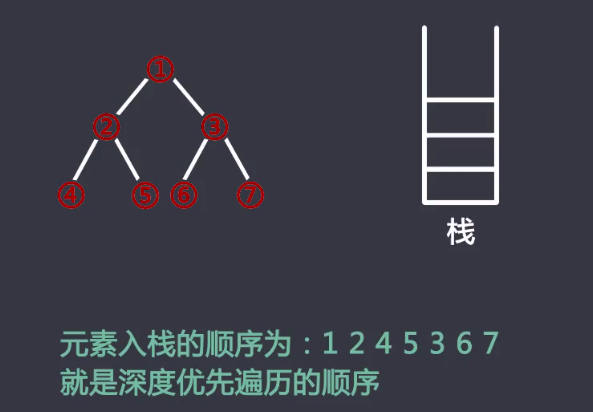
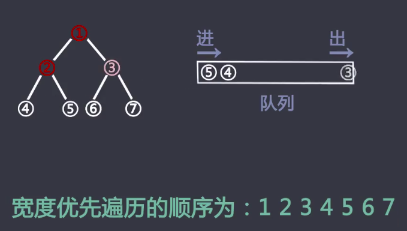

### 一、队列和栈

#### 栈和队列的基本性质

1. 栈是先进后出的

2. 队列是先进先出的

3. 栈和队列在实现结构上可以有数组和链表两种形式

   数组结构比较容易实现

   用链表结构较复杂，因为牵扯很多指针操作

#### 栈结构的基本操作

1. pop操作
2. top和peek操作
3. push操作
4. size操作

#### 队列的基本操作

与栈不同的是，push为在队头加入元素

而pop操作则是从队列尾部弹出一个元素

栈和队列的基本操作，都是时间复杂度为O（1）的操作

双端队列结构为首尾都可以压入和弹出元素

优先级队列为根据元素的优先级值，决定元素的弹出顺序

优先级队列的结构为堆结构，并不是线性结构

#### 深度优先遍历（DFS）和宽度优先遍历（BFS）

##### 深度优先遍历可以用栈实现

  
 

元素入栈的顺序即访问的顺序。

##### 宽度优先遍历可以用队列实现

  
 

所有元素进队列的顺序就是访问的顺序

平时使用的递归函数实际上用到了系统提供的函数系统栈

递归的过程可以看着递归函数依次进入函数栈的处理过程

所有用递归函数可以做的过程都一定可以用非递归的方式实现

练习：定义栈的数据结构，请在该类型中实现一个能够得到栈最小元素的min函数。[参考](https://gist.github.com/Gugibv/4eee19a5a91b3a8b25d95d8d0ab75268/raw/ecc6d4f0091c28390dc8097c605956bcdc8e9524/Solution.java)

